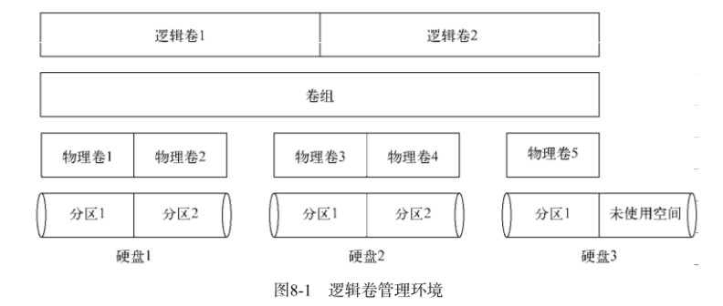
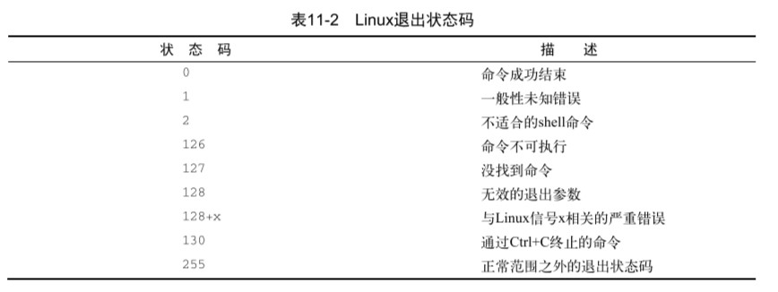
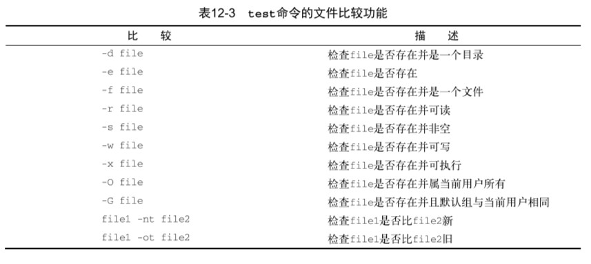

# Linux命令行和shell编程

## Linux简介

* Linux内核
* GUN工具
* 图形化桌面环境
* 应用软件


### 内核功能

### 系统内存管理

**交换空间（swa.space）** 通过硬盘上的储存空间实现虚拟内存

**页面（page）** 内存储存单元按照组划分为很多块

内存会维护一个内存页面表,指明那些页面位于物理内存,那些位于磁盘上。

### 软件程序管理

**进程** 指运行中的程序

### 硬件设备管理

Linux系统将硬件设备当作特殊的文件,称为设备文件

* 字符型设备文件
* 块设备文件
* 网络设备文件

### 文件系统管理

Linux内核支持通过不同的文件系统从硬盘中读取数据

Linux内核采用虚拟文件系统（Virtua.File System,VFS）作为和每个文件系统交互的接口,挂载文件系统时,VFS将信息缓存在内存中

### GUN工具

1. 核心GNU工具（coreutils（core utilities））
   * 用于处理文件的工具
   * 用于处理文本的工具
   * 用于管理进程的工具
2. shell

    GNU/Linuxshell是一种特殊的交互式工具。它为用户提供了启动程序,管理文件系统中的文 件以及运行在Linux系统上的进程的途径。

### Linux桌面环境

1. Xwindow系统

    Window软件是直接和PC上的显卡及显示器打交道的底层程序。它控制着Linux程序如何在 电脑上显示出漂亮的窗口和图形。

2. KDE桌面

    类Microsof.Windows的图形化桌面环境

3. GNOME桌面

4. Unity桌面

Ubuntu使用

## shell常用命令


### 基本shell命令

```bash
cd # 切换目录

ls # 显示当前目录下文件和目录
    -l # 显示详细信息
```

#### 处理文件

```bash
touch # 创建文件

cp # 复制文件
    -p # 递归复制
```

#### 链接文件

```bash
ln # 硬链接
    -s # 软连接
```

#### 移动重命名

```bash
mv # 移动文件或者重命名
```

#### 删除文件

```bash
rm # 删除文件
    -i # 提示是否删除
    -f # 强制删除
    -r # 删除文件及目录
```

#### 建立目录

```bash
mkdir # 新建目录
    -p# 建立多级目录
```

#### 删除目录

```bash
rmdir # 删除空目录
```

#### 查看文件类型

```bash
file # 查看文件类型（编码,脚本,可执行）
```

#### 查看文本文件内容

```bash
cat # 显示文本
    -n # 显示行号
    -s # 去掉多余空白行
    -T # 将制表符显示为 ^I
    -b # 跳过空白行

more # 显示一页的内容

less # 高级more

tail # 显示尾部内容（默认10行）
    -n # 指定显示行数
    -f # 实时查看（其他程序使用时）

head # 显示头部内容（默认10行）
    -n # 指定行数
```

### 监测程序

#### 探查进程

```bash
ps # 显示进程信息
    -A # 显示所有进程
    -f # 显示完整信息
    -l # 显示长格式信息
```

ps中的信息：

UID：启动进程的用户

PID：进程ID

PPID：父进程的ID

C：CPU利用率

STIME：进程启动时的系统时间

TTY：进程启动时的终端

TIME：累计CPU时间

CMD：启动的程序名称

S：进程状态（O：正在运行；S：休眠；R：可运行；Z：僵化,进程已结束但父进程已不存在；T：停止）

#### 实时显示

```bash
top # 实时显示进程信息
# top运行时的命令
    f # 选择输出排序的字段
    d # 修改轮询间隔
    q # 退出top
```

top中的信息：

PID：进程ID

USER：进程属主名

PR：优先级

NI：谦让度

VIRT：占用虚拟内存总量

RES：占用物理内存总量

SHR：进程和其他进程共享的内存总量

S：进程的状态（D：可中断的休眠状态；R：可运行；S：休眠；T：跟踪状态或停止状态；Z：僵化）

%CPU：使用CPU的时间比例

%MEM；占用内存比例

TIME+：从启动为止的CPU时间

COMMAND：启动的程序名

平均负载有三个值：最近1分钟,5分钟,15分钟的平均负载。值越大,负载越高。

#### 结束进程

```bash
kill # 给进程发送控制信号,默认为TERM；只能用进程的PID
    -n # 指定信号（用信号名或信号值）
killall # 支持通过进程名来结束进程,也支持通配符
```

|信号值 | 信号名 | 描述                   |
|------ | ------ | ---------------------------- |
|1 |      HUP   |  挂起                         |
|2  |     INT    | 中断                         |
|3  |     QUIT   | 结束进行                     |
|9     |  KILL  |  无条件终止                   |
|11  |    SEGV |   段错误                       |
|15    |  TERM   | 尽可能终止                   |
|17     | STOP   | 无条件停止运行,但不终止     |
|18 |     TSTP |   停止或暂停,但继续在后台运行 |
|19     | CONT   | 在STOP或TSTP之后恢复执行     |

### 磁盘监测

#### 挂载存储媒体

```bash
mount -t type device directory # 挂载指定设备
# type指定磁盘文件系统类型,device设备名,directory挂载点
```

#### 取消挂载

```bash
umount direcorty device # 卸载,支持通过设备文件或是挂载点卸载
```

#### 查看挂载磁盘信息

```bash
df # 显示已挂载设备信息
    -h # 使用易读形式显示

du # 显示某个特定目录（默认当前目录）的磁盘使用情况,一磁盘块为单位
    -h # 使用易读形式显示
```

### 处理数据文件

#### 数据排序

```bash
sort file1 # 对文本中的数据进行排序
    -n # 将数字识别为数字而不是字符
    -r # 反向排序

uniq file # 删除重复行(必须是相邻的)
    -c # 统计重复行的数量
```

#### 搜索数据

```bash
grep [options] pattern [file] # 在指定文件中查找包含匹配指定模式的字符的行（可使用正则表达式）
    -r # 反向搜索（输出不匹配的行）
    -n # 显示行号
    -c # 只显示有多少行包括匹配的模式
    -e # 指定多个匹配模式,使用-e来指定每个模式
    -q # 静默模式,不产生输出;匹配成功返回0,否则为1
```

#### 压缩数据（单个文件）

|工具                      |       文件拓展名 |
|------------------------------- | ---------- |
|bzip2（单个文件,不保留源文件） | .bz2 |
|compress（基本淘汰）           |  .Z         |
|gzip（单个文件,不保留源文件） |  .gz   |
|zip（可以打包)                  | .zip       |

```bash
gzip file # 压缩指定文件（可使用通配符批量压缩）

gzcat # 查看压缩过的文本文件的内容

gunzip # 解压文件
```

#### 归档文件

```bash
tar function [options] object1 object2 ... # 将指定文件按选项归档
    -c # 创建新的归档文件
    -t # 列出已归档文件内容
    -f # 输出结果到文件
    -v # 在处理时显示文件
# 例子
tar -cvf test.tar test/ test2/ # 将目录 test 和 test2 归档到 test.tar 文件
tar -tf test.tar # 查看 test.tar 内容
tar -xvf test.tar # 提取 test.tar 内容
```

**窍门：** 以 .tgz 结尾的文件是gzip压缩过的tar文件,可以使用命令`tar -zxvf filename.tgz` 来解压

## 理解shell

### shell类型

用户配置文件：/etc/passw ,在第七个字段列出了默认shell程序

shel 程序位于：/bin 目录下

交互shell ：用于用户与系统进行交互

系统shell ：用于在系统启动时,启动脚本,默认位置是 /bin/sh

常见shell程序：

|系统   | 默认交互 shell | 默认系统 shell |
|------ | -------------- | -------------- |
|CentOS | bash     |       bash           |
|Ubuntu | bash           | dash           |

### shell的父子关系

从shell中创建的shell称为子shell,子shell中也可创建子shell；可以从`ps.命令中的 PID和PPID看出 shell 的父子关系

#### 进程列表

命令列表：在命令间加入`;.,命令会依次执行

```bash
#例如
pwd ; ls ; cd /etc ; pwd ; cd ; pwd ; ls
```

进程列表：命令列表加上括号（进程列表会生成一个子shell来执行命令）

```bash
#例如
(pwd ; ls ; cd /etc ; pwd ; cd ; pwd ; ls)
```

可以使用环境变量命令查看是否生成了.shell

```bash
echo $BASH_SUBSHELL
```

#### 子shell用法

##### 后台模式

在后台模式中运行命令可以在处理命令的同时让出CLI,以供使用；在命令末尾加上字符`&`.将命令置入后台模式

```bash
# 例子
sleep 300&
```

在执行上述例子后,会输出两条信息,第一条是显示在方括号中的*后台作业号（backgroun.job）* ,第二条是后台作业的进程ID

显示后台作业信息

```bash
jobs # 显示后台作业信息
    -p # 显示命令的PID
```

##### 将进程列表置入后台

```bash
# 例子
(sleep 2 ; echo $BAUSH_SUBSHELL ; sleep 2)&
```

##### 协程

协程可以同时做两件事。在后台生成一个子shell,并在这个子 shell 中执行命令。

```bash
# 例子
coproc sleep 10
```

可以使用命令的拓展语法设置协程名（默认为COPROC）

格式：coproc 协程名 { 命令； } ；第一个花括号和协程名之间有一个空格；命令以分号结尾；分号和闭花括号之间也有空格

```bash
# 例子
coproc MY_Job { sleep 10; } # 注意格式
```

#### shell的内建命令

##### 外部命令

也称为文件系统命令,是存在于 bash shell 之外的程序。通常位于/bin,/usr/bin,/sbin或/usr/sbin中

```bash
# 使用which可以显示命令位置
which ps # 显示ps命令位置


# 使用type可以显示命令的类型
# 例子
type -a ps # 显示ps命令类型
```

当外部命令执行时,会创建出一个子进程。这种操作被称为衍生（forking）。

##### 内建命令

内建命令不需要使用子进程来执行,有些命令有多种实现。例如echo和pwd既有内建命令也有外部命令

```bash
history # 命令执行历史
# 命令历史记录被保存在隐藏文件.bash_history 中,位于用户的主目录
# bash的命令记录缓存在内存中,当shell退出时才写入文件
    -w # 强制写入命令历史
# 使用惊叹号和命令的编号即可唤回命令
!20# 唤回第20条命令

alias# 别名
    -p # 当前可用别名
# 例子
alias li='ls -li' # 创建别名
```

### Linux环境变量

### 环境变量

bash shell 使用环境变量（environment variable）特性来存储有关shell会话和工作环境的信息,这项特性使得可以在内存中存储数据

环境变量分为两类：

* 全局环境变量
* 局部环境变量

#### 全局环境变量

全局变量对于shell会话和所有生成的子shell都可见。系统环境变量基本都是使用全大写字母,以区别普通用户的环境变量。可以使用env或printenv命令查看全局变量

```bash
printenv # 查看全局环境变量,也可使用env命令

printenv 变量名 # 查看个别变量,不能使用env命令

# 可以使用echo显示变量值,在环境变量前加上$（美元符）
# 例子
echo $HOME # 输出HOME变量值
```

#### 局部环境变量

局部变量只能在定义它们的进程中可见,用户可以自定义自己的局部变量,被称为用户定义局部变量

```bash
set # 显示全部变量（包括全局变量,局部变量和用户定义变量）,并按照字母顺序排序
```

### 用户定义变量

#### 设置局部用户定义变量

在shell中,通过等号给环境变量赋值,值可以是数值或字符串。只能在当前shell中使用

```bash
my_variable=Hello # 变量赋值,变量名,等号和值之间没有空格
|在自定义局部变量时,使用小写字母避免重新定义系统变量

```

#### 设置全局环境变量

先创建一个局部环境变量,然后通过`exprot`命令将它导出到全局环境中

```bash
my_variable="I am Global now" # 创建局部变量

exprot my_variable # 导出到全局环境
```

在子shell中修改全局变量不会影响父shell中的值（使用export命令也不行）

### 删除环境变量

使用`unset`命令,在`unset`命令中引用环境变量时,不要用$

```bash
unset my_variable # 删除变量
```

在子shell 中删除全局环境变量,只对子shell有效。

### 默认的shell环境变量

默认情况下,bash shell 会用一些特定的环境变量来定义系统环境

|变量     | 描述                                                       |
|-------- | ------------------------------------------------------------ |
|HOME |     当前用户的主目录                                           |
|PATH |     shell查找命令的目录列表,由冒号分隔                        |
|BASH     | 当前shell实例的全路径名                                      |
|BASH_ENV | 设置了的话,每个bash脚本会在运行前尝试运行该变量定义的启动文件 |
|HOSTNAME | 当前的主机名                                           |
|LANG     | shell的语言环境类别                                        |
|LC_ALL   | 定义了一个语言环境类别,能够覆盖LANG变量                     |

### 设置PATH环境变量

PATH环境变量定义了用于进行命令和程序查找的目录

将新的搜索目录添加到现有的PATH环境变量中,需要引用原来的PATH值,然后添加新的目录

```bash
PATH=$PATH:/home/user/scripts # 在PATH中添加新的目录
```

### 定位系统环境变量

在登入Linux系统启动bash shell 时,默认bash会在几个文件中查找命令。这些文件叫做**启动文件**或**环境文件**

启动bash shell 有3中方式：

* 登录时作为默认登录shell
* 作为非登录shell的交互式shell
* 作为运行脚本的非交互式shell

#### 登录shell

登录shell会从5个不同的启动文件里读取命令：

* /etc/profile
* $HOME​/.bash_profile
* $HOME/.bashrc
* $HOME/.bash_login
* $HOME/.profile

1. /etc/profile文件是系统上默认的bash shell的主启动文件

2. $HOME目录下的启动文件  
    提供一个用户专属的启动文件来定义用户用到的环境变量,通常使用一下文件的一到两个  
    $HOME/.bash_profile  
    $HOME/.bash_login
    $HOME/.profile  
    $HOME/.basrc  

#### 交互式shell进程

交互式shell不会访问/etc/profile文件,只会检查用户家目录下的.bashrc文件

### 非交互式shell

系统执行shell脚本的时候使用的就是这种shell,bash shell 提供了BASH_ENV环境变量

对于启动子shell的脚本,子shell会继承父shell的全局环境变量

对于不启动子shell的脚本,脚本会使用当前shell的环境变量

#### 环境变量持久化

将环境变量写入以上使用的文件中,即可

**注:**/etc/profile文件会在发行版升级后跟新,推荐在/etc/profile.d目录创建一个以.sh结尾的文件存储全局变量

个人用户永久性bash shell变量存储在$HOME/.bashrc文件（可以将别名置入其中,使其效果永久化）

### 数组变量

要给环境变量设置多个值,可以把值放在括号里,值与值之间用空格分隔

```bash
mytest=(one two three four five)
```

使用索引值来引用一个数组元素

## Linux文件权限

Linux沿用了Unix文件权限的办法,即允许用户和组根据每个文件和目录的安全性设置来访问文件

### Linux的安全性

Linux安全系统的核心是用户账户,用户对系统中各种对象的访问权限取决于他们登陆系统时的账户

用户权限是通过创建用户时分配的用户ID（Uset ID,UID）来追踪的

UID是唯一的

#### /etc/passwd文件

Linux系统使用一个专门的文件来讲用户的登录名匹配到对应的UID值,/etc/passwd文件包含了一些用户信息

* 登录用户名
* 用户密码（密码实际保存在/etc/shadow文件中）
* 用户账户的UID
* 用户账户组的GID
* 用户账户的文本描述（备注字段）
* 用户HOME目录的位置
* 用户的默认shell

root用户的UID是0

**系统账户**: 系统上运行各种服务进程访问资源用的特殊账户

Linux为系统账户预留了500以下的UID值

#### /etc/shadow文件

/etc/shadow文件为系统上的每个用户都保存了一条记录,并且只有root用户能够访问

* 与/etc/passwd文件中的登录名字段对应的登录名
* 加密后的密码
* 自上次修改密码后过去的天数（自1970-1-1算起）
* 多少天后才能更改密码
* 多少天后必须更改密码
* 密码过期前提前多少天提醒用户更改密码
* 密码过期后多少天禁用用户账户
* 用户账户被禁用的日期（用自1970-1-1到当天的天数表示）
* 预留字段给将来使用

#### 添加新用户

```bash
useradd # 添加用户（会使用默认值及命令行参数来设置）
    —D # 查看设置默认值（后跟选项修改默认设置）
    -m # 创建HOME目录,并添加模板文件
```

系统默认值被设置/etc/default/useradd文件中

模板文件位于/etc/skel下,CentO.7 中有 \*.bash_logout \*.bash_profile \*.bashrc 文件

#### 删除用户

```bash
userdel # 删除用户（不删除用户的HOME目录）
    -r # 删除用户目录及邮件目录
```

#### 修改目录

```bash
usermod # 修改/etc/passwd文件字段
    -u # 修改用户账户的登录名
    -L # 锁定账户,使用户无法登录
    -p # 修改账户的密码
    -U # 解除锁定,使用户能够登录

passwd # 修改账户密码（只有root能修改其他账户）
    -e # 强制用户下次登录时修改密码

chpasswd # 批量修改（可以从标准输入自动读取登录名和密码对列表）
# 可以使用重定向将含有userid:passwd对的文件重定向给给文件
#例子
chpasswd < users.txt #user.txt含有userid:passwd对列表

chsh # 修改默认用户登录shell（必须用shell的全路径作为参数）

chfn # 在/etc/passwd文件的备注字段中存储信息

chage # 管理用户的有效期
    -E # 设置密码过期的日期
    -I # 设置密码过期到锁定账户的天数
    -W # 设置密码过期前多久开始出现提醒信息
```

### Linux组

组权限允许多个用户对系统中的对象（文件,目录或设备等）共享一组共用的权限。每个组都有唯一的GID和唯一的组名

#### /etc/group文件

组信息保存在/etc/group文件中,有四个字段

* 组名
* 组密码（用户通过组密码称为临时组员）
* GID
* 属于该组的用户列表（不含指定该组为默认组的账户）

#### 创建新组

```bash
groupadd # 创建新组

# 使用usermod添加用户
usermod -G 组名 用户名
```

#### 修改组

```bash
groupmod # 修改组
    -G # 修改已有组的GID
    -n # 修改组名
```

### 文件权限

在ls -l显示的权限中,第一位代表对象的类型,之后三组字符编码,定义了三种访问权限

* r 代表对象是可读的
* w 代表对象是可写的
* x 代表对象是可执行的

三组权限对应三个安全级别

* 对象的属主
* 对象的属组
* 系统的其他用户


#### 默认权限

```bash
umask # 设置所创建文件和目录的默认权限
# umask是掩码,他会屏蔽掉不想授予该安全级别的权限
# 例子
# umask
0022
# 第一位代表了一项特别的安全特性,叫做粘着位（sticky bit）
# 后三位标识文件或目录对应的umask八进制值
```


对于文件,全权限的值是666,对目录,则是777

umask值通常设置在/etc/profile启动文件中,有些是在/etc/login.defs文件中（如Ubuntu）

#### 安全性设置

```bash
chmod # 改变文件和目录的安全性设置
    -r # 权限得改变递归地作用到文件和子目录
##格式
chmod options mode file # mode参数可以用八进制模式或者符号模式进行安全性设置
# 八进制文件权限会自动应用到指定的文件上
```

符号模式权限的格式

[ugoa....[+-=] [rwxXstugo...]

第一组字符定义权限作用的对象

* u 代表用户
* g 代表组
* o 代表其他
* a 代表上述所有

后面的符号

* \+ 代表在现有权限基础上增加
* \- 代表在现有权限基础上移除
* = 将权限设置成后面的值

最后的

* X 如果对象是目录或者它已有执行权限,赋予执行权限
* s 运行时重新设置UID或GID
* t 保留文件或目录
* u 将权限设置为跟属主一样
* g 将权限设置为跟属组一样
* o 将权限设置跟其他用户一样

```bash
# 例子
chmod o+r newfile # 为其他用户添加读取权限
chmod u-x newfile # 移除属主已有的执行权限
```

#### 改变所属关系

```bash
chown # 改变文件的属主（只有root能改变文件的属主）
    -R # 递归改变
    -l # 改变该文件的所有符号链接文件的所属关系
# 格式
chown options owner.[group] file

chgrp # 改变文件的默认属组（文件的属主能更改属组,还得是新组的成员

```

### 共享文件

Linux系统上共享文件的方法是创建组

Linux为文件和目录存储了额外的三个信息位

* 设置用户ID（SUID）：当文件被用户使用时,程序会以文件属主的权限运行
* 设置组ID（SGID）：对文件来说,程序会以文件属组的权限运行,对目录来说,目录中创建的新文件会以目录的默认属组作为默认属组
* 粘着位：进程结束后文件还驻留（粘着）在内存中

启用SGID后,可以强制在一个共享目录下创建的新文件都属于该目录的属组,这个组也就成为了每个用户的属组

SGID可通过chmod命令设置,加到标准3位八进制前（组成4位八进制）,或在符号模式下用符号s


## 文件系统

### Linux文件系统

Linux支持多种类型的文件系统管理文件和目录。每种文件系统都在存储设备上实现了虚拟目录结构,仅特性略有不同

#### 基本Linux文件系统

|名称                          |       描述                                       | 优缺点                                                       |
|----------------------------------- | ------------------------------------------ | ------------------------------------------------------------ |
|ext文件系统（extended file system） | 使用块存储数据,使用索引节点存储文件的信息 | 文件最大2GB,存储碎片化,                              |
|ext2文件系统                        | 拓展了索引表文件内容（时间节点）           | 文件最大2TB（后期增加到32TB）；通过按组分配磁盘减轻碎片化；容易在系统崩溃或断电时损坏 |

#### 日志文件系统

日志文件系统是先将文件写入临时文件（称为日志,journal）中,在数据成功写到存储设备和索引节点表后,在删除对应的日志条目

Linux中有三种保护等级不同的日志方法

|方法     | 描述                                               |   优缺点                   |
|-------- | ---------------------------------------------------- | ------------------------ |
|数据模式 | 索引节点和文件都会被写入日志                   |       丢失数据风险低；但性能差 |
|有序模式 | 只有索引节点数据会被写入日志,数据成功写入后才删除   | 性能和安全性中等         |
|回写模式 | 只有索引节点数据会写入日志,但不控制文件数据何时写入 | 性能高,风险高     |

##### 使用日志的文件系统

|名称                                 | 描述                                                         | 优缺点                                 |
|------------------------------------ | ------------------------------------------------------------ | -------------------------------------- |
|ext3文件系统                       |   对于ext2增加了日志文件,默认使用有序模式                     | 没有内建的数据压缩功能；不支持加密文件 |
|ext4文件系统                        |  支持数据压缩和加密,还支持区段特性；引入块预分配技术（block preallocation） |                                        |
|Reiser文件系统                       | 只支持回写日志模式；支持在线调整已有文件系统的大小；引入尾部压缩（tailpacking）技术（一个文件的数据可以填进另一个文件的数据块中的空白空间） | Linux中最快的日志文件系统之一          |
|JFS文件系统（Journaled File System） | 采用有序日志方法；基于区段的文件分配                   |                                              |
|XFS文件系统                          | 采用回写模式的日志；允许在线调整文件系统大小,但之只能扩大   |                                        |

#### 写时复制文件系统

使用写时复制（copy-on-write,COW）技术,COW利用快照兼顾了安全性和性能。如果要修改数据,会使用克隆或可写快照；修改过的数据并不会直接覆盖当前数据,而是存放在其他位置

|名称                  |       描述                                         |
|--------------------------- | -------------------------------------------- |
|ZFS文件系统           |       未使用GPL许可                                |
|Btrf文件系统（B树文件系统） | 稳定,易用；能够动态调整已挂载文件系统的大小 |

### 操作文件系统

#### 创建分区

```bash
fdisk # 分区工具（交互程序）
# 格式
fdisk 设备名（绝对路径）
# 交互命令
    d # 删除分区
    l # 显示可用分区类型
    n # 添加一个新分区
    q # 退出,不保存更改
    w # 将分区表写入磁盘
    p # 显示设备详细信息
```

#### 创建文件系统

不同文件系统格式化命令不同


```bash
# 格式化
命令 分区
# 例子
mkfs.ext4 /dev/sdb1 # 将ext4文件系统写入sdb1分区
```

在创建文件系统后,将其挂载到虚拟目录下的挂载点,就可使用了

```bash
mount # 挂载命令（临时挂载,重启失效）
    -t # 指明要挂载的文件系统类型
# 要自动挂载可将信息添加到/etc/fstab文件
```

#### 文件系统的检查可修复

```bash
fsck # 检查修复文件系统
    -t # 指定文件系统类型（未挂载的设备需要使用）
    -a|-y # 如果检测到错误,自动修复
    -r # 提示错误
    -V # 详细输出
# 格式
fsck options filesystem # 文件系统可以通过设备名,挂载点,UUID引用
```

### 逻辑卷管理

**Linux逻辑卷管理**（logicat volume manager,LVM）

#### 逻辑卷管理布局

硬盘称为**物理卷（physicat volume,PV）**,每个逻辑卷都会映射到硬盘上特定的物理分区

多个物理卷集中在一起形成一个**卷组（volum.group,VG）**,卷组提供创建逻辑分区的平台

结构的队后一层是**逻辑卷（logicat volume,LV）**,逻辑卷提供了创建文件系统的分区环境 ,Linux系统将逻辑卷视物理分区



#### Linux中的LVM

* LVM1,只能用于Linux内核2.4版本,提供了基本的逻辑卷管理功能
* LVM2,可用于Linux内核2.6版本,提供了额外功能

1. 快照

    LVM1只能创建只读快照。LVM2允许创建在线逻辑卷的可读写快照

2. 条带化

    可跨多个物理硬盘创建逻辑卷（不同于RAID条带化,LVM条带化没有提供容错）

3. 镜像

   LVM镜像是实时更新的逻辑卷的完整副本

#### 使用Linux LVM

1. 定义物理卷

    将硬盘上的物理分区转换为Linu.LVM的物理卷区段,使用`fdisk`命令,通过`t`命令改变分区类型（8e类型表示分区会作为Linux LVM系统的一部分）；然后通过`pvcreate`命令创建实际的物理卷

    ```bash
    pvcreate /dev/sdb1 # 创建物理卷
    pvdisplay /dev/sdb1 # 查看物理卷信息
    ```

2. 创建卷组

    ```bash
    vgcreate Vol1（卷组名） /dev/sdb1 # 创建卷组
    vgdisplay Vol1 # 查看卷组信息
    ```

3. 创建逻辑卷

    ```bash
    lvcreate -l 100%FREE -n lvtest Vol1 # 创建逻辑卷使用全部空闲空间,卷名lvtest,在Vol1卷组创建
        -l # 指定分配区段数,或百分比
        -L # 指定使用大小（KB,MB,GB）
        -n # 指定逻辑卷名
        -lvdisplay Vol1# 查看逻辑卷信息
   ```

4. 创建文件系统

    ```bash
    mkfs.ext4 /dev/Vol1/lvtest # 在逻辑卷lvtest中写入ext4文件系统
    ```

5. 挂载使用

    ```bash
    mount /dev/Vol1/lvtest /mnt/my_partition # 将lvtest卷挂载至/my_partition
    ```

**注意**：在写入文件系统和挂载使用时,使用卷组名和逻辑卷名,而不是物理分区路径

#### 修改LVM

Linux LVM包中的常见命令

|命令     | 功能             |
|-------- | ------------------ |
|vgchange | 激活和禁用卷组 |
|vgremove | 删除卷组         |
|vgextend | 将物理卷加到卷组中 |
|vgreduce | 从卷组删除物理卷   |
|lvextend | 增加逻辑卷大小 |
|lvreduce | 减小逻辑卷大小     |

## 安装软件程序

包管理系统（packag.management system,PMS）

### 包管理基础

PMS利用一个数据库记录相关内容

* Linux系统上安装的软件包
* 每个包安装了什么文件
* 每个安装的软件包的版本

软件包存储在远程服务器上,这些服务器称为**仓库（repository）**,PMS工具会检测软件包的依赖关系,并在安装需要的包之前安装需要的包

* 基于Debian的发行版,使用的时dpkg命令

* 基于Red Hat的发行版,使用的时rpm命令

两者都能列出已安装包,安装新包和删除已有包

### 基于Debian的系统

基于Debian系PMS工具的核心是dpkg命令,包含

* apt-get
* apt-cache
* aptitude

#### 用aptitude管理软件包

aptitude具有交互界面,也可使用单个命令的方式

```bash
aptitude show package_name # 显示某个特定包的详细信息,但无法显示安装的相关包

dpkg -l package_name # 列出了安装的所有相关的包

dpkg --search absolute_file_name # 查看特定文件属于那个软件包（使用绝对路径）
```

#### 用aptitude安装软件包

```bash
aptitude search package_name # 查找包（隐式添加通配符）
# i 表示已经安装；p或v表示包可用,但没安装；c 表示包被删除,但配置还在

aptitude install package_name # 安装指定包（自动安装包依赖）
```

#### 用aptitude更新软件

```bash
aptitude safe-upgrade # 更新系统上所有包（自动检查依赖）

aptitude full-upgrade # 更新系统所有包（不检查依赖）
aptitude dist-upgrade # 同上
```

#### 用aptitude卸载软件

```bash
aptitude remove package_name # 只卸载包,不删除数据和配置
aptitude purge package_name # 完全删除包
```

#### aptitude仓库

`aptitude`仓库位置存储在文件`/etc/apt/sources.list`中

### 基于 Red Hat 的系统

基于 Red Hat 的系统的核心是rpm工具,常见：

* yum：Red Hat 和 Fedora, 更新版本使用 dnf
* urpm：Mandriva
* zypper：openSUSE

#### 列出已安装包

```bash
yum list installed # 列出系统上已安装的包

yum list package_name # 查看指定包的信息

yum list installed package_name # 查看包是否安装

yum provides file_name # 查看指定文件属于那个包
```

#### 用 yum 安装软件

```bash
yum install package_name # 安装指定包（自动安装依赖）

yum localinstall package_name.rpm # 下载rpm包后本地安装
```

#### 用 yum 更新软件

```bash
yum list updates # 列出所有可用更新

yum update package_name # 更新指定包

yum update # 更新所有包
```

#### 用 yum 卸载软件

```bash
yum remove package_name # 只删除软件包保留配置和数据

yum erase package_name # 清除所有文件
```

#### 处理损坏的包依赖关系

损坏的包依赖关系（broke.dependency）

```bash
yum clean all # 清除问题文件,然后更新

yum deplist package_name # 显示包依赖

yum update --skip-broken # 忽略依赖关系损坏的包,更新其他包
```

#### yum 软件仓库

```bash
yum repolist # 显示正在使用的仓库
```

配置文件位置`/etc/yum.repos.d`

### 从源码安装

1. 下载源码包,然后解包
2. 进入源码目录
3. 查看README文件
4. 执行`./configure`（检查依赖）
5. 使用`make`命令构建二进制文件,创建可执行文件（要安装到Linux系统中常用位置,使用`make install`命令

## 校验和加密

### 校验

检验和(checksum)是对文件应用特定算法进行计算得出的一段密钥,用于检验文件是否被修改;一般使用单向散列算法,无法逆推出原始数据

#### md5sum

md5sum 是一段长度为32位的十六进制串

```bash
md5sum filename
    -c # 与指定校验和对比
# 对文件计算 md5 校验和
```

与之类似的校验和算法还有 sha1, sha128, sha512 等等;更安全的可以使用加盐散列(salted hash)

### 加密

对数据进行加密防止未经授权的访问,加密算法可以无损的重构原始数据

#### gpg

gpg(GNU privacy guard)是一种应用广泛的工具

```bash
gpg -c filename # 对文件进行加密
gpg filename.gpg # 读取口令并解密文件
```

#### base64

将二进制数据转换成以64为基数的形式(radix-64 representation)

```bash
base64 filename > outputfile # 加密
base64 -d file > outputfile # 解密
```

## 使用编辑器

1. vim 编辑器
2. nano 编辑器
3. emacs 编辑器
4. KDE 系编辑器
    1. KWrite
    2. Kate
5. GNOME 编辑器
    1. gedit

------

## 构建基本脚本

### 使用多个命令

在同一行的多个命令之间使用分号隔开,命令会顺序执行

### 创建 shell 脚本

shell 脚本的第一行指定要使用的shell,格式为

```bash
#!/bin/bash
```

先给脚本添加执行权限,然后要.shell 能运行脚本有两个方法：

* 将脚本所在目录添加至PATH环境变量中
* 使用路径（两种都可）来引用shell脚本文件

### 显示信息

使用`echo` 命令输出字符串,默认可以不使用引号；如果想字符串和命令结果显示在同一行,使用`echo -n` ,字符串两侧要添加引号,并且字符串尾部要有一个空格

```bash
# 例子
echo -n "The time and date are: "
```

`echo`使用转义符号,需要使用`echo -e`

```bash
echo -e "1\t2\t3"
```

脚本可以使用转义序列在终端生成彩色文本

```bash
echo -e "\e[1;31m This is red text \e[0m"
```

其中常用文本颜色有:重置=0,黑色=30,红色=31,绿色=32.黄色=33,蓝色=34,洋红=35,青色=36,白色=37;

背景颜色为4开头:重置=0,黑色=40,红色=41,绿色=42,黄色=43.蓝色=44,洋红=45,青色=46,白色=47

另一个可用于终端打印的是`printf`,默认不会换行,需要使用格式替换字符(forma.substitution character)

```bash
printf "hello"
```

### 使用变量

变量允许临时性地将信息存储在shell脚本中,以便和脚本中地其他命令一起使用

#### 系统环境变量

在环境变量名称前加上美元符（\$）来使用这些环境变量\$varialble,其他形式：\${variable}

查看一个进程的环境变量,结果字段间.null 字符(\\0)分隔,可以使用`tr`命令进行替换

```bash
cat /proc/$PID/environ
```

#### 用户变量

用户变量可以是由字母,数字或下划线组成的文本字符串,长度不超过20个；区分大小写

在赋值时,等号两边不能有空格

引用变量时要使用美元符,赋值是不需要

#### 命令替换

从命令输出中提取信息,并将其赋给变量,的方法：

* 反引符号（\`)
* $()格式

shell会运行命令替换符中的命令,并将其输出赋给变量

```bash
date +%y%m%d # 以两位数的年月日组合显示日期
140131
```

**注意：命令替换会创建一个子shell 来运行对应的命令,**

### 重定向输入和输出

#### 输出重定向

最基本的重定向将命令的输出发送到一个文件中,bash shell 使用大于号（>）（覆盖式重定向）；（>>）（追加式重定向）

#### 输入重定向

输入重定向将文件的内容重定向到命令,使用小于号（<）

*内联输入重定向（inlin.input redirection）* ,使用（<<）,还必须指定一个文本标记来划分输入数据的开始和结尾

```bash
command << EOF
....
EOF
# 例子
wc << EOF
>test string1
>test string2
>test string3
>EOF
# 输出
3 9 42 # wc命令会对内联输入重定向提供的数据进行行,词和字节的计数
```

### 管道

管道连接（piping）,将一个命令的输出作为另一个命令的输入；使用管道符（|）连接两个命令

Linux系统实际上会同时运行这连个命令,在系统内部将它们连接起来；在第一个命令产生输出的同时,输出会被立即送给第二个命令,数据传输不会用到任何中间文件或缓冲区

### 执行数学运算

#### expr命令

expr命令允许在命令行上处理数学表达式,但只能识别少数的数学和字符串操作符

#### 使用方括号

在 bash 中,在将一个数学运算结果赋给某个变量时,可以用美元符和方括号（\$[ operation ]）将数学表达式围起来,但 bash shell 的数学运算只支持整数运算（zsh 提供了完整的浮点数算数操作）

#### 浮点解决方案

bash 内建计算器 bc

##### bc 的基本用法

bash计算器实际上是一种编程语言,允许在命令行中输入浮点表达式,bash 计算器能识别：

* 数字（整数和浮点数）
* 变量（简单变量和数组）
* 注释（以 # 或 C 语言中的 /\* \*/ 开始的行）
* 表达式
* 编程语句（例如 if-then 语句）
* 函数

浮点运算是由内建变.scale 控制的,将这个值设置为计算结果中保留的小数位数

```bash
bc -q # -q 打开时跳过欢迎信息
scale=2 # 四位浮点数,scale 默认值是0
3.4 / 5
quit # 退出
```

##### 在脚本中使用bc

可以使用命令替换运行 bc 命令,并将输出赋给一个变量

```bash
variable=$(echo "options; expression" | bc)
# options：设置变量；expression：定义数学表达式（可以使用变量）
# 例子
var1=$(echo "scale=4;3.44/5" | bc)
echo The answer is $var1
```

bc命令能识别输入重定向,最好使用内联重定向

```bash
variable=$(bc << EOF
options
statements
expression
EOF
)
```

可以在bash 计算器中赋值给变量**在 bash 计算器中创建的变量只在 bash 计算器中有效,不能在 shell 脚本中使用**

### 退出脚本

shell 中运行的每个命令都使用*退出状态码（exit status*）告诉 shell 它已经运行完毕

#### 查看退出状态码

Linux 提供了一个专门的变量\$? 来保存上个已执行命令的退出状态码

常见退出状态码



#### exit 命令

默认情况下,shell 脚本会以脚本的最后一个命令的退出状态码退出

exit命令允许在脚本结束时指定一个退出状态码（可以使用变量）

如果指定的状态码大于255,shell会通过模运算（对256取余）将结果缩减到0-255区间

## 使用结构化命令

使用结构化命令（structure.command）可以改变程序执行的顺序

### if-then 语句

if-then语句格式：

```bash
if command
then
    commands
fi
```

if 后的命令的退出状态码是0,则会运行 then 后的命令

**注意:** 如if 后的命令执行失败会在脚本输出中显示失败信息

### if-then-else 语句

```bash
if command
then
    command
else
    command
fi
```

### 嵌套 if

当有多种条件时,可以使用嵌套if-then 语句

```bash
if command
then
    if command
    then
        ommand
    fi
fi
```

也可以使用 elif

```bash
if command
then
    command
elif command
then
    command
else
    command
fi
```

### test 命令

if-then不能测试命令退出状态码之外的条件

test 命令则能测试不同条件,条件成立则会退出并返回状态码0;否则返回非零退出状态码

```bash
if test condition # condition 是 test 命令要测试的一系列参数和值
then
    commands
fi
```

bash shell 中可以使用另一种形式,无需声明 test 命令

```bash
if [ condition ] # 方括号中是测试条件;condition 两边都有空格
then
    commands
fi
```

test 命令可以判断三类条件:

* 数值比较
* 字符串比较
* 文件比较

#### 数值比较

对两个数值进行比较(bash shell 中只能处理整数)


#### 字符串比较


1. 字符串相等性

    字符串中的所有字符相同(包含标点和大小写情况)

2. 字符串顺序

    大于号和小于号必须转义,否则 shell 会将它们当作重定向符号
    大于和小于顺序与 sort 命令不同

    **注:在比较测试中,大写字母被认为小于小写字母,与 sort 命令相反**

    **在比较测试中使用的是标准 ASCII 顺序,根据数值排序;sort 则使用的是系统的本地化语言设置中的定义**

3. 字符串大小

    -n 和 -z 可以检查一个变量是否含有数据

**注意:** 在进行数值比较是使用的是代码,而字符串比较使用的是数学符号

#### 文件比较



### 符合条件测试

if-then语句允许使用布尔逻辑来组合测试

* [ condition1 ] && [ condition2 ] ,两者都需要满足
* [ condition1 ] || [ condition2 ] ,两者满足其一即可

### if-then 的高级特性

bash shell 提供了两项可在if-then语句中使用的高级特性:

* 用于数学表达式的双括号
* 用于高级字符串处理功能的双方括号

#### 使用双括号

双括号允许在比较过程中使用高级数学表达式(其中的符号无需转义),格式如下:

`(( expression ))`

除 test 命令使用的标准数学运算符,也可以使用其他的


#### 使用双方括号

双方括号提供了针对字符串比较的高级特性(模式匹配),格式如下:

`[ expression ]`

在模式匹配中,可以使用正则表达式来匹配字符串

### case 命令

case 命令会采用列表格式来检查单个变量的多个值

```bash
case variable in
pattern1) command1;;
pattern2) command2;;
pattern3) command3;;
*) commands;;
esac
```

\*) 用来善后(可以不写);pattern 支持简单的正则表达式

## 循环结构

### for 命令

创建一个遍历一系列值得循环

```bash
for var in list
do
    commands
done
```

其.list 有几种不同方式来指定列表的值,并且可选项

#### 直接定义 list 值

```bash
for test in abc bcd cde def
do
    echo $test
done
```

#### 特殊符号

|list 中的一些特殊符号要用转移符号进行转义,或者使用双引号

#### 从变量读取

```bash
list="ab.bcd cde def" # 定义 list
list=$list"efg" # list 添加元素
for test in $list # 使用变量
do
    commands
done
```

#### 从命令读取

```bash
for test in $(cat $file) # 使用 cat 命令的输出作为 list
```

#### 更改字段分隔符

内部分隔符(interna.field separator),隔开字段的符号

bash shell 默认的分隔符:

* 空格
* 制表符
* 换行符

可以在脚本中自定义分隔符(如果要使用多个符号串联即可)

```bash
IFS=$'\n':; # 将换行符,冒号,分号作为换行符
```

#### 使用通配符读取目录

可以使用 for 命令自动遍历目录中的文件

```bash
for file in /home/rich/test/*
do
    commands
done
```

### C 语言风格的 for 命令

#### C 语言的 for 命令

* 语言中的 for 命令通常使用**变量,迭代条件,变量变化方法**作为 for 循环条件

bash 中 C 语言风格的 for 循环

```bash
for (( variable assignment ; condition ; iteration process ))
# 例子
for (( a = 1; a < 10; a++ ))
```

不同于 bash shell 标准的 for 命令:

* 变量赋值可以有空格
* 条件中的变量不以美元符开头
* 迭代过程未用 expr 命令格式

#### 使用多个变量

* 语言风格的 for 命令允许使用多个变量,但只能定义一种条件

```bash
for (( a=1, b=10; a <= 10; a++, b--))
do
    commands
done
```

### while 命令

while 命令允许定义一个要测试的命令,然后循环执行一组命令

#### while 的基本格式

```bash
while test command
do
    some commands
done
```

测试命令格式于 if-then 中的相同,while 会在测试条件不成立时停止

#### 使用多个测试命令

while 命令允许在 while 语句定义多个测试命令,但只有最后一个测试命令的退出状态码用来决定循环结束

### until 命令

until 命令和 while 命令的工作方式相反,只有测试命令的退出状态码不为0,bash shell 才会执行循环中列出的命令;与 while 相似,until 也可以使用多个测试命令,最后一个测试命令的退出状态码决定循环是否结束

```bash
until test commands
do
    some commands
done
```

### 嵌套循环

嵌套循环(nested loop) ,在循环中使用循环

被嵌套的循环也被称为内部循环(inner loop)

### 循环处理文件数据

遍历存储在文件中的数据,要使用:

* 嵌套循环
* 修改IFS环境变量

### 控制循环

使用一下两个命令来控制循环:

* break 命令
* continue 命令

#### break 命令

使用 break 命令可以跳出循环

1. 跳出单个循环

2. 跳出内部循环

3. 跳出外部循环

    在内部循环,要停止外部循环时,可以使用:

    `bread N`,默认N为1,表示跳出当前循环;N为2表示停止下一级的外部循环

#### continue 命令

continue 命令可以跳过某次循环中的剩余命令,但不会终止整个循环

与break 一样,continue 命令也可以通过参数指定继续执行哪一级循环:

`continue n`

### 处理循环的输出

* shell 脚本中,可以对循环的输出使用管道或进行重定向,通过在 done 命令之后添加一个处理命令实现

```bash
for test in list
do
    commands
done > output.txt # 输出重定向到 output.txt 文件
```

这种方法同样使用于将循环的结果管接给另一个命令

### 实例

#### 查找可执行文件

可执行文件的目录被定义在环境变量PATH中

1. 创建一个 for 循环,对环境变量 PATH 中的目录进行迭代,注意设置分隔符

    ```bash
    IFS=:
    for folder in $PATH;do
        commands
    done
    ```

2. 使用另一个 for 循环来迭代特定目录中的所有文件

    ```bash
    for file in $folder/*;do
    ```

3. 检查各个文件是否具有可执行文件

    ```bash
    if [ -x $file ]
    then
        echo " $file"
    fi
   ```

#### 创建多个用户账户

将新用户的账户放在一个文本文件中:

userid,username

第一列是用户名,第二列是用户全名(备注信息);使用都好分隔

* IFS 分隔符设置为逗号,并放入 while 语句的条件测试部分,然后使用 read 命令读取文件中的各行

`while IFS=',' read -r userid name`

read 命令会自动读取 .csv 文本的下一行内容

要把数据从文件送.while 命令,只需在 while 命令尾部使用输入重定向即可

`done < '$input'` \$input 指向要输入的文件

## 处理用户输入

bash shell 提供了一些不同的方法从用户处获得数据,包括参数\选项以及直接从键盘读取输入

### 命令行参数

#### 读取参数

位置参数(positiona.parameter),是一组特殊变量,存储的是从命令行读取到的参数:\$0 是程序名,\$1 是第一个参数,\$2 是第二个参数,以此类推,直到第九个参数\$9

在输入参数时,参数使用空格隔开,含有空格的字符串参数要用引号;变量使用与其他变量相同

```bash
./test.sh hello 'Rich Brian'
```

如果需要的参数大于九个,必须为变量加上花括号,比如\${10}

```bash
echo The tenth parameter is ${10}
```

#### 读取脚本名

在使用\$.获取脚本名时,会同时获取路径

使用`basename`命令可以剥离路径返回脚本名

```bash
shellname=$(basename $0)
```

#### 测试参数

在使用参数前要检查其中是否存在数据

```bash
if [ -n "$1"] # 检查变量1 是否为空
then
    commands
fi
```

### 特殊参数变量

* bash shell 中有些特殊变量会记录命令行参数

#### 参数统计

特殊变量`\$#`含有脚本运行时携带的命令行参数的个数

if-then 语句用-ne 测试命令行参数数量

${!#} 代表最后一个命令行参数变量.当命令行上没有参数时,${!#}会返回脚本名

#### 抓取所有数据

$* 和 $@ 变量可以用来访问所有变量

$* 会将命令行上提供的所有参数当作一个整体保存

$@ 会将命令行上的所有参数作为同一字符串内的独立单词

### 移动变量

shift 命令会根据参数的相对位置移动命令行参数,默认向左移动一位,\$.的值会被删除(**注意,变量 $0 的值,依旧是程序名不会变**)

也可以一次移动多个位置,指明移动位数即可: shift N

### 处理选项

#### 查找选项

1. 处理简单选项

    在提取每个单独参数时,.case 语句来判断某个参数是否为选项

    ```bash
    while [-n "$1" ]
    do
        case "$1" in
        -a) commands;;
        -b) commands;;
        -c) commands;;
        *) commands;;
        esac
    shift
    done
   ```

2. 分离参数和选项

    使用双破折号 -- 分隔参数和选项

    ```bash
    case "$1" in
    -a) commands;;
    -b) commands;;
    -c) commands;;
    --) shift
        break;;
    *) commands;;
    esac
   ```

    在遇到双破折号时,使用 break 跳出 while 循环

3. 处理带值的选项

    有些选项会带上一个额外的参数值

    ```bash
    case "$1" in
    -a) commands;;
    -b) commands with "$2"
        shift;;
    *) commands;;
    esac
   ```

    需要处理的参数.\$1 ,额外的参数位于 \$2 ,因为这个选项占用了两个参数位,所以还需要使用 shift 命令多移动一个位置

#### 使用 getopt 命令

1. 命令的格式:

    ```bash
    getopt optstring parameters
    ```

    optstring定义了命令行有效的选项字母,还定义了哪些选项字母需要参数值(在需要参数值得选项字母后加一个冒号)

    ```bash
    # 例子
    getopt ab:cd -a -b test1 -cd test2 test3
    ```

    getopt 会自动将合并得选项拆开,并添加双破折号来分隔其他参数

    如果指定了一个没有.optstring 中定义的选项,getopt命令会产生一条错误消息

    可以使用 -q 选项忽略错误信息

2. 在脚本中使用 getopt

    使用 getopt 格式化后的命令行参数替换原始的命令行参数

    ```bash
    set -- $(getopt a b:cd "$@") # set的 -- 选项会将后面的参数按位置放入脚本变量
    ```

    getopt 不能处理带空格和引号的参数值

#### 使用更高级的 getopts

每次调用 getopt 命令会处理命令行上检测到的一个参数,处理完所有的参数后,会退出并返回一个大于0的状态码, getopts 格式如下:

```bash
getopt optstring variable # variable 会保存当前检测到的选项
```

getopts 会用到两个环境变量,选项的参数会保存在 OPTARG 环境变量中,OPTIND 保存了getopts 正在处理的参数的位置

```bash
echo
while getopts :ab:c opt
do
    case "$opt" in
        a) comands;;
        b) commands with "$OPTARG";;
        c) commands;;
        *) commands;;
    esac
done
```

getopts 命令解析命令行选项时会移除开头的单破折号,所以在 case 定义中不用但破折号

getopts 功能:

* 参数值可以包含空格
* 选项和参数连写,不用加空格
* 将未定义的选项同一输出成问号

getopts 处理每个选项时会将 OPTIND 环境变量值增一

### 将选项标准化

Linux中有一些常用选项


### 获取用户输入

#### 基本的读取

```bash
read variable# 读取命令,read 会将数据放进一个变量(如不指定会将数据放入特殊的环境便令REPLY中)
    -p # 直接在 read 指定提示符
```

#### 超时

```bash
    -t # 指定 read 命令等待输入的秒数(计时器过期,read 命令会返回非零状态码)
    -n # 指定 read 命令读取一定数量的字符后退出
```

#### 隐藏方式读取

```bash
    -s # 避免输入数据出现在显示器上(实际上会显示,只是文本颜色和背景色一样)
```

#### 从文件中读取

每次调用 read 命令会从文件中读取一行文本,当再没内容时,read 命令退出并返回非零状态码

常见使用方式如下:

```bash
cat test | while read line
do
    commands with $line
done
```

## 呈现数据

显示输出的方法:

* 在屏幕上显示输出
* 重定向到文件

### 标准文件描述符

Linux 用文件描述符(file descriptor)来标识每个文件对象,每个进程最多有九个

bash shell 保留了前三个(0/1/2)

|文件描述符 | 缩写   | 描述     |
|---------- | ------ | -------- |
|0    |       STDIN  | 标准输入 |
|1        |   STDOUT | 标准输出 |
|2         |  STDERR | 标准错误 |

1. STDIN

    代表 shell 的标准输入,对于终端,标准输入是键盘

    可以使用重定向输入,使用文件内容替代键盘输入

2. STDOUT

    代表 shell 的标准输出,对于终端,标准输出是终端显示器

    使用重定向输出,使用文件作为输出目标

3. STDERR

    代表 shell 的标准错误输出,默认情况下,错误输出也会输出到显示器输出,但不会随STDOUT 的重定向改变

### 重定向错误

在使用重定向符号时定向 STDERR 文件描述符即可

1. 只重定向错误

    将文件描述符的值放在重定向符号前,正常输出依旧显示在终端显示器上

    ```bash
    ls -la badfile 2> test # 将错误输出重定向到 test 文件
    # badfile 文件不存在,会产生错误输出
    ```

2. 分别重定向错误和正常输出

    分别重定向错误输出和正常输出,使用两个重定向符号,并在符号前加上对应的文件描述符

    ```bash
    ls -la test badtest 2> testerr 1>testok # 将错误和正常输出分开重定向
    # test 文件存在,会产生正常输出;badtest 文件不存在,会产生错误输出
    ```

3. 同时重定向

    使用 &> 符号时,可以同时将错误和正常输出重定向到同一个文件(bash shell 赋予了错误信息更高的优先级,在同时输出时,将错误信息放在前面)

    ```bash
    ls -la test badtest &> testall # 将所有输出重定向至 testall 文件
    # 错误信息排在正常信息之前
    ```

### 在脚本中重定向输出

两种在脚本中重定向输出的方法:

* 临时重定向输出
* 永久重定向脚本中的所有命令

#### 临时重定向

将输出信息重定向到文件描述符,并在描述符前加.& 符号即可(在不使用重定向时,默认是STDOUT)

```bash
echo "This is an error message." >&2
```

#### 永久重定向

使用 exec 命令使在脚本执行期间重定向某个特定文件描述符,exec 命令后的输出会重定向

exec 会启动一个新的 shell 将 STDOUT 文件描述重定向到文件

```bash
exec 1>testout # 在脚本执行期间 STDOUT 都会输出到 testout 文件
```

#### 在脚本中重定向输入

exec 命令也可以将 STDIN 重定向到文件

```bash
exec 0< testfile # 使脚本从 testfile 获得输入,而不是 STDIN
```

### 创建自己的重定向

* shell 的九个文件描述符中除前三个外(3-8),都可以作为输入或者输出重定向

#### 创建输出文件描述符

使用 exec 命令给输出分配文件描述符

```bash
exec 3>tset3out
echo "This should be stored in the file" >&3 # 这个语句会被重定向到文件中
```

#### 重定向文件描述符

```bash
exec 3>&1 # 使 3 指向 STDOUT
exec 1>test4out # 将 STDOUT 重定向到文件
echo "This should store in the output file" # 这是一条标准输出 STDOUT
exec 1>&3 # 将 1 重新指向 STDOUT
```

#### 创建输入文件描述符

|STDIN 指向另一个文件描述符

```shll
exec 6<&0 # 使 6 指向 STDIN
exec 0< testfile # 从文件获取 STDIN
while read line
do
    echo "$line"
done
exec 0<&6 # 使 0 重新指向 STDIN
```

#### 创建读写文件描述符

使用单个文件描述符同时作为输入和输出

```bash
exec 3<> testfile # 将 3 同时作为输入和输出描述符
read line <&3
```

由于对同一个文件进行数据读写,shell 会维护一个内部指针,指明在文件中的当前位置,任何读写都会从文件指针上次的位置开始

#### 关闭文件描述符

如果在脚本中创建了新的输入或者输入文件描述符,shell 会在脚本退出时自动关闭它们

手动关闭可以使用

```bash
exec 3>&- # 关闭文件描述符3
```

### 列出打开的文件描述符

使用 lsof 命令会列出整个 Linux 系统打开的所有文件描述符

```bash
lsof # 显示所有文件信息
    -p # 指定PID
    -d # 指定文件描述符编号
```

### 阻止命令输出

运行在后台的脚本出现错误信息,shell 会通过邮件将它们发给进程的属主

可以将输出消息重定向到 /dev/null,来丢弃消息

### 创建临时文件

使用 mktemp 命令可以在 /tmp 目录中创建一个唯一的临时文件(不使用默认的 umask 值)

#### 创建本地临时文件

指定一个文件名模板,后缀为6个X即可,在本地目录中创建临时文件

```bash
mktemp test.XXXXXX
    -u # 仅生成文件名,不实际创建
```

#### 在 /tmp 目录创建临时文件

-t 选项会强制在系统的临时目录创建该文件,命令会返回创建文件的全路径

可以在系统的任何目录下引用该临时文件

#### 创建临时目录

-d 选项,创建临时目录而不是文件

### 记录消息

使用 tee 命令可以将输出同时发送到显示器和日志文件

```bash
tee filename # 默认覆盖输出
    -a # 追加输出
```

#### 实例演示

读取 .csv 格式文件,输出 SQL INSERT 语句文件

```bash
##!/bin/bash
# read file and create INSERT statements for MySQL

outfile='members.sql'
IFS=','
while read lname fname address city state zip
do
    cat >> $outfile << EOF
    INSER.INTO members (lname,fname,address,city,state,zip) VALUES ('$lname','$fname','$address','$city','$state','$zip');
EOF
done < $(1)
```

done < $(1)

while 循环使用 read 语句从数据文件中读取文件

cat >> $outfile <<EOF

cat 从后面语句获取输入,然后输出被重定向到了文件

## 控制脚本

通过向脚本发送信号,修改脚本的优先级以及运行模式等来对脚本进行控制

### 处理信号

Linux利用信号与运行在系统中的进程进行通信,可以通过脚本编程,使其在收到特定信号时执行某些命令,从而控制 shell 脚本的操作

#### 重温 Linux 信号


默认情况下,bash shell 会忽略收到的任何 SIGQUIT (3) 和 SIGTERM (5) 信号,以避免交互式 shell 被意外终止;而 bash shell 会处理收到的 ISGHUP (1) 和 SIGINT (2) 信号

bash shell 收到信号后, 会传递给所有由它启动的进程(包括脚本)

#### 生成信号

bash shell 允许使用键盘上的组合键生成两种基本的 Linux 信号

1. 中断进程

    `Ctrl+C`组合键会生.SIGINT 信号,并将其发送给当前在 shell 中运行的所有进程

2. 暂停进程

    `Ctrl+Z`组合键会生成一.SIGTSTP 信号,停止 shell 中运行的任何进程.停止(stopping)和终止(terminating)不同,停止进程会让程序继续保留在内存中,并能从上次停止的位置继续运行

    在停止一个进程时.shell 会进行通知,并给停止的进程分配一个作业号(job number)

    可以使用 ps 命令来查看已停止的作业

    S 列中(进程状态), ps 命令将已停止的状态显示为 T

#### 捕获信号

`trap`命令允许指.shell 脚本要监看并从 sehll 中拦截的 Linux 信号,如果脚本收到了`trap`命令中列出的信号,该信号不在由 shell 处理,而是交由本地处理

`trap`命令的格式是:

```bash
trap commands signals # signals 代表要捕获的信号,commands 是在捕获信号时脚本的行为
```

#### 捕获脚本退出

要捕.shell 脚本的退出,只要在`trap`命令后面加上 EXIT 信号即可

```bash
trap "echo Goodbye..." EXIT # 捕获 EXIT 信号
```

#### 修改或移除捕获

要在脚本中的不同位置进行不同的捕获处理,只要使用新的`trap`命令

```bash
trap "echo hello" SIGINT
...
trap "echo changed" SIGINT
```

也可以删除设置好的捕获,在`trap`命令和取消捕获的信号之间加上破折号即可(单破折号和双破折号都可以)

```bash
trap -- SIGINT
```

### 以后台模式运行脚本

在后台模式中,进程运行时不会和终端上的交互相关联

#### 后台运行脚本

要以后台模式运.shell 脚本,在命令结尾处添加 & 符号即可

```bash
./test.sh &
```

在运行时,终端会输出一条作业信息,方括号中的是作业号,后面的是进程ID(PID)

当后台进程结束时,会显示结束信息:作业.状态 命令

当后台进程运行时,仍然会使用终端显示器来显示STDOUT和STDERR消息

#### 运行多个后台作业

在命令提示符下可以同时启动多个后台作业,可以使用 ps 命令查看

需要注意的是,每一个后台进程都和终端会话(pts/0)终端联系在一起,如果终端退出,后台进程也会随之退出

### 在非控制台下运行脚本

可以使用 nohup 命令运行一个后台脚本, nohup 命令会阻断所有发送给该进程的 SIGHUP 信号

格式如下:

```bash
nohup ./test.sh &
```

由于 nohup 命令会解除终端与进程的关联,进程也就不会同 STDOUT 和 STDERR 联系;为了保存该命令产生的输出, nohup 命令会自动将 STDOUT 和 STDERR 的消息重定向到一个名为 nohup.out的文件中

### 作业控制

启动/停止/终止以及恢复作业的这些功能统称为作业控制

#### 查看作业

jobs 命令用来查看 shell 当前正在处理的做作业

​   -p # 显示进程的 PID

脚本中 $$ 变量显示 Linux 系统分配给该脚本的 PID

job 输出中带加号的作业会被当作默认作业,在使用控制命令操作作业时,如果没有指定作业号,该作业会被当成操作对象

带减号的在当前默认作业处理完成后,会成为下一个默认作业

#### 重启停止的作业

要以后台模式重启一个作业,可以使用 bg 命令加上作业号

```bash
bg 作业号 # 不加作业号就是以默认作业为对象
```

要以前台模式重启作业,可以.fg 命令,使用方法与 bg 相同

### 调整谦让度

在多任务操作系统中,内核负责.CPU 时间分配给系统上运行的每个进程.*调度优先级*(scheduling priority)是内核分配给进程的 CPU 时间.在 Linux 系统中,由 shell 启动的所有进程的调度优先级默认都是相同的.

调度优先级是个整数值,.-20(最高)到 +19(最低).默认情况下, bash shell 以优先级 0 来启动所有进程

#### nice 命令

nice 命令可以设置命令启动时的调度优先级

```bash
nice -n 10 ./test.sh &
```

nice 命令阻止普通系统用户提高命令的优先级

#### renice 命令

改变系统上已运行的命令的优先级,可以使用 renice 命令

```bash
renice -n 10 -p 5055
    -n # 指定优先级
    -p # 指定PID
```

renice 命令有些限制

* 只能对属于自己的进程执行
* 只能降低进程的优先级
* root 用户可以任意调整

### 定时运行作业

#### 用 at 命令来计划执行作业

at 命令允许指定 Linux 系统何时运行脚本

atd 守护进程会检查系统上的一个特殊目录(通常位于/var/spool/at)来获取用 at 命令提交的作业

1. at 命令的格式

    ```bash
    at [-f filename] time
        -f # 指定要执行的命令,不使用时会从 STDIN 接收输入
    ```

    time 参数指定了 Linux 系统何时运行改作业

    a.命令能识别多种不同的时间格式

    * 标准的小时和分钟格式,比如10:15
    * AM/PM指示符,比如10:15 PM
    * 特定可命名时间,比如 now/noon/midnight/teatime(4PM)
    * 标准日期格式,比如MMDDYY,MM/DD/YY或DD.MM.YY
    * 文本日期,比如Jul 4或Dec 25
    * 也可以指定时间增量,比如 now + 25min

    在使用 at 命令时,该作业会被提交到作业队列(job queue)

2. 获取作业的输出

    Linux系统会将作业的输出通过邮件系统发送给用户

    at 命令利用 sendmail 应用程序发送邮件
    可以使用重定向获得输出信息或使用 -M 选项屏蔽产生的信息

3. 列出等待的作业

    使用 atq 命令,会显示作业号,运行时间,所在队列

4. 删除作业

    使用 atrm 命令,指定作业号即可,但只能删除自己的作业

#### 安排需要定期执行的脚本

cron 程序会在后台运行并检查一个特殊的表(cron 时间表),获取要执行的作业

1. cron 时间表

    ```bash
    # 格式如下
    min hour dayofmonth month dayofweek command
    ```

2. 构建 cron 时间表

    ```bash
    crontab
        -l # 查看已有的内容
        -e # 添加条目
   ```

3. 浏览 cron 目录

    有四个预配置 cron 脚本目录

    hourly,daily,monthly,weekly

    只要将脚本置入对应目录下,就会按周期执行

4. anacron 程序

    anacron程序使用自己的时间表(/etc/anacrontab)来检查作业,如果某个作业错过了执行时间,anacron 会尽快运行该作业,但只会处理位于 cron 目录的作业,并且不会处理间隔小于一天的作业

    anacrod 时间表

    ```bash
    # 格式如下
    period delay identifier command
    运行间隔(以天为单位.系统启动后等待时间开始运行错过的脚本 标识日志消息和错误邮件中的作业 作业
    ```

#### 使用新 shell 启动脚本

每次启动一个 shell 时, bash shell 会运行 ~/.bashrc 文件,可以将脚本放入该文件,使得在打开一个 bash shell 时,脚本会自动运行

## 创建函数

### 基本的脚本函数

#### 创建函数的方法

第一种格式采用关键.function

```bash
function name {
    commands
}
# name 定义了函数的名称
```

第二种类似其他语言的方式

```bash
name() {
commands
}
|函数名后的空括号表示正在定义的是一个函数
```

#### 使用函数

在使用前定义函数,调用函数直接使用函数名即可

重复定义同名函数,会覆盖定义

#### 导出函数

可以使用 export 导出函数,将函数的作用域扩展到子进程

```bash
export -f fname
```

### 返回值

#### 默认退出状态码

默认情况下,函数的退出状态码是函数中最后一条命令返回的退出状态码

#### 使用 return 命令

bash shell 使用 return 命令来推出函数并返回特定的退出状态码

```bash
function name {
    commands
    return N
}
name() {
commands
return N
}
# N 为指定的返回值(必须是0~255)
```

#### 使用函数输出

可以将函数的返回值存入变量使用

```bash
name() {
commands
return N
}
result=$(name )| result=`name`
# 将函数 name 的返回值保存在变量 result 中
```

### 在函数中使用变量

#### 向函数传递参数

函数可以使用标准的参数环境变量来表示命令行上传给函数的参数,使用格式:

```bash
funname() {
sum=$(($1+ $2))
echo $sum
}
funname value1 value2 # 可以使用变量 $value
```

需要注意的是**函数中的位置变量和脚本中的不同,函数要使用脚本中的需要手动传递**

```bash
value1=$1
value2=$2
funname value1 value2
funname $1 $2
```

#### 在函数中处理变量

作用域是变量生效的区域,函数中的变量和普通变量的作用域不同

函数使用两种类型的变量:

* 全局变量
* 局部变量

1. 全局变量

    全局变量是 shell 脚本中任何地方都有效的变量;默认情况下,在脚本中定义的任何变量都是全局变量

2. 局部变量

    函数内部使用的任何变量都可以被声明成局部变量;使用 local 关键字进行声明

    ```bash
    local temp 或
    local temp=value
    ```

    local 关键字限制了变量的作用域为该函数中;如果函数外有同名函数, shell 会保证两个变量的值是分离的

### 数组变量和函数

#### 向函数传递数组参数

使用以下形式

```bash
funname ${array[*]}
```

在函数内部重建数组变量,然后使用

```bash
newarray=($(echo $@))
```

#### 从函数返回数组

同理,输出使用以下形式

```bash
echo ${newarray[*]}
```

从脚本接收函数输出后,重建数组

```bash
result=($(funname ${array[*]}))
```

### 关联数组

首先使用声明语句将一个变量定义为关联数组

```bash
declare -A ass_array
```

赋值

```bash
ass_array=([index1]=varl1 [index2]=val2)
|或使用独立的"索引-值"进行赋值
ass_array[index1]=val1
aass_array[index2]=val2
```

列出数组索引

```bash
echo ${!ass_array[*]}
# 或使用 @
echo ${!ass_array[@]}
```

### 函数递归

局部变量自成体系,不需要外部资源,所以可以递归地调用

比如计算阶乘

```bash
function factorial{
    if [$1 -eq 1]
    then
        echo 1
    else
        local temp=$ [ $1 -1 ]
        local result=`factorial $temp`
        echo $[ $result * $1 ]
    fi
}
```

### 创建库

bash shell 允许创建库函数文件,然后在多个脚本中引用该库文件

写好库文件后,在要引用的文件内使用以下方法

```bash
source /script_lib
. /script_lib
```

source 命令会在当前 shell 上下文中执行命令, source 有个别名,称为*点操作符*(dot operator)

### 在命令行上使用函数

#### 在命令行上创建函数

一种是采用单行方式定义函数

```bash
function funname { command; command; }
```

第二种是用多行方式

#### 在 .bashrc 文件中定义函数

1. 直接定义函数

    .bashrc 文件中定义函数

2. 读取函数文件

    使用 source 命令引用库文件

## 图形化桌面环境中的脚本编程

### 创建文本菜单

通常菜单脚本会清空显示区域,然后显示可用的选项列表

shell 脚本菜单的核心是 case 命令

#### 创建菜单布局

例如

```bash
clear
echo
echo -e "\t\t\tSys Admain Menu\n"
echo -e "\t1.Display disk space"
echo -e "\t2.Display logged on users"
echo -e "\t3.Display memory useage"
echo -3 "\t0.Exit menu\n\n"
echo -en "\t\tEnter option: "
```

然后使用 read 命令获取用户输入

```bash
read option
```

#### 创建菜单函数

为每个菜单选型创建独立.shell 函数;同时将菜单布局也作为一个函数创建

#### 添加菜单逻辑

使用 case 命令处理选项

```bash
case $option in
0) bread ;;
1) diskspac.;;
2) whoseo.;;
3) memusag.;;
*) clear;echo "Sorry, wrong selection" ;;
esac
```

#### 整合 shell 脚本菜单

将以上的函数补全,组合卸载一个脚本中

#### 使用 select 命令

 select 命令只需要一条命令就可以创建出菜单,然后获取输入的答案并自动处理

```bash
select variable in list
do
    commands
done
```

select 会将每个列表项显示成一个代编号的选项,并自动生成一个菜单

要注意的是**存储在变量中的结果值是整个文本字符串而不是关联的数字,.case 中使用文本字符串作为选项**

### 制作窗口

#### dialog 包

dialog 命令使用命令行参数来决定生成那种窗口部件(widget)


在命令行上指定某个特定的部件

```bash
dialog --widget parameters
# widget 是部件名
# parameters 定义窗口大小以及部件需要的文本
```

每个 dialog 部件都提供了两种形式的输出

* 使用 STDERR
* 使用退出状态码

1. msgbox 部件

    msgbox 会在窗口中显示一条简单的消息,直到用户单击 OK 按钮后消失

    ```bash
    dialog --msgbox text height width
    ```

    text 是在窗口中显示的字符串, dialog 会根据 height 和 width 参数创建的窗口大小自动换行,使用 -\-title 参数可以在窗口顶部显示一个标题

    ```bash
    dialog --title Testing --msgbox "this is a test window" 30 50
    ```

2. yesno 部件

    yesno 允许用户选择 yes 或 no,退出状态码为 yes-0,no-1

    ```bash
    dialog --title "Please answer" --yesno "Is this thing on?" 10 20
    ```

3. inputbox 部件

    inputbox 提供了一个简单的文本框区域来输入文本字符串,dialog 命令会将文本字符串的值发给 STDERR, inputbox 提供了两个按钮:OK(0) 和Cancel(1)

    ```bash
    dialog --inputbox "Enter your age:" 10 20 2>age.txt
    ```

4. textbox 部件

    textbox 部件会生成一个滚动窗口来显示由参数指定的文件中的文本

    ```bash
    dialog --textbox /etc/passwd 15 45
    ```

5. menu 部件

    menu 允许创建一个菜单

    ```bash
    dialog --menu "Sys Admin Menu" 20 30 10 1 "some" 2 "some" 3 "some" 2> test.txt
    ```

    第一个参数定义了菜单的标题,之后的两个是窗口高和宽,第四个则定义了在窗口中一次显示的菜单项总数;在这些参数后的是菜单项对,菜单标号和文本

6. fselect 部件

    fselect 提供了一个浏览选择文件的窗口

    ```bash
    dialog --title "Select a file" --fselect $HOME/ 10 50 2>file.txt
    ```

    fselect 后的第一个参数是窗口使用的起始目录位置

## 初识 sed 和 gawk

### 文本处理

Linux 中使用最广泛的两种命令行编辑器: sed 和 gawk

#### sed 编辑器

sed 被称为*流编辑器(stream editor)*,sed 编辑器处理流程:

1. 每次从输入中读取一行数据
2. 根据命令匹配数据
3. 修改数据流中的数据
4. 将新数据输出到 STDOUT

sed 格式如下:

```bash
sed options script file
    -e # 使用多条命令
    -f # 使用 sed 脚本文件
    -p # 不产生命令输出,使用print命令完成输出
```

命令,替换命令

```bash
echo "This is a test" | sed 's/test/big test'
```

1. 替换标记

    * 数字,表明替换第几处匹配的地方
    * g,替换所有
    * p,打印原先行内容
    * w *file*,将替换结果写入文件

2. 替换字符

    sed 允许使用其他字符作为替换命令中的字符串分隔符

    ```bash
    sed 's!/bin/bash!/bin/csh!' /etc/passwd # 使用!作为分隔符
    ```

使用多条命令

```bash
sed -e 's/brown/green/; s/dog/cat/' filename.txt
```

从文件中读取命令

```bash
sed -f <script.sed> filename.txt
```

##### 使用地址

如果想只对某些行进行操作,则要使用行寻址(lin.addressing),sed 支持两种形式行寻址

* 以数字形式表示区间
* 用文本模式来滤出行

常用命令

|命令            |描述                           |
|--------------- | ------------------------------ |
|s, s/old/new/ | 替换命令                   |
|d               | 删除命令                       |
|i          |      插入(行前)                     |
|a            |    追加(行后)                     |
|c               | 行修改                         |
|y, y/aaaa/bbbb/ | 转换(等长字符串替换)     |
|p               | 打印文本行                     |
|=          |      打印行号                       |
|l         |       列出行(包括不可打印字符,如\\t) |
|w [file]        | 写入文件                       |

#### gawk 程序

gawk 程序是 Unix 中的原始 awk 程序的 GNU 版本,它是一种编程语言而不只是编辑器命令

* 定义变量
* 算术和字符串操作
* 结构化编程
* 生成格式化报告

注意:**gawk 中使用正则表达式间隔,必须使用 \-\-re-interval命令行选项**

1. gawk 命令格式

    ```bash
    gawk options program file
        -F # 指定分隔符
        -f # 读取文件
        -v var=value # 定义变量和值
        -mf # 处理的最大字段数
        -mr # 处理的最大行数
    ```

2. 从命令行读取程序脚本

    gawk 程序脚本用一对花括号来定义

    ```bash
    gawk '{print "Hello world!"}' file
    ```

3. 使用数据字段变量

    * $0代表整个文本行
    * $1代表文本行中的第1个
    * $2代表文本行中的第2个数据字段
    * $n代表文本行中的第n个数据字段

    在文本行中,字段通过分隔符划分;gawk 默认以任意空白字符(空格,制表符)为分隔符

4. 在程序脚本中使用多个命令

    在命令行上的程序脚本中使用多条命令,要在命令间添加分号即可

5. 从文件中读取程序

6. 在处理数据前运行脚本

    使用 BEGIN 关键字

7. 在处理数据后运行脚本

    使用 END 关键字

8. 将外部变量值传递给awk

    使用选项 -v 可以将外部值传递给awk

    ```bash
    VAR=1000
    echo | awk -v VARIABLE=$$VAR '{ print VARIABLE }'
    # 或使用一种更灵活的方法
    echo | awk '{ print v1, v2 }' v1=$var1 v2=$var2
    ```

### tr 命令

tr 可以将一组字符转换成另一组;tr 只能从 stdin 接收输入

```bash
tr [option] set1 set2
# tr 会将第一组的字符换成第二组的,并每个字符对应,可以使用字符范围(a-z)
    -d # 删除指定的字符集合
    -c # 使用 set1 的补集,将不在 set1 中的字符替换为 set2 中的
    -s # 压缩字符串
```

## 正则表达式

使用模式模板(patter.template)匹配文本

正则表达式通过正则表达式引擎(regula.expression engine)实现,Linux中,有两种

* POSIX基础正则表达式(basic regular expression,BRE)引擎
* POSIX扩展正则表达式(extended regular expression,ERE)引擎

### 特殊字符

|字符 | 含义                                        |
|---- | ------------------------------------------------- |
|. |    除换行符外任意一个字符                          |
|[]   | 指定的一个                                    |
|[^]  | 除指定的一个                                  |
|[-] |  指定区间的一个                                   |
|*   | 前面字符出现0次或多次                            |
|?    | 前面字符出现0次或1次                           |
|+    | 前面字符出现1次或多次                             |
|{} |   前面字符出现次数; m 出现 m 次; m,n 出现 m 到 n 次 |
|\|   | 逻辑OR,匹配分支                               |
|()   | 表达式分组,视为整体                               |


### 锚字符

|字符 | 含义 |
|---- | ---- |
|^    | 行首 |
|\$   | 行尾 |

## 调试脚本

使用 -x 选项,启用 shell 脚本的跟踪调试功能,调试输出会发送到 stderr,可以使用重定向

```bash
bash -x script.sh
```

使用 set -x 和 set +x 包围要调试的部分

```bash
commands
set -x
commands
set +x
...
```

## TIPS

### 获取字符串长度

```bash
length=${#var}
```

### 终端提示符变量

PS1

### shell参数扩展

如果 parameter 有不为空的值,则使用 expression 的值

```bash
${parameter:+expression}
```

### 重定向拷贝

使用 tee 命令,tee 命令从 stdin 接收输入,然后写入文件的同时从 stdout 输出,tee 命令写入文件默认是覆盖方式,使用 -a 选项,用于追加内容

```bash
pwd | tee filename
```

### shebang 的妙用

shebang 改成

```bash
#!/bin/bash -xv # 开启脚本调试
```

### Fork 炸弹

```bash
:(){ :|:& };:
```

这个函数会一直生成新的进程,最终形成拒绝服务攻击

可以同过修改配置文件 /etc/security/limits.conf 中的 nproc 来限制可生成的最大进程数,进而阻止这种攻击

### 通过引用子 shell 的方式保留空格和换行符

```bash
out="$(cat text.txt)"
# 使用双引号可以保留结果中的换行符
```

### 更快的 while 循环

在多数系统中, true 是作为 /bin 中的一个二进制文件实现的,每次执行 while true 时, shell 就会生成一个进程;使用 shell 的内建命令 : ,可以避免

```bash
while :;do
echo
done
# : 的退出状态总是 0
```

### % 和 # 操作符

% 删除位于右侧通配符匹配的字符,非贪婪操作;%% 贪婪操作

```bash
file_jpg="sample.jpg"
name=${file_jpg%.*}
# 输出 name
sample
```

\# 删除位于左侧通配符匹配的字符,非贪婪操作;## 贪婪操作

```bash
file_jpg="sample.jpg"
extension=${file_jpg#*.}
# 输出extension
jpg
```

### 按列合并文件

使用 paste 命令可以实现安列合并文件内容

```bash
paste file1 file2 file3 ...
    -d # 指定分隔符(默认是制表符)
```

### 下载命令

使用 wget 命令可以从互联网下载文件

```bash
wget URL
    -O # 指定输出文件名
    -o # 指定日志信息输出文件(默认 STDOUT)
    -t # 中断尝试次数(设为0,表示不断重试)
    -c # 断点续传
    --limit-rate # 下载限速,可使用 k 和 m
```

### 文本摘要

使用 ots 工具可以生成文本摘要,ots 从 stdin 读取输入,输出到 stdout

```bash
ots File.txt |less
```

### 创建压缩文件系统

squashfs 程序能创建一种超高压缩率的只读文件系统,可以使用环回方式挂载访问

```bash
mksquashfs SOURCES compressedfs.squashfs
    -e # 排除指定文件
# 利用环回挂载 squashfs 文件
mount -o loop compressedfs.squashfs /mnt/squash
```

### 连接无线网络

使用 iwconfig 和 iwlist 工具来配置无线网络参数

```bash
iwlist scan # 扫描可用无线网络
```

### 在本地挂载点挂载远程驱动器

使用 sshfs 可以挂载远程文件系统

```bash
sshf -o allow_other user@remotehost:/home/path /mnt/mountpoint # 挂载远程文件
umount /mnt/mountpoint # 卸载
```

### 创建套接字

netcat 或 nc 命令都可以创建用户 TCP/IP 网络上传输数据的套接字

```bash
nc -l 1234 # 在端口1234上创建了一个侦听套接字

nc HOST 1234 # 连接到套接字
```

### 创建虚拟私有网络(Virtual Private Network,VPN)

使用 OpenVPN 可以部署VPN的服务器和客户端

### 在 Linux 中使用虚拟机

可以使用四种工具,其中三种开源

开源:

* KVM
* XEN
* VirtualBox

商业:

* VMware

### 使用容器

* LXC
* docker

### 同时解压多个tarball

```bash
ls . |xargs -n 1 tar -xvf
```
