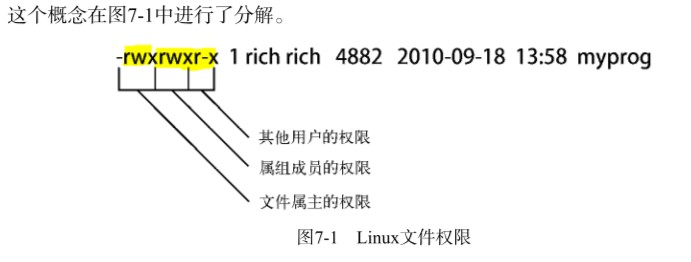
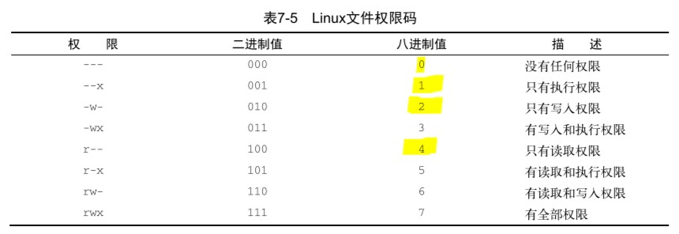
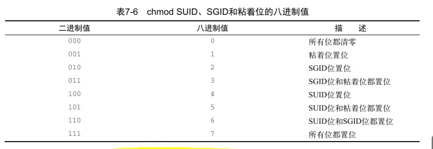
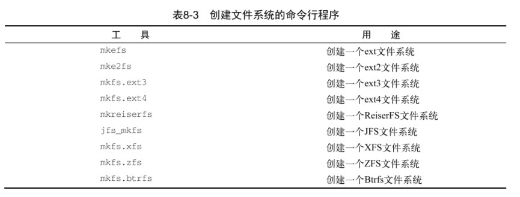
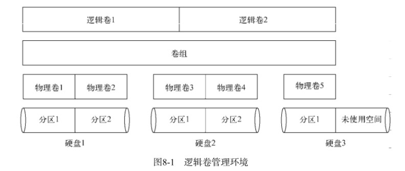
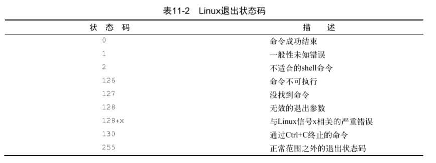
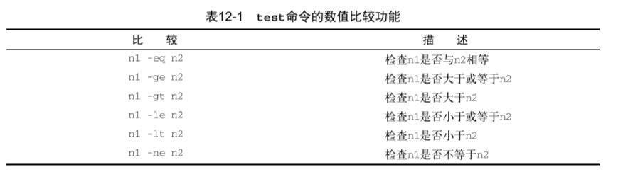
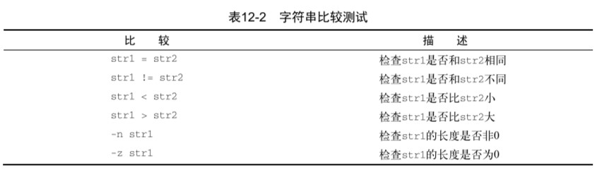
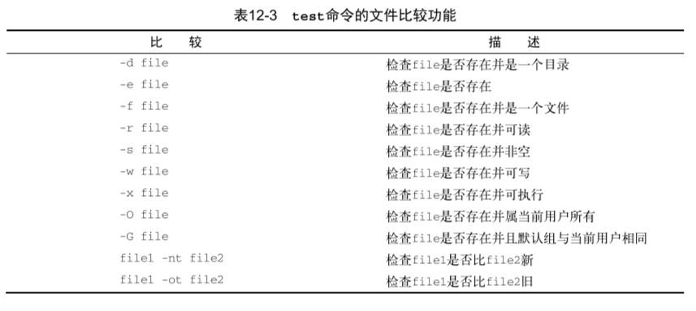
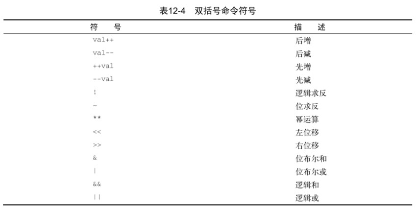

Linux命令行和shell编程

## Linux简介

*   Linux内核
*   GUN工具
*   图形化桌面环境
*   应用软件

### 内核功能

#### 系统内存管理

**交换空间（swap space）** 通过硬盘上的储存空间实现虚拟内存

**页面（page）** 内存储存单元按照组划分为很多块

内存会维护一个内存页面表，指明那些页面位于物理内存，那些位于磁盘上。

#### 软件程序管理

**进程** 指运行中的程序

#### 硬件设备管理

Linux系统将硬件设备当作特殊的文件，称为设备文件

*   字符型设备文件
*   块设备文件
*   网络设备文件

#### 文件系统管理

Linux内核支持通过不同的文件系统从硬盘中读取数据

Linux内核采用虚拟文件系统（Virtual File System，VFS）作为和每个文件系统交互的接口，挂载文件系统时，VFS将信息缓存在内存中

### GUN工具

1.  核心GNU工具（coreutils（core utilities））

    *   用于处理文件的工具
    *   用于处理文本的工具
    *   用于管理进程的工具

2.  shell

    GNU/Linux shell是一种特殊的交互式工具。它为用户提供了启动程序、管理文件系统中的文 件以及运行在Linux系统上的进程的途径。

### Linux桌面环境

1.  X window系统

    X Window软件是直接和PC上的显卡及显示器打交道的底层程序。它控制着Linux程序如何在 电脑上显示出漂亮的窗口和图形。

2.  KDE桌面

    类Microsoft Windows的图形化桌面环境

3.  GNOME桌面

4.  Unity桌面

    Ubuntu使用

## shell常用命令

### 基本shell命令

~~~shell
cd # 切换目录

ls # 显示当前目录下文件和目录
	-l # 显示详细信息
~~~

#### 处理文件

~~~shell
touch # 创建文件

cp # 复制文件
	-R # 递归复制
~~~

#### 链接文件

~~~shell
ln # 硬链接
	-s # 软连接
~~~

#### 移动重命名

~~~shell
mv # 移动文件或者重命名
~~~

#### 删除文件

~~~shell
rm # 删除文件
	-i # 提示是否删除
	-f # 强制删除
	-r # 删除文件及目录
~~~

#### 建立目录

~~~shell
mkdir # 新建目录
	-p # 建立多级目录
~~~

#### 删除目录

~~~shell
rmdir # 删除空目录
~~~

#### 产看文件类型

~~~shell
fiel # 产看文件类型（编码、脚本、可执行）
~~~

#### 产看文本文件内容

~~~shell
cat # 显示文本
	-n # 显示行号
	
	
more # 显示一页的内容

less # 高级more

tail # 显示尾部内容（默认10行）
	-n # 指定显示行数
	-f # 实时查看（其他程序使用时）
	
	
head # 显示头部内容（默认10行）
	-n # 指定行数
~~~

### 监测程序

#### 探查进程

~~~shell
ps # 显示进程信息
	-a # 显示所有进程
	-f # 显示完整信息
	-l # 显示长格式信息
~~~

>   ps中的信息：
>
>   UID：启动进程的用户
>
>   PID：进程ID
>
>   PPID：父进程的ID
>
>   C：CPU利用率
>
>   STIME：进程启动时的系统时间
>
>   TTY：进程启动时的终端
>
>   TIME：累计CPU时间
>
>   CMD：启动的程序名称
>
>   S：进程状态（O：正在运行；S：休眠；R：可运行；Z：僵化，进程已结束但父进程已不存在；T：停止）

#### 实时显示

~~~shell
top # 实时显示进程信息
## top运行时的命令
f # 选择输出排序的字段
d # 修改轮询间隔
q # 退出top
~~~

>   top中的信息：
>
>   PID：进程ID
>
>   USER：进程属主名
>
>   PR：优先级
>
>   NI：谦让度
>
>   VIRT：占用虚拟内存总量
>
>   RES：占用物理内存总量
>
>   SHR：进程和其他进程共享的内存总量
>
>   S：进程的状态（D：可中断的休眠状态；R：可运行；S：休眠；T：跟踪状态或停止状态；Z：僵化）
>
>   %CPU：使用CPU的时间比例
>
>   %MEM；占用内存比例
>
>   TIME+：从启动为止的CPU时间
>
>   COMMAND：启动的程序名

平均负载有三个值：最近1分钟、5分钟、15分钟的平均负载。值越大，负载越高。

#### 结束进程

~~~shell
kill # 给进程发送控制信号，默认为TERM；只能用进程的PID
	-s # 指定信号（用信号名或信号值）
killall # 支持通过进程名来结束进程，也支持通配符
~~~

| 信号值 | 信号名 | 描述                         |
| ------ | ------ | ---------------------------- |
| 1      | HUP    | 挂起                         |
| 2      | INT    | 中断                         |
| 3      | QUIT   | 结束进行                     |
| 9      | KILL   | 无条件终止                   |
| 11     | SEGV   | 段错误                       |
| 15     | TERM   | 尽可能终止                   |
| 17     | STOP   | 无条件停止运行，但不终止     |
| 18     | TSTP   | 停止或暂停，但继续在后台运行 |
| 19     | CONT   | 在STOP或TSTP之后恢复执行     |

### 磁盘监测

#### 挂载存储媒体

~~~shell
mount -t type device directory # 挂载指定设备
# type指定磁盘文件系统类型，device设备名，directory挂载点
~~~

#### 取消挂载

~~~shell
umount direcorty|device # 卸载，支持通过设备文件或是挂载点卸载
~~~

#### 查看挂载磁盘信息

~~~shell
df # 显示已挂载设备信息
	-h # 使用易读形式显示
	
	
du # 显示某个特定目录（默认当前目录）的磁盘使用情况，一磁盘块为单位
	-h # 使用易读形式显示
~~~

### 处理数据文件

#### 数据排序

~~~shell
sort file1 # 对文本中的数据进行排序
	-n # 将数字识别为数字而不是字符
	-M # 按月排序
~~~

#### 搜索数据

~~~shell
grep [options] pattern [file] # 在指定文件中查找包含匹配指定模式的字符的行（可使用正则表达式）
	-v # 反向搜索（输出不匹配的行）
	-n # 显示行号
	-c # 只显示有多少行包括匹配的模式
	-e # 指定多个匹配模式，使用-e来指定每个模式
	
~~~

#### 压缩数据（单个文件）

| 工具                            | 文件拓展名 |
| ------------------------------- | ---------- |
| bzip2（单个文件，不保留源文件） | .bz2       |
| compress（基本淘汰）            | .Z         |
| gzip（单个文件，不保留源文件）  | .gz        |
| zip（可以打包)                  | .zip       |

~~~shell
gzip file # 压缩指定文件（可使用通配符批量压缩）

gzcat # 查看压缩过的文本文件的内容

gunzip # 解压文件
~~~

#### 归档文件

~~~shell
tar function [options] object1 object2 ... # 将指定文件按选项归档
	-t # 列出已归档文件内容
	-c # 切换到指定目录
	-f # 输出结果到文件
	-v # 在处理时显示文件
# 例子
tar -cvf test.tar test/ test2/ # 将目录 test 和 test2 归档到 test.tar 文件
tar -tf test.tar # 查看 test.tar 内容
tar -xvf test.tar # 提取 test.tar 内容
~~~

**窍门：** 以 .tgz 结尾的文件是gzip压缩过的tar文件，可以使用命令`tar -zxvf filename.tgz` 来解压

## 理解shell

### shell类型

用户配置文件：/etc/passwd ，在第七个字段列出了默认shell程序

shell 程序位于：/bin 目录下

交互 shell ：用于用户与系统进行交互

系统 shell ：用于在系统启动时，启动脚本，默认位置是 /bin/sh

常见shell程序：

| 系统   | 默认交互 shell | 默认系统 shell |
| ------ | -------------- | -------------- |
| CentOS | bash           | bash           |
| Ubuntu | bash           | dash           |

### shell的父子关系

从shell中创建的shell称为子shell，子shell中也可创建子shell；可以从`ps` 命令中的 PID和PPID看出 shell 的父子关系

#### 进程列表

命令列表：在命令间加入`;` ，命令会依次执行

~~~shell
# 例如
pwd ; ls ; cd /etc ; pwd ; cd ; pwd ; ls
~~~

进程列表：命令列表加上括号（进程列表会生成一个子shell来执行命令）

~~~shell
# 例如
(pwd ; ls ; cd /etc ; pwd ; cd ; pwd ; ls)
~~~

可以使用环境变量命令查看是否生成了子 shell

~~~shell
echo $BASH_SUBSHELL
~~~

#### 子shell用法

##### 后台模式

在后台模式中运行命令可以在处理命令的同时让出CLI，以供使用；在命令末尾加上字符`&` 将命令置入后台模式

~~~shell
# 例子
sleep 300&
~~~

在执行上述例子后，会输出两条信息，第一条是显示在方括号中的*后台作业号（background job）* ，第二条是后台作业的进程ID

显示后台作业信息

~~~shell
jobs # 显示后台作业信息
	-l # 显示命令的PID
~~~

##### 将进程列表置入后台

~~~shell
# 例子
(sleep 2 ; echo $BAUSH_SUBSHELL ; sleep 2)&
~~~

##### 协程

协程可以同时做两件事。在后台生成一个子 shell，并在这个子 shell 中执行命令。

~~~shell
# 例子
coproc sleep 10
~~~

可以使用命令的拓展语法设置协程名（默认为COPROC）

格式：coproc 协程名 { 命令； } ；第一个花括号和协程名之间有一个空格；命令以分号结尾；分号和闭花括号之间也有空格

~~~shell
# 例子
coproc MY_Job { sleep 10; } # 注意格式
~~~

#### shell的内建命令

##### 外部命令

也称为文件系统命令，是存在于bash shell之外的程序。通常位于/bin、/usr/bin、/sbin或/usr/sbin中

~~~shell
# 使用which可以显示命令位置
which ps # 显示ps命令位置

# 使用type可以显示命令的类型
# 例子
type -a ps # 显示ps命令类型
~~~

当外部命令执行时，会创建出一个子进程。这种操作被称为衍生（forking）。

##### 内建命令

内建命令不需要使用子进程来执行，有些命令有多种实现。例如echo和pwd既有内建命令也有外部命令

~~~shell
history # 命令执行历史
# 命令历史记录被保存在隐藏文件.bash_history 中，位于用户的主目录
# bash的命令记录缓存在内存中，当shell退出时才写入文件
	-a # 强制写入命令历史
# 使用惊叹号和命令的编号即可唤回命令
!20 # 唤回第20条命令

alias # 别名
	-p # 当前可用别名
# 例子
alias li='ls -li' # 创建别名
~~~

## Linux环境变量

### 环境变量

bash shell 使用环境变量（environment variable）特性来存储有关shell会话和工作环境的信息，这项特性使得可以在内存中存储数据

环境变量分为两类：

*   全局环境变量
*   局部环境变量

#### 全局环境变量

全局变量对于shell会话和所有生成的子shell都可见。系统环境变量基本都是使用全大写字母，以区别普通用户的环境变量。可以使用env或printenv命令查看全局变量

~~~shell
printenv # 查看全局环境变量，也可使用env命令

printenv 变量名 # 查看个别变量，不能使用env命令

# 可以使用echo显示变量值，在环境变量前加上$（美元符）
# 例子
echo $HOME # 输出HOME变量值
~~~

#### 局部环境变量

局部变量只能在定义它们的进程中可见，用户可以自定义自己的局部变量，被称为用户定义局部变量

~~~shell
set # 显示全部变量（包括全局变量、局部变量和用户定义变量），并按照字母顺序排序
~~~

### 用户定义变量

#### 设置局部用户定义变量

在shell中，通过等号给环境变量赋值，值可以是数值或字符串。只能在当前shell中使用

~~~shell
my_variable=Hello # 变量赋值，变量名、等号和值之间没有空格
# 在自定义局部变量时，使用小写字母避免重新定义系统变量

~~~

#### 设置全局环境变量

先创建一个局部环境变量，然后通过`exprot`命令将它导出到全局环境中

~~~shell
my_variable="I am Global now" # 创建局部变量

exprot my_variable # 导出到全局环境
~~~

在子shell中修改全局变量不会影响父shell中的值（使用export命令也不行）

### 删除环境变量

使用`unset`命令，在`unset`命令中引用环境变量时，不要用$

~~~shell
unset my_variable # 删除变量
~~~

在子shell 中删除全局环境变量，只对子shell有效。

### 默认的shell环境变量

默认情况下，bash shell 会用一些特定的环境变量来定义系统环境

| 变量     | 描述                                                         |
| -------- | ------------------------------------------------------------ |
| HOME     | 当前用户的主目录                                             |
| PATH     | shell查找命令的目录列表，由冒号分隔                          |
| BASH     | 当前shell实例的全路径名                                      |
| BASH_ENV | 设置了的话，每个bash脚本会在运行前尝试运行该变量定义的启动文件 |
| HOSTNAME | 当前的主机名                                                 |
| LANG     | shell的语言环境类别                                          |
| LC_ALL   | 定义了一个语言环境类别，能够覆盖LANG变量                     |

### 设置PATH环境变量

PATH环境变量定义了用于进行命令和程序查找的目录

将新的搜索目录添加到现有的PATH环境变量中，需要引用原来的PATH值，然后添加新的目录

~~~shell
PATH=$PATH:/home/user/scripts # 在PATH中添加新的目录
~~~

### 定位系统环境变量

在登入Linux系统启动bash shell 时，默认bash会在几个文件中查找命令。这些文件叫做**启动文件**或**环境文件** 

启动bash shell 有3中方式：

*   登录时作为默认登录shell
*   作为非登录shell的交互式shell
*   作为运行脚本的非交互式shell

#### 登录shell

登录shell会从5个不同的启动文件里读取命令：

*   /etc/profile
*   $HOME​/.bash_profile
*   $HOME/.bashrc
*   $HOME/.bash_login
*   $HOME/.profile

1.  /etc/profile文件是系统上默认的bash shell的主启动文件

2.  $HOME目录下的启动文件

    提供一个用户专属的启动文件来定义用户用到的环境变量，通常使用一下文件的一到两个

    *   $HOME/.bash_profile
*   $HOME/.bash_login
    *   $HOME/.profile
*   $HOME/.basrc

#### 交互式shell进程

交互式shell不会访问/etc/profile文件，只会检查用户家目录下的.bashrc文件

### 非交互式shell

系统执行shell脚本的时候使用的就是这种shell，bash shell 提供了BASH_ENV环境变量

对于启动子shell的脚本，子shell会继承父shell的全局环境变量

对于不启动子shell的脚本，脚本会使用当前shell的环境变量

#### 环境变量持久化

将环境变量写入以上使用的文件中，即可

**注：/etc/profile文件会在发行版升级后跟新，推荐在/etc/profile.d目录创建一个以.sh结尾的文件存储全局变量**

个人用户永久性bash shell变量存储在$HOME/.bashrc文件（可以将别名置入其中，使其效果永久化）

### 数组变量

要给莫格环境变量设置多个值，可以把值放在括号里，值与值之间用空格分隔

~~~shell
mytest=(one two three four five)
~~~

使用索引值来引用一个数组元素

## Linux文件权限

Linux沿用了Unix文件权限的办法，即允许用户和组根据每个文件和目录的安全性设置来访问文件

### Linux的安全性

Linux安全系统的核心是用户账户，用户对系统中各种对象的访问权限取决于他们登陆系统时的账户

用户权限是通过创建用户时分配的用户ID（User ID，UID）来追踪的

UID是唯一的

#### /etc/passwd文件

Linux系统使用一个专门的文件来讲用户的登录名匹配到对应的UID值，/etc/passwd文件包含了一些用户信息

*   登录用户名
*   用户密码（密码实际保存在/etc/shadow文件中）
*   用户账户的UID
*   用户账户组的GID
*   用户账户的文本描述（备注字段）
*   用户HOME目录的位置
*   用户的默认shell

root用户的UID是0

*系统账户：系统上运行各种服务进程访问资源用的特殊账户*

Linux为系统账户预留了500以下的UID值

#### /etc/shadow文件

/etc/shadow文件为系统上的每个用户都保存了一条记录，并且只有root用户能够访问

*   与/etc/passwd文件中的登录名字段对应的登录名
*   加密后的密码
*   自上次修改密码后过去的天数（自1970-1-1算起）
*   多少天后才能更改密码
*   多少天后必须更改密码
*   密码过期前提前多少天提醒用户更改密码
*   密码过期后多少天禁用用户账户
*   用户账户被禁用的日期（用自1970-1-1到当天的天数表示）
*   预留字段给将来使用

#### 添加新用户

~~~shell
useradd # 添加用户（会使用默认值及命令行参数来设置）
	—D # 查看设置默认值（后跟选项修改默认设置）
	-m # 创建HOME目录，并添加模板文件
~~~

系统默认值被设置/etc/default/useradd文件中

模板文件位于/etc/skel下，CentOS 7 中有*.bash_logout* *.bash_profile* *.bashrc* 文件

#### 删除用户

~~~shell
userdel # 删除用户（不删除用户的HOME目录）
	-r # 删除用户目录及邮件目录
~~~

#### 修改目录

~~~shell
usermod # 修改/etc/passwd文件字段
	-l # 修改用户账户的登录名
	-L # 锁定账户，使用户无法登录
	-p # 修改账户的密码
	-U # 解除锁定，使用户能够登录
	
passwd # 修改账户密码（只有root能修改其他账户）
	-e # 强制用户下次登录时修改密码
	
chpasswd # 批量修改（可以从标准输入自动读取登录名和密码对列表）
# 可以使用重定向将含有userid:passwd对的文件重定向给给文件
#例子
chpasswd < users.txt #user.txt含有userid:passwd对列表

chsh # 修改默认用户登录shell（必须用shell的全路径作为参数）

chfn # 在/etc/passwd文件的备注字段中存储信息

chage # 管理用户的有效期
	-E # 设置密码过期的日期
	-I # 设置密码过期到锁定账户的天数
	-W # 设置密码过期前多久开始出现提醒信息
~~~

### Linux组

组权限允许多个用户对系统中的对象（文件、目录或设备等）共享一组共用的权限。每个组都有唯一的GID和唯一的组名

#### /etc/group文件

组信息保存在/etc/group文件中，有四个字段

*   组名
*   组密码（用户通过组密码称为临时组员）
*   GID
*   属于该组的用户列表（不含指定该组为默认组的账户）

#### 创建新组

~~~shell
groupadd # 创建新组

# 使用usermod添加用户
usermod -G 组名 用户名
~~~

#### 修改组

~~~shell
groupmod # 修改组
	-g # 修改已有组的GID
	-n # 修改组名
~~~

### 文件权限

在ls -l显示的权限中，第一位代表对象的类型，之后三组字符编码，定义了三种访问权限

*   r 代表对象是可读的
*   w 代表对象是可写的
*   x 代表对象是可执行的

三组权限对应三个安全级别

*   对象的属主
*   对象的属组
*   系统的其他用户

#### 默认权限

~~~shell
umask # 设置所创建文件和目录的默认权限
# umask是掩码，他会屏蔽掉不想授予该安全级别的权限
# 例子
$ umask
0022
# 第一位代表了一项特别的安全特性，叫做粘着位（sticky bit）
# 后三位标识文件或目录对应的umask八进制值
~~~

对于文件，全权限的值是666，对目录，则是777

umask值通常设置在/etc/profile启动文件中，有些是在/etc/login.defs文件中（如Ubuntu）

#### 安全性设置

~~~shell
chmod # 改变文件和目录的安全性设置
	-R # 权限得改变递归地作用到文件和子目录
#格式
chmod options mode file # mode参数可以用八进制模式或者符号模式进行安全性设置
# 八进制文件权限会自动应用到指定的文件上
~~~

符号模式权限的格式

[ugoa...] [+-=] [rwxXstugo...]

第一组字符定义权限作用的对象

*   u代表用户
*   g代表组
*   o代表其他
*   a代表上述所有

后面的符号

*   +代表在现有权限基础上增加
*   -代表在现有权限基础上移除
*   =将权限设置成后面的值

最后的

*   X如果对象是目录或者它已有执行权限，赋予执行权限
*   s运行时重新设置UID或GID
*   t保留文件或目录
*   u将权限设置为跟属主一样
*   g将权限设置为跟属组一样
*   o将权限设置跟其他用户一样

~~~shel
# 例子
chmod o+r newfile # 为其他用户添加读取权限
chmod u-x newfile # 移除属主已有的执行权限
~~~

#### 改变所属关系

~~~shell
chown # 改变文件的属主（只有root能改变文件的属主）
	-R # 递归改变
	-h # 改变该文件的所有符号链接文件的所属关系
#格式
chown options owner.[group] file

chgrp # 改变文件的默认属组（文件的属主能更改属组，还得是新组的成员

~~~

### 共享文件

Linux系统上共享文件的方法是创建组

Linux为文件和目录存储了额外的三个信息位

*   设置用户ID（SUISD）：当文件被用户使用时，程序会以文件属主的权限运行
*   设置组ID（SGID）：对文件来说，程序会以文件属组的权限运行，对目录来说，目录中创建的新文件会以目录的默认属组作为默认属组
*   粘着位：进程结束后文件还驻留（粘着）在内存中

启用SGID后，可以强制在一个共享目录下创建的新文件都属于该目录的属组，这个组也就成为了每个用户的属组

SGID可通过chmod命令设置，加到标准3位八进制前（组成4位八进制），或在符号模式下用符号s

## 文件系统

### Linux文件系统

Linux支持多种类型的文件系统管理文件和目录。每种文件系统都在存储设备上实现了虚拟目录结构，仅特性略有不同

#### 基本Linux文件系统

| 名称                                | 描述                                       | 优缺点                                                       |
| ----------------------------------- | ------------------------------------------ | ------------------------------------------------------------ |
| ext文件系统（extended file system） | 使用块存储数据，使用索引节点存储文件的信息 | 文件最大2GB，存储碎片化，                                    |
| ext2文件系统                        | 拓展了索引表文件内容（时间节点）           | 文件最大2TB（后期增加到32TB）；通过按组分配磁盘减轻碎片化；容易在系统崩溃或断电时损坏 |

#### 日志文件系统

日志文件系统是先将文件写入临时文件（称为日志，journal）中，在数据成功写到存储设备和索引节点表后，在删除对应的日志条目

Linux中有三种保护等级不同的日志方法

| 方法     | 描述                                                 | 优缺点                   |
| -------- | ---------------------------------------------------- | ------------------------ |
| 数据模式 | 索引节点和文件都会被写入日志                         | 丢失数据风险低；但性能差 |
| 有序模式 | 只有索引节点数据会被写入日志，数据成功写入后才删除   | 性能和安全性中等         |
| 回写模式 | 只有索引节点数据会写入日志，但不控制文件数据何时写入 | 性能高，风险高           |

##### 使用日志的文件系统

| 名称                                 | 描述                                                         | 优缺点                                 |
| ------------------------------------ | ------------------------------------------------------------ | -------------------------------------- |
| ext3文件系统                         | 对于ext2增加了日志文件，默认使用有序模式                     | 没有内建的数据压缩功能；不支持加密文件 |
| ext4文件系统                         | 支持数据压缩和加密，还支持区段特性；引入块预分配技术（block preallocation） |                                        |
| Reiser文件系统                       | 只支持回写日志模式；支持在线调整已有文件系统的大小；引入尾部压缩（tailpacking）技术（一个文件的数据可以填进另一个文件的数据块中的空白空间） | Linux中最快的日志文件系统之一          |
| JFS文件系统（Journaled File System） | 采用有序日志方法；基于区段的文件分配                         |                                        |
| XFS文件系统                          | 采用回写模式的日志；允许在线调整文件系统大小，但之只能扩大   |                                        |

#### 写时复制文件系统

使用写时复制（copy-on-write，COW）技术，COW利用快照兼顾了安全性和性能。如果要修改数据，会使用克隆或可写快照；修改过的数据并不会直接覆盖当前数据，而是存放在其他位置

| 名称                        | 描述                                         |
| --------------------------- | -------------------------------------------- |
| ZFS文件系统                 | 未使用GPL许可                                |
| Btrf文件系统（B树文件系统） | 稳定、易用；能够动态调整已挂载文件系统的大小 |

### 操作文件系统

#### 创建分区

~~~shell
fdisk # 分区工具（交互程序）
# 格式
fdisk 设备名（绝对路径）
# 交互命令
	d 删除分区
	l 显示可用分区类型
	n 添加一个新分区
	q 退出，不保存更改
	w 将分区表写入磁盘
	p 显示设备详细信息
~~~

#### 创建文件系统

不同文件系统格式化命令不同

~~~shell
# 格式化
命令 分区
# 例子
mkfs.ext4 /dev/sdb1 # 将ext4文件系统写入sdb1分区
~~~

在创建文件系统后，将其挂载到虚拟目录下的挂载点，就可使用了

~~~shell
mount # 挂载命令（临时挂载，重启失效）
	-t # 指明要挂载的文件系统类型
# 要自动挂载可将信息添加到/etc/fstab文件
~~~

#### 文件系统的检查可修复

~~~shell
fsck # 检查修复文件系统
	-t # 指定文件系统类型（未挂载的设备需要使用）
	-a|-y # 如果检测到错误，自动修复
	-r # 提示错误
	-V # 详细输出
# 格式
fsck options filesystem # 文件系统可以通过设备名、挂载点、UUID引用
~~~

### 逻辑卷管理

**Linux逻辑卷管理（logical volume manager，LVM）**

#### 逻辑卷管理布局

硬盘称为**物理卷（physical volume，PV）**，每个逻辑卷都会映射到硬盘上特定的物理分区

多个物理卷集中在一起形成一个**卷组（volume group，VG）**，卷组提供创建逻辑分区的平台

结构的队后一层是**逻辑卷（logical volume，LV）**，逻辑卷提供了创建文件系统的分区环境 ，Linux系统将逻辑卷视物理分区

#### Linux中的LVM

*   LVM1，只能用于Linux内核2.4版本，提供了基本的逻辑卷管理功能
*   LVM2，可用于Linux内核2.6版本，提供了额外功能

1.  快照

    LVM1只能创建只读快照。LVM2允许创建在线逻辑卷的可读写快照

2.  条带化

    可跨多个物理硬盘创建逻辑卷（不同于RAID条带化，LVM条带化没有提供容错）

3. 镜像

   LVM镜像是实时更新的逻辑卷的完整副本 

#### 使用Linux LVM

1.  定义物理卷

    将硬盘上的物理分区转换为Linux LVM的物理卷区段，使用`fdisk`命令，通过`t`命令改变分区类型（8e类型表示分区会作为Linux LVM系统的一部分）；然后通过`pvcreate`命令创建实际的物理卷

    ~~~shell
    pvcreate /dev/sdb1 # 创建物理卷
    pvdisplay /dev/sdb1 # 查看物理卷信息
    ~~~

2.  创建卷组

    ~~~shell
    vgcreat Vol1（卷组名） /dev/sdb1 # 创建卷组
    vgdisplay Vol1 # 查看卷组信息
    ~~~

3.  创建逻辑卷

    ~~~shell
    lvcreate -l 100%FREE -n lvtest Vol1 # 创建逻辑卷使用全部空闲空间，卷名lvtest，在Vol1卷组创建
    	-l # 指定分配区段数，或百分比
    	-L # 指定使用大小（KB、MB、GB）
    	-n # 指定逻辑卷名
    lvdisplay Vol1# 查看逻辑卷信息
    ~~~

4.  创建文件系统

    ~~~shell
    mkfs.ext4 /dev/Vol1/lvtest # 在逻辑卷lvtest中写入ext4文件系统
    ~~~

5.  挂载使用

    ~~~shell
    mount /dev/Vol1/lvtest /mnt/my_partition # 将lvtest卷挂载至/my_partition
    ~~~

**注意：在写入文件系统和挂载使用时，使用卷组名和逻辑卷名，而不是物理分区路径**

#### 修改LVM

Linux LVM包中的常见命令

| 命令     | 功能               |
| -------- | ------------------ |
| vgchange | 激活和禁用卷组     |
| vgremove | 删除卷组           |
| vgextend | 将物理卷加到卷组中 |
| vgreduce | 从卷组删除物理卷   |
| lvextend | 增加逻辑卷大小     |
| lvreduce | 减小逻辑卷大小     |

## 安装软件程序

包管理系统（package management system，PMS）

### 包管理基础

PMS利用一个数据库记录相关内容

*   Linux系统上安装的软件包
*   每个包安装了什么文件
*   每个安装的软件包的版本

软件包存储在远程服务器上，这些服务器称为**仓库（repository）**，PMS工具会检测软件包的依赖关系，并在安装需要的包之前安装需要的包

*   基于Debian的发行版，使用的时dpkg命令

*   基于Red Hat的发行版，使用的时rpm命令

    两者都能列出已安装包、安装新包和删除已有包

### 基于Debian的系统

基于Debian系PMS工具的核心是dpkg命令，包含

*   apt-get
*   apt-cache
*   aptitude

#### 用aptitude管理软件包

aptitude具有交互界面，也可使用单个命令的方式

~~~shell
aptitude show package_name # 显示某个特定包的详细信息，但无法显示安装的相关包

dpkg -l package_name # 列出了安装的所有相关的包

dpkg --search absolute_file_name # 查看特定文件属于那个软件包（使用绝对路径）
~~~

#### 用aptitude安装软件包

~~~shell
aptitude search package_name # 查找包（隐式添加通配符）
# i 表示已经安装；p或v表示包可用，但没安装；c 表示包被删除，但配置还在

aptitude install package_name # 安装指定包（自动安装包依赖）
~~~

#### 用aptitude更新软件

~~~shell
aptitude safe-upgrade # 更新系统上所有包（自动检查依赖）

aptitude full-upgrade # 更新系统所有包（不检查依赖）
aptitude dist-upgrade # 同上
~~~

#### 用aptitude卸载软件

~~~shell
aptitude remove package_name # 只卸载包，不删除数据和配置
aptitude purge package_name # 完全删除包
~~~

#### aptitude仓库

`aptitude`仓库位置存储在文件`/etc/apt/sources.list`中

### 基于 Red Hat 的系统

基于 Red Hat 的系统的核心是rpm工具，常见：

*   yum：Red Hat 和 Fedora
*   urpm：Mandriva
*   zypper：openSUSE

#### 列出已安装包

~~~shell
yum list installed # 列出系统上已安装的包

yum list package_name # 查看指定包的信息

yum list installed package_name # 查看包是否安装

yum provides file_name # 查看指定文件属于那个包
~~~

#### 用 yum 安装软件

~~~shell
yum install package_name # 安装指定包（自动安装依赖）

yum localinstall package_name.rpm # 下载rpm包后本地安装
~~~

#### 用 yum 更新软件

~~~shell
yum list updates # 列出所有可用更新

yum update package_name # 更新指定包

yum update # 更新所有包
~~~

#### 用 yum 卸载软件

~~~shell
yum remove package_name # 只删除软件包保留配置和数据

yum erase package_name # 清除所有文件
~~~

#### 处理损坏的包依赖关系

损坏的包依赖关系（broken dependency）

~~~shell
yum clean all # 清除问题文件，然后更新

yum deplist package_name # 显示包依赖

yum update --skip-broken # 忽略依赖关系损坏的包，更新其他包
~~~

#### yum 软件仓库

~~~shell
yum repolist # 显示正在使用的仓库
~~~

配置文件位置`/etc/yum.repos.d`

### 从源码安装

1.  下载源码包，然后解包
2.  进入源码目录
3.  查看README文件
4.  执行`./configure`（检查依赖）
5.  使用`make`命令构建二进制文件，创建可执行文件（要安装到Linux系统中常用位置，使用`make install`命令

## 使用编辑器

1.  vim 编辑器
2.  nano 编辑器
3.  emacs 编辑器
4.  KDE 系编辑器
    1.  KWrite
    2.  Kate
5.  GNOME 编辑器
    1.  gedit

------

## 构建基本脚本

### 使用多个命令

在同一行的多个命令之间使用分号隔开，命令会顺序执行

### 创建 shell 脚本

shell 脚本的第一行指定要使用的shell，格式为

~~~shell
#! /bin/bash
~~~

先给脚本添加执行权限，然后要让 shell 能运行脚本有两个方法：

*   将脚本所在目录添加至PATH环境变量中
*   使用路径（两种都可）来引用shell脚本文件

### 显示信息

使用 `echo` 命令输出字符串，默认可以不使用引号；如果想字符串和命令结果显示在同一行，使用`echo -n` ，字符串两侧要添加引号，并且字符串尾部要有一个空格

~~~shell
# 例子
echo -n "The time and date are: "
~~~

### 使用变量

变量允许临时性地将信息存储在shell脚本中，以便和脚本中地其他命令一起使用

#### 环境变量

在环境变量名称前加上美元符（\$）来使用这些环境变量\$varialble，其他形式：\${variable}

#### 用户变量

用户变量可以是由字母、数字或下划线组成的文本字符串，长度不超过20个；区分大小写

在赋值时，等号两边不能有空格

引用变量时要使用美元符，赋值是不需要

#### 命令替换

从命令输出中提取信息，并将其赋给变量，的方法：

*   反引符号（\`)
*   \$()格式

shell会运行命令替换符中的命令，并将其输出赋给变量

~~~shell
date +%y%m%d # 以两位数的年月日组合显示日期
140131
~~~

**注意：命令替换会创建一个子 shell 来运行对应的命令，**

### 重定向输入和输出

#### 输出重定向

最基本的重定向将命令的输出发送到一个文件中，bash shell 使用大于号（>）（覆盖式重定向）；（>>）（追加式重定向）

#### 输入重定向

输入重定向将文件的内容重定向到命令，使用小于号（<）

*内联输入重定向（inline input redirection）* ，使用（<<），还必须指定一个文本标记来划分输入数据的开始和结尾

~~~shell
command << marker
# 例子
wc <<EOF
>test string1
>test string2
>test string3
>EOF
# 输出
3 9 42 # wc命令会对内联输入重定向提供的数据进行行、词和字节的计数
~~~

### 管道

管道连接（piping），将一个命令的输出作为另一个命令的输入；使用管道符（|）连接两个命令

Linux系统实际上会同时运行这连个命令，在系统内部将它们连接起来；在第一个命令产生输出的同时，输出会被立即送给第二个命令，数据传输不会用到任何中间文件或缓冲区

### 执行数学运算

#### expr命令

expr命令允许在命令行上处理数学表达式，但只能识别少数的数学和字符串操作符

#### 使用方括号

在 bash 中，在将一个数学运算结果赋给某个变量时，可以用美元符和方括号（\$[ operation ]）将数学表达式围起来，但 bash shell 的数学运算只支持整数运算（zsh 提供了完整的浮点数算数操作）

#### 浮点解决方案

bash 内建计算器 bc

##### bc 的基本用法

bash 计算器实际上是一种编程语言，允许在命令行中输入浮点表达式，bash 计算器能识别：

*   数字（整数和浮点数）
*   变量（简单变量和数组）
*   注释（以 # 或 C 语言中的 /* */ 开始的行）
*   表达式
*   编程语句（例如 if-then 语句）
*   函数

浮点运算是由内建变量 scale 控制的，将这个值设置为计算结果中保留的小数位数

~~~shell
bc -q # -q 打开时跳过欢迎信息
scale=4 # 四位浮点数，scale 默认值是0
3.44 / 5
.6880
quit # 退出
~~~

##### 在脚本中使用bc

可以使用命令替换运行 bc 命令，并将输出赋给一个变量

~~~shell
variable=$(echo "options; expression" | bc)
# options：设置变量；expression：定义数学表达式（可以使用变量）
# 例子
var1=$(echo "scale=4;3.44/5" | bc) 
echo The answer is $var1
~~~

bc命令能识别输入重定向，最好使用内联重定向

~~~shell
variable=$(bc << EOF
options
statements
expression
EOF
)
~~~

可以在 bash 计算器中赋值给变量**在 bash 计算器中创建的变量只在 bash 计算器中有效，不能在 shell 脚本中使用**

### 退出脚本

shell 中运行的每个命令都使用*退出状态码（exit status*）告诉 shell 它已经运行完毕

#### 查看退出状态码

Linux 提供了一个专门的变量\$? 来保存上个已执行命令的退出状态码

常见退出状态码

#### exit 命令

默认情况下，shell 脚本会以脚本的最后一个命令的退出状态码退出

exit 命令允许在脚本结束时指定一个退出状态码（可以使用变量）

如果指定的状态码大于255，shell会通过模运算（对256取余）将结果缩减到0-255区间

## 使用结构化命令

使用结构化命令（structured command）可以改变程序执行的顺序

### if-then 语句

if-then 语句格式：

~~~shell
if command
then
	commands
fi
~~~

if 后的命令的退出状态码是0,则会运行 then 后的命令

**注意:如果 if 后的命令执行失败会在脚本输出中显示失败信息**

### if-then-else 语句

~~~shell
if command
then
	command
else
	command
fi
~~~

### 嵌套 if

当有多种条件时,可以使用嵌套的 if-then 语句

~~~shell
if command
then
	if command
	then
		command
	fi
fi
~~~

也可以使用 elif

~~~shell
if command
then
	command
elif command
then
	command
else
	command
fi
~~~

### test 命令

if-then 不能测试命令退出状态码之外的条件

test 命令则能测试不同条件,条件成立则会退出并返回状态码0;否则返回非零退出状态码

~~~shell
if test condition # condition 是 test 命令要测试的一系列参数和值
then
	commands
fi
~~~

在 bash shell 中可以使用另一种形式,无需声明 test 命令

~~~shell
if [ condition ] # 方括号中是测试条件;condition 两边都有空格
then
	commands
fi
~~~

test 命令可以判断三类条件:

*   数值比较
*   字符串比较
*   文件比较

#### 数值比较

对两个数值进行比较(在 bash shell 中只能处理整数)

#### 字符串比较

1.  字符串相等性

    字符串中的所有字符相同(包含标点和大小写情况)

2.  字符串顺序

    *   大于号和小于号必须转义,否则 shell 会将它们当作重定向符号
    *   大于和小于顺序与 sort 命令不同

    **注:在比较测试中,大写字母被认为小于小写字母,但 sort 命令相反**

    **在比较测试中使用的是标准的 ASCII 顺序,根据数值排序;sort 则使用的是系统的本地化语言设置中的定义**

3.  字符串大小

    -n 和 -z 可以检查一个变量是否含有数据

**注意:在进行数值比较是使用的是代码,而字符串比较使用的是数学符号**

#### 文件比较

### 符合条件测试

if-then 语句允许使用布尔逻辑来组合测试

*   [ condition1 ] && [ condition2 ] ,两者都需要满足
*   [ condition1 ] || [ condition2 ] ,两者满足其一即可

### if-then 的高级特性

bash shell 提供了两项可在if-then语句中使用的高级特性:

*   用于数学表达式的双括号
*   用于高级字符串处理功能的双方括号

#### 使用双括号

双括号允许在比较过程中使用高级数学表达式(其中的符号无需转义),格式如下:

`(( expression ))`

除了 test 命令使用的标准数学运算符,也可以使用其他的

#### 使用双方括号

双方括号提供了针对字符串比较的高级特性(模式匹配),格式如下:

`[ expression ]`

在模式匹配中,可以使用正则表达式来匹配字符串

### case 命令

case 命令会采用列表格式来检查单个变量的多个值

~~~shell
case variable in
pattern1) command1;;
pattern2) command2;;
pattern3) command3;;
*) commands;;
esac
~~~

\*) 用来善后(可以不写);pattern 支持简单的正则表达式