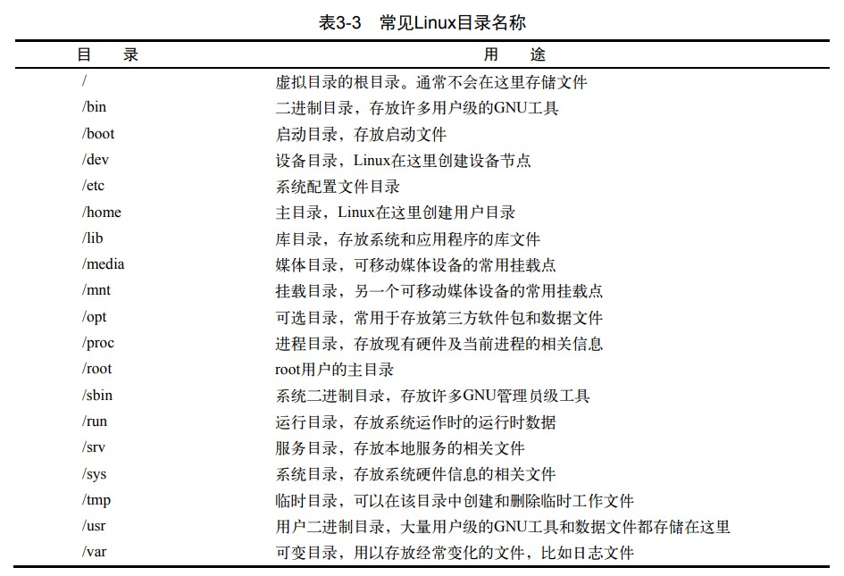

# Linux shell

## Linux

*   Linux内核
*   GUN工具
*   图形化桌面环境
*   应用软件

### 内核功能

#### 系统内存管理

**交换空间（swap space）**通过硬盘上的储存空间实现虚拟内存

**页面（page）** 内存储存单元按照组划分为很多块

内存会维护一个内存页面表，指明那些页面位于物理内存，那些位于磁盘上。

#### 软件程序管理

**进程** 指运行中的程序

#### 硬件设备管理

Linux系统将硬件设备当作特殊的文件，称为设备文件

*   字符型设备文件
*   块设备文件
*   网络设备文件

#### 文件系统管理

Linux内核支持通过不同的文件系统从硬盘中读取数据

Linux内核采用虚拟文件系统（Virtual File System，VFS）作为和每个文件系统交互的接口，挂载文件系统时，VFS将信息缓存在内存中

## GUN工具

1.  核心GNU工具（coreutils（core utilities））

    *   用于处理文件的工具
    *   用于处理文本的工具
    *   用于管理进程的工具

2.  shell

    GNU/Linux shell是一种特殊的交互式工具。它为用户提供了启动程序、管理文件系统中的文 件以及运行在Linux系统上的进程的途径。

## Linux桌面环境

1.  X window系统

    X Window软件是直接和PC上的显卡及显示器打交道的底层程序。它控制着Linux程序如何在 电脑上显示出漂亮的窗口和图形。

2.  KDE桌面

    类Microsoft Windows的图形化桌面环境

3.  GNOME桌面

4.  Unity桌面

    Ubuntu使用

## shell

### 基本shell命令

~~~shell
cd # 切换目录
ls # 显示当前目录下文件和目录
	-l # 显示详细信息
~~~

#### 处理文件

~~~shell
touch # 创建文件
cp # 复制文件
	-R # 递归复制
~~~

### 链接文件

~~~shell
ln # 硬链接
	-s # 软连接
~~~

### 移动重命名

~~~shell
mv # 移动文件或者重命名
~~~

#### 删除文件

~~~shell
rm # 删除文件
	-i # 提示是否删除
	-f # 强制删除
	-r # 删除文件及目录
~~~

#### 建立目录

~~~shell
mkdir # 新建目录
	-p # 建立多级目录
~~~

#### 删除目录

~~~shell
rmdir # 删除空目录
~~~

