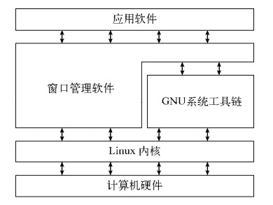
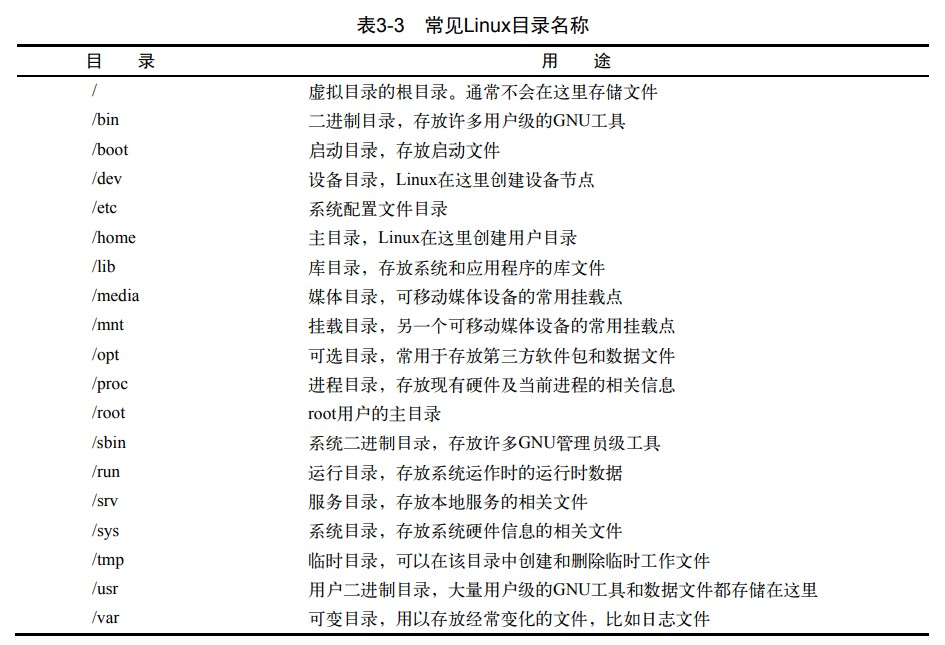

# Linux命令行和shell编程

## Linux

*   Linux内核
*   GUN工具
*   图形化桌面环境
*   应用软件

### 内核功能

#### 系统内存管理

**交换空间（swap space）** 通过硬盘上的储存空间实现虚拟内存

**页面（page）** 内存储存单元按照组划分为很多块

内存会维护一个内存页面表，指明那些页面位于物理内存，那些位于磁盘上。

#### 软件程序管理

**进程** 指运行中的程序

#### 硬件设备管理

Linux系统将硬件设备当作特殊的文件，称为设备文件

*   字符型设备文件
*   块设备文件
*   网络设备文件

#### 文件系统管理

Linux内核支持通过不同的文件系统从硬盘中读取数据

Linux内核采用虚拟文件系统（Virtual File System，VFS）作为和每个文件系统交互的接口，挂载文件系统时，VFS将信息缓存在内存中

### GUN工具

1.  核心GNU工具（coreutils（core utilities））

    *   用于处理文件的工具
    *   用于处理文本的工具
    *   用于管理进程的工具

2.  shell

    GNU/Linux shell是一种特殊的交互式工具。它为用户提供了启动程序、管理文件系统中的文 件以及运行在Linux系统上的进程的途径。

### Linux桌面环境

1.  X window系统

    X Window软件是直接和PC上的显卡及显示器打交道的底层程序。它控制着Linux程序如何在 电脑上显示出漂亮的窗口和图形。

2.  KDE桌面

    类Microsoft Windows的图形化桌面环境

3.  GNOME桌面

4.  Unity桌面

    Ubuntu使用

## shell常用命令

### 基本shell命令

~~~shell
cd # 切换目录
ls # 显示当前目录下文件和目录
	-l # 显示详细信息
~~~

#### 处理文件

~~~shell
touch # 创建文件
cp # 复制文件
	-R # 递归复制
~~~

#### 链接文件

~~~shell
ln # 硬链接
	-s # 软连接
~~~

#### 移动重命名

~~~shell
mv # 移动文件或者重命名
~~~

#### 删除文件

~~~shell
rm # 删除文件
	-i # 提示是否删除
	-f # 强制删除
	-r # 删除文件及目录
~~~

#### 建立目录

~~~shell
mkdir # 新建目录
	-p # 建立多级目录
~~~

#### 删除目录

~~~shell
rmdir # 删除空目录
~~~

#### 产看文件类型

~~~shell
fiel # 产看文件类型（编码、脚本、可执行）
~~~

#### 产看文本文件内容

~~~shell
cat # 显示文本
	-n # 显示行号
more # 显示一页的内容
less # 高级more
tail # 显示尾部内容（默认10行）
	-n # 指定显示行数
	-f # 实时查看（其他程序使用时）
head # 显示头部内容（默认10行）
	-n # 指定行数
~~~

### 监测程序

#### 探查进程

~~~shell
ps # 显示进程信息
	-a # 显示所有进程
	-f # 显示完整信息
	-l # 显示长格式信息
~~~

>   ps中的信息：
>
>   UID：启动进程的用户
>
>   PID：进程ID
>
>   PPID：父进程的ID
>
>   C：CPU利用率
>
>   STIME：进程启动时的系统时间
>
>   TTY：进程启动时的终端
>
>   TIME：累计CPU时间
>
>   CMD：启动的程序名称
>
>   S：进程状态（O：正在运行；S：休眠；R：可运行；Z：僵化，进程已结束但父进程已不存在；T：停止）

#### 实时显示

~~~shell
top # 实时显示进程信息
## top运行时的命令
f # 选择输出排序的字段
d # 修改轮询间隔
q # 退出top
~~~

>   top中的信息：
>
>   PID：进程ID
>
>   USER：进程属主名
>
>   PR：优先级
>
>   NI：谦让度
>
>   VIRT：占用虚拟内存总量
>
>   RES：占用物理内存总量
>
>   SHR：进程和其他进程共享的内存总量
>
>   S：进程的状态（D：可中断的休眠状态；R：可运行；S：休眠；T：跟踪状态或停止状态；Z：僵化）
>
>   %CPU：使用CPU的时间比例
>
>   %MEM；占用内存比例
>
>   TIME+：从启动为止的CPU时间
>
>   COMMAND：启动的程序名

平均负载有三个值：最近1分钟、5分钟、15分钟的平均负载。值越大，负载越高。

#### 结束进程

~~~shell
kill # 给进程发送控制信号，默认为TERM；只能用进程的PID
	-s # 指定信号（用信号名或信号值）
killall # 支持通过进程名来结束进程，也支持通配符
~~~

| 信号值 | 信号名 | 描述                         |
| ------ | ------ | ---------------------------- |
| 1      | HUP    | 挂起                         |
| 2      | INT    | 中断                         |
| 3      | QUIT   | 结束进行                     |
| 9      | KILL   | 无条件终止                   |
| 11     | SEGV   | 段错误                       |
| 15     | TERM   | 尽可能终止                   |
| 17     | STOP   | 无条件停止运行，但不终止     |
| 18     | TSTP   | 停止或暂停，但继续在后台运行 |
| 19     | CONT   | 在STOP或TSTP之后恢复执行     |

### 磁盘监测

#### 挂载存储媒体

~~~shell
mount -t type device directory # 挂载指定设备
# type指定磁盘文件系统类型，device设备名，directory挂载点
~~~

#### 取消挂载

~~~shell
umount direcorty|device # 卸载，支持通过设备文件或是挂载点卸载
~~~

#### 查看挂载磁盘信息

~~~shell
df # 显示已挂载设备信息
	-h # 使用易读形式显示
du # 显示某个特定目录（默认当前目录）的磁盘使用情况，一磁盘块为单位
	-h # 使用易读形式显示
~~~

### 处理数据文件

#### 数据排序

~~~shell
sort file1 # 对文本中的数据进行排序
	-n # 将数字识别为数字而不是字符
	-M # 按月排序
~~~

#### 搜索数据

~~~shell
grep [options] pattern [file] # 在指定文件中查找包含匹配指定模式的字符的行（可使用正则表达式）
	-v # 反向搜索（输出不匹配的行）
	-n # 显示行号
	-c # 只显示有多少行包括匹配的模式
	-e # 指定多个匹配模式，使用-e来指定每个模式
	
~~~

#### 压缩数据（单个文件）

| 工具                 | 文件拓展名 |
| -------------------- | ---------- |
| bzip2                | .bz2       |
| compress（基本淘汰） | .Z         |
| gzip                 | .gz        |
| zip                  | .zip       |

~~~shell
gzip file # 压缩指定文件（可使用通配符批量压缩）
gzcat # 查看压缩过的文本文件的内容
gunzip # 解压文件
~~~

#### 归档文件

~~~shell
tar function [options] object1 object2 ... # 将指定文件按选项归档
	-t # 列出已归档文件内容
	-c # 切换到指定目录
	-f # 输出结果到文件
	-v # 在处理时显示文件
# 例子
tar -cvf test.tar test/ test2/ # 将目录 test 和 test2 归档到 test.tar 文件
tar -tf test.tar # 查看 test.tar 内容
tar -xvf test.tar # 提取 test.tar 内容
~~~

**窍门：** 以 .tgz 结尾的文件是gzip压缩过的tar文件，可以使用命令`tar -zsvf filename.tgz` 来解压

## 理解shell

### shell类型

用户配置文件：/etc/passwd ，在第七个字段列出了默认shell程序

shell 程序位于：/bin 目录下

交互 shell ：用于用户与系统进行交互

系统 shell ：用于在系统启动时，启动脚本，默认位置是 /bin/sh

常见shell程序：

| 系统   | 默认交互 shell | 默认系统 shell |
| ------ | -------------- | -------------- |
| CentOS | bash           | bash           |
| Ubuntu | bash           | dash           |
|        |                |                |

