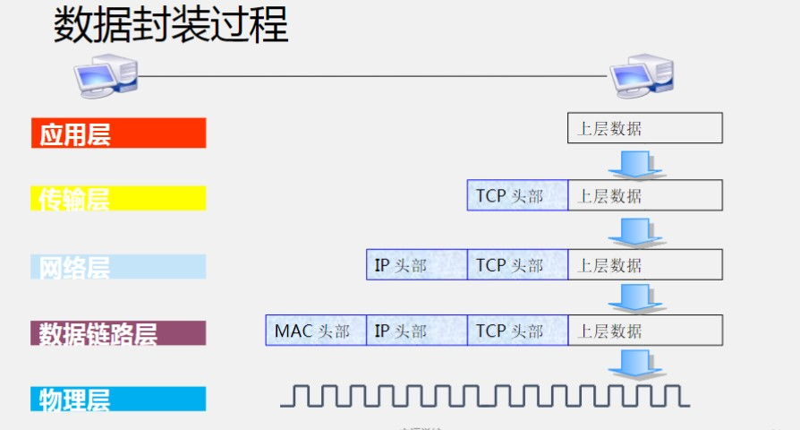
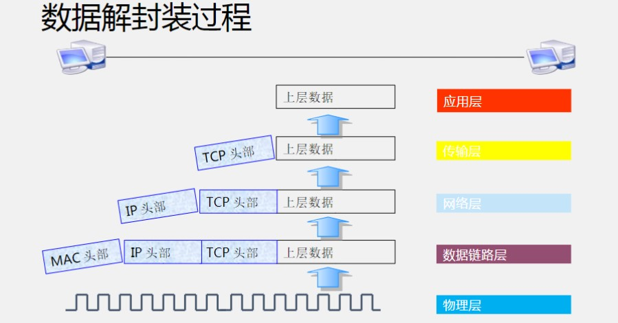
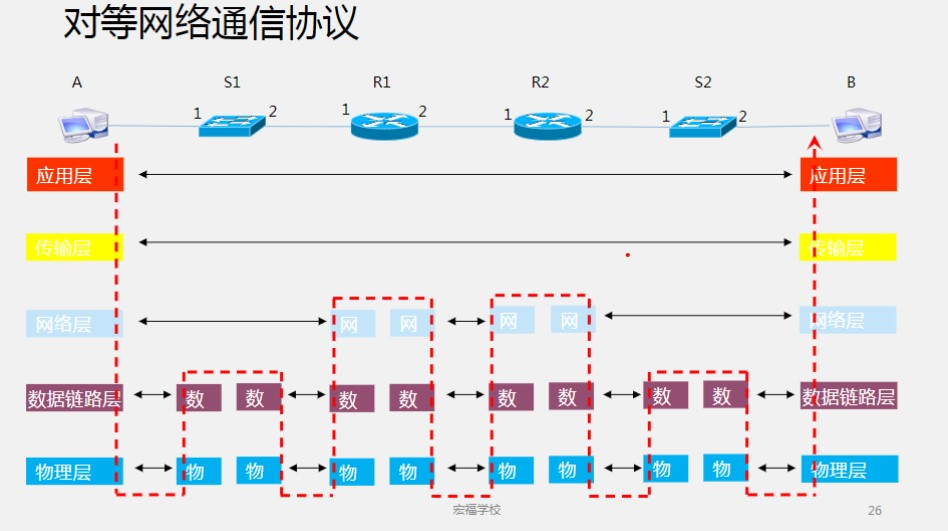

#  TCP/IP四层模型和通信原理

## OSI模型 vs TCP/IP模型

## TCP/IP协议族的组成

| 层名称     | 协议                            | 网络设备           | 传输   |
| ---------- | ------------------------------- | ------------------ | ------ |
| 应用层     | HTTP、FTP、TFP、SMTP、SNMP、DNS | 计算机             |        |
| 传输层     | TCP、UDP                        | 防火墙             | 数据段 |
| 网络层     | ICMP、IGMP、IP、ARP、RARP       | 路由器、三层交换机 | 数据包 |
| 数据链路层 | PPP、PPPOE                      | 二层交换机         | 数据帧 |
| 物理层     |                                 | 网卡               | 比特流 |

### 应用层常见协议

*   HTTP：超文本传输协议（网站访问WEB）（Apache、Nginx、IIS）
*   FTP：文件传输协议（网络文件传输）
*   TFTP：简单文件传输协议（交换机和路由器系统重装）
*   SMTP：简单邮件传输协议（发信）
*   POP3：邮局协议3代（收信）
*   SNMP：简单网络管理协议（服务器监控）
*   DNS：域名系统（域名与IP解析）

### 传输层协议

*   TCP：传输控制协议（面向连接的、可靠的传输协议）
*   UDP：用户数据报协议（面向无连接、不可靠的传输协议）

### 网络层协议

*   IP：网际协议
*   ICMP：互联网控制消息协议（网络探测，ping，tracert）
*   IGMP：互联网组管理协议
*   ARP：地址解析协议（IP——》MAC）
*   RARP：反向地址解析协议（MAC——》IP）

### 数据链路层协议

*   PPP：点对点协议
*   PPPOE：点对点拨号协议

### 物理层

通信类相关协议，和网络工程师、运维工程师关系不大

### 防火墙

数据包过滤（IP、MAC、端口、协议类型、数据包中数据（软件模拟防火墙））

### 交换机

二层交换：整个交换有一个MAC地址，不是用于网络通信（不能作为访问目标），用于交换机特殊换算（例如：STP（生成树协议）

三层交换：每一个网口有一个独立MAC地址，可以作为访问目标

### 数据封装过程

1.  应用层产生数据
2.  传输层封装TCP头部
3.  网络层封装IP头部
4.  数据链路层封装MAC头部
5.  物理层传输封装好的数据

### 数据解封过程

1.  物理层接收封装好的数据
2.  数据链路层拆下MAC头部
3.  网络层拆下IP头部
4.  传输层拆下TCP头部
5.  应用层使用数据

## 网络通信原理

### 对等网络通信原理

公网IP<——>公网IP

私有IP<——>私有IP

**IP地址永不变，MAC地址经过一次路由，重新计算**

网关：首先是路由器，是默认路由（路由表是从上到下查询，默认路由在最下面）

#### 私有IP地址

*   10.0.0.0 - 10.255.255.255

*   172.16.0.0 - 172.31.255.255

*   192.168.0.0 - 192.168.255.255

#### 对等网络通信过程

1.  主机A发送数据（包含源端口，目的端口；源iP：A，目标IP：B；源MAC：A，目的MAC：R1-1（查路由表，没有B的MAC，默认发给网关））
2.  交换机S1转发给R1（查MAC表，转发给对应端口）
3.  路由器R1对比目的MAC地址，拆下MAC头，查看IP，转发（查路由表，源MAC换为R1-2的MAC，目的MAC换为R2-1）
4.  路由器R2对比目的MAC地址，拆下MAC头，查看IP，转发（查路由表，源MAC换为R2-2的MAC，目的MAC换为B）
5.  交换机S2转发给主机B（查MAC表，转发给对应端口）
6.  主机B收到数据

### 非对等网络

私有IP==》公网

网关：首先是路由器，是默认路由，NAT（网络地址转换）（将私有IP转换为公网IP）

#### 非对称网络通信过程

通信过程与对称网络通信过程相似，但在主机发送的数据通过路由器时，路由器会通过NAT将私有IP转换为公有IP（表现为整个网段中的主机与外部通信时使用同一个公网IP）