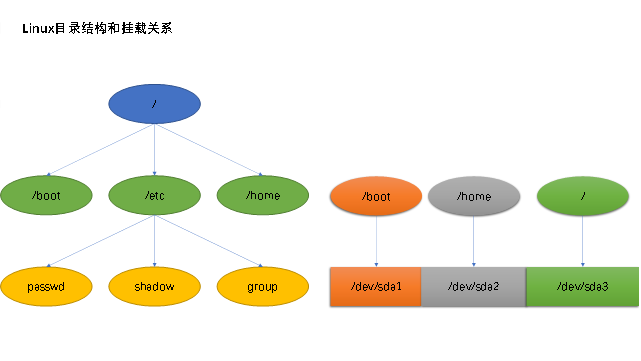

# Linux安装和部署

## 虚拟机配置

VMware网络设置注意事项：

1.  桥接不要占用他人IP

2.  NAT，若要连接互联网，需要给虚拟机配置网关和DNS

排错：

1.  检查连接设备
2.  检查连接方式（桥接、NAT、仅主机）
3.  检查IP是否同网段
4.  Windows防火墙

## 磁盘设备和分区命名规范

分区目的：便于管理，提高数据存储安全性

分区表类型：MBR和GPT

### 磁盘命名

sd：对SATA、SCSI、SAS等类型接口类型的磁盘命名前缀，后续用a-z表示第几块磁盘

hd：对IDE接口类型的磁盘命名前缀，后续用a-z表示第几块

例如：

sda：表示STAT等接口的第一块磁盘

hdc：表示IDE接口的第三块磁盘

### 分区命名规范

在指定磁盘后使用序号命名分区顺序：1-n

MBR：

主分区：sda1-sda4

扩展分区：sda1-sda4

逻辑分区：sda5-sdan

GPT：

sda1-n

### 分区挂载

在Linux中使用目录作为分区的入口，将分区和分区入口关联起来的方式称为挂载

### Linux安装时分区

必须分区：

根分区 / 存储

swap分区（交换分区）无挂载点 用于内存数据暂存

建议分区：

引导分区 /boot 储存引导信息和内核（会默认选择使用磁盘的第一个分区）

**注意：安装过程中要将引导程序安装在硬盘上，不要安装在移动介质**