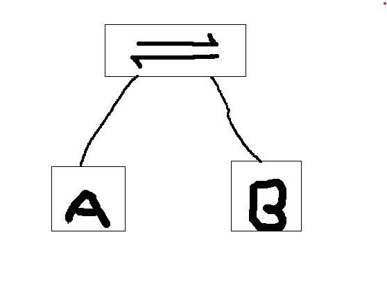

# 进制

| 进制     | 基本数字                                         | 示例     | 进位方式 |
| -------- | ------------------------------------------------ | -------- | -------- |
| 十进制   | 0、1、2、3、4、5、6、7、8、9                     | 255      | 十进一   |
| 二进制   | 0、1                                             | 11111111 | 二进一   |
| 十六进制 | 0、1、2、3、4、5、6、7、8、9、A、Ｂ、C、D、E、Ｆ | FF       | 十六进一 |
| 八进制   | 0、1、2、3、4、5、6、7                           | 377      | 八进一   |

## 进制转换

#### 标准算法

大小数通用，乘除运算，相对复杂

十进制转二进制：除2取余

二进制转十进制：乘2取幂

#### 装水桶法

不适合大数，加减运算，相对简单

二进制位对应十进制的值

| 位数   | 8    | 7    | 6    | 5    | 4    | 3    | 2    | 1    |
| ------ | ---- | ---- | ---- | ---- | ---- | ---- | ---- | ---- |
| 二进制 | 1    | 1    | 1    | 1    | 1    | 1    | 1    | 1    |
| 十进制 | 128  | 64   | 32   | 16   | 8    | 4    | 2    | 1    |

十进制转十六进制：先转为二进制，四位分段，拆分运算（二进制四位对应十六进制一位）

十六进制转十进制：每个位上的值分别计算为二进制后，合并运算

## ISO/OSI七层模型

OSI：开放系统互联

| 层数 | 名称       | 协议           | 传输数据单位 |
| ---- | ---------- | -------------- | ------------ |
| 7    | 应用层     | 应用层协议     | APDU         |
| 6    | 表示层     | 表示层协议     | PPDU         |
| 5    | 会话层     | 会话层协议     | SPDU         |
| 4    | 传输层     | 传输层协议     | TPDU         |
| 3    | 网络层     | 网路层协议     | 报文         |
| 2    | 数据链路层 | 数据链路层协议 | 帧           |
| 1    | 物理层     | 物理层协议     | 比特         |

**注意事项**

1.  上三层为用户提供服务，下四层负责实际数据传输

2.  下四层的传输单位

    传输层： 数据段（报文）

    网络层：数据包（报文分组）（数据包有格式要求，大小不能超过$2^{16}$ = 65535Byte）

    数据链路层：数据帧

    物理层：比特（位）

3.  从上到下，越贴近硬件，上层可以识别下层数据，下层不能识别上层数据。

4.  数据发送时，数据从上层向下层传输；数据接收时，数据从下层向上层传输

5.  数据不能跨层传递，每层之间通过逻辑的接口传递

6.  物理层负责实际数据传递，其他层只是逻辑对应

7.  OSI模型只是理论模型，不能对应实际协议或硬件

### 局域网通信原理（交换机通信原理）

交换机：同一个逻辑网段通信，不会分割广播域

路由器：用于不同逻辑网段通信，会分割广播域

源IP：A-IP

目的IP：B-IP 通过DNS服务获取

源Mac：A-MAC

目的Mac：B-MAC 通过广播获取ARP

A要与B通信需要得到B的IP和Mac地址

1.  主机A将一个源地址为自己，目标MAC地址为主机B的数据帧发给交换机
2.  交换机收到数据帧后，将帧中的源MAC和对应接口记录到MAC地址表中
3.  交换机检查MAC地址表，如果有目的MAC信息，则从对应接口发送数据；如果没有则从所有非发送接口发送
4.  主机B收到数据，响应（只有B会响应，其他主机会丢弃），返回一个数据帧（包含B的MAC地址）
5.  交换机收到B回应的数据帧，记录帧中的源MAC地址（B的），交换机就建立好了一个有A和B的MAC地址的地址表，A和B就能顺利通信了

#### 查询未知MAC

电脑：ARP（地址解析协议：IP——》MAC）（广播）

交换机：查询MAC地址表获取（泛洪）（交换机中Mac地址表的Mac地址与网口对应）

**注：电脑建立的ARP表和交换机建立的MAC地址表都是暂时的，重启会清空**

#### 广播和泛洪：

| 名称 | 工作层     | 方式    | 发信地址                                        |
| ---- | ---------- | ------- | ----------------------------------------------- |
| 广播 | 网络层     | IP地址  | 全网段：255.255.255.255  单网段：192.168.15.255 |
| 泛洪 | 数据链路层 | MAC地址 | FF-FF-FF-FF-FF-FF                               |

在电脑从DHCP服务的过程中会进行一次全网段广播。

广播域：路由器会阻止广播的继续传播

### 命令

arp -a 查看记录的ip和mac列表

