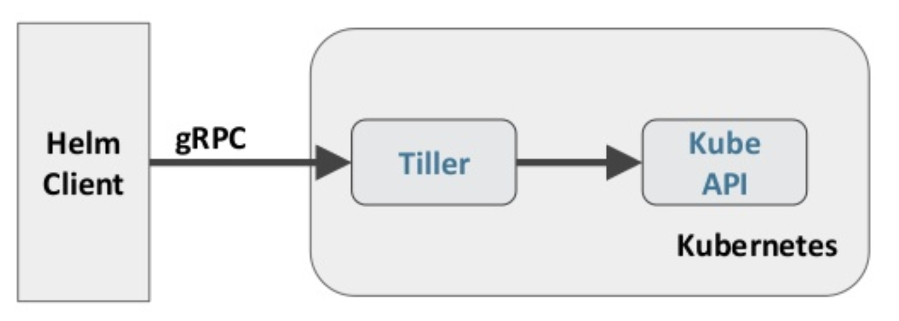
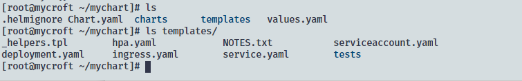

# Helm

kubernetes 的中随着项目的微服务化,服务解耦,应用的部署难度也随之上升,而 helm 通过打包的方式简化了部署难度和发布版本控制

Helm 本质上是通过动态生成 k8s 的资源清单文件,然后调用 kubectl 自动执行资源部署

从效果上看, helm 类似于包管理工具,是部署环境的流程封装,在 helm 中有两个比较重要的概念:

* chart 是一个应用的信息合集,其中包括了各种 k8s 对象的配置模板,参数定义,依赖关系,文档说明等; 是应用部署的自包含逻辑单元
* release 则是 chart 的运行实例,代表了一个正在运行的应用;当 chart 被安装到 Kubernetes 集群,就生成一个实例

Helm v2的架构如下图:



Helm 的客户端通过 gRPC 与 Tiller 通信提交命令,Tiller 则与 apiserver 交互

需要注意的是 Helm v2 和 v3 版本作了较大改动, v3 移除了 Tiller 使用客户端直接与 apiserver 进行交互,还有许多其他的修改,详细请查看官网关于 [v2 与 v3 的区别](https://helm.sh/docs/topics/v2_v3_migration/)

## Helm 部署

1. 下载需要的版本
2. 解压`tar -zxvf helm-v3.0.0-linux-amd64.tar.gz`
3. 将可执行文件移动到需要的目录`mv linux-amd64/helm /usr/local/bin/helm`

Helm 常用命令如下:

|命令|描述|
|--|--|
|create|创建一个 chart 并指定名称|
|dependency|管理 chart 依赖|
|get|下载一个 releasse|
|history|获取 release 历史|
|install| 安装一个 chart|
|list| 列出 release|
|package|将 chart 打包到 chart 存档文件中|
|pull| 从远程仓库下载 chart|
|repo| 管理 chart 仓库|
|rollback| 版本回滚|
|search| 搜索 chart|
|show| 展示 chart 详细信息|
|status| 限制已命名版本状态|
|temlate| 本地呈现模板|
|unistall| 卸载一个 release|
|upgrade| 更新一个 release|
|version| 查看 helm 客户端版本|

国内的 chart 仓库

* 微软[http://mirror.azure.cn/kubernetes/charts/](http://mirror.azure.cn/kubernetes/charts/)
* 阿里云仓库[https://kubernetes.oss-cn-hangzhou.aliyuncs.com/charts](https://kubernetes.oss-cn-hangzhou.aliyuncs.com/charts)

添加库使用`helm repo add`,删除使用`helm repo remove`,查看可以使用`helm repo list`,更新使用`helm repo update`

## Helm 创建 chart

```shell
helm create <chart-名称>
helm create mychart
```

在当前目录会生成 chart 的基础文件目录: mychart;目录中有几个模板文件: Chart.yaml,包含要创建的 chart 的名字,版本等; values.yaml,指定具体配置,镜像,service 端口等;在 templates 目录中的是各种资源清单的模板文件,而其中的多数数据都来自 values.yaml 文件



在修改 values.yaml 文件中的参数后,使用`helm upgrade <chart-name> <chart-path>`来更新 release
