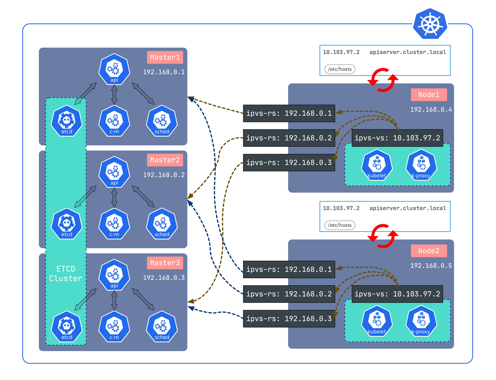

# k8s 的高可用

k8s 的高可用实现方案有很多,本文主要介绍使用 Sealos 的方案

sealos 的安装方案主要有以下几种特点:

* 可离线安装
* 使用 LVS 负载,不依赖 haproxy,keepalived
* golang 开发
* 证书有效期 99 年

sealos 的高可用方案如下图,可以看到,使用了三个 master 节点做高可用,通过 LVS 进行负载, node 通过域名访问 master,而三个 master 节点在后面提供服务



## sealos 部署

sealos 是一个可执行命令,通过以下命令即可安装高可用的 k8s 集群

```shell
sealos init --master 192.168.0.2 \
    --master 192.168.0.3 \
    --master 192.168.0.4 \
    --node 192.168.0.5 \
    --user root \
    --passwd your-server-password \
    --version v1.14.1 \
    --pkg-url /root/kube1.14.1.tar.gz
```

如果不需要 master 的高可用, 可以使用以下命令安装单 master 多 node

```shell
sealos init --master 192.168.0.2 \
    --node 192.168.0.5 \
    --user root \
    --passwd your-server-password \
    --version v1.14.1 \
    --pkg-url /root/kube1.14.1.tar.gz
```

参数解释:

|参数|含义|
|--|--|
|passwd| 服务密码|
|master| master 节点IP|
|node| node 节点IP|
|pkg-url| 资源包地址,支持本地路径|
|version| 资源包对应版本|
|kubeadm-config| 自定义 kubeadm 配置文件|
|pk| ssh 私钥地址,免密钥时使用|
|pk-passwd| ssh 私钥密码|
|user| ssh 用户名|
|interface| 机器网卡名, CNI 网卡发现使用|
|network| CNI 类型|
|podcidr| pod 网段|
|repo| 镜像仓库|
|svccidr| clusterIP 网段|
|vlog| kubeadm 日志等级|
|cert-sans| kubernetes apiServerCertSANs|
|without-cni| 不安装 CNI 插件,自定义时使用|

更详细的参数解释可以使用`sealos init --help`查看

在安装完成后可以进行以下操作:

```shell
kubectl get node                    # 查看节点状态
kubectl get node --all-namespaces   # 查看所有命名空间的 Pod

# 清理集群
sealos clean --all

# 添加 master 节点
sealos join --master 192.168.0.6

# 添加 node
sealos join --node 192.168.0.8

# 删除指定 master
sealos clean --master 192.168.0.6

# 删除指定 node
sealos clean --node 192.168.0.8

# 备份集群,默认保存在 /opt/sealos/ectd-backup/sanpshot
sealos etcd save
