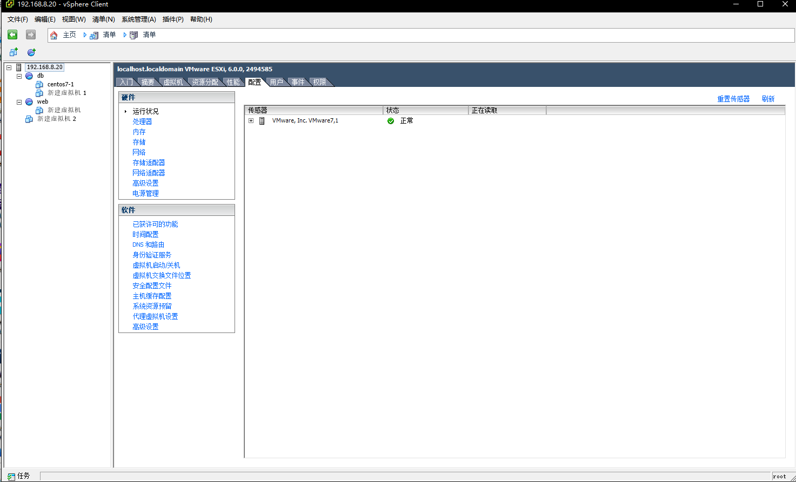

# 虚拟化

## 技术分类

全虚拟化--软件模拟的虚拟化

半虚拟化--优化指令集

硬件直通--在虚拟化环境中直接使用硬件

## 架构分类

寄居虚拟化(Hosted Architecture)--在宿主OS之上构建虚拟化

裸金属虚拟化(Bare Metal Architecture)--在硬件之上构建虚拟化

## VCenter

VMware ESXi, 采用裸金属架构

使用 vSphere Client 连接管理

### 权限管理

在"host-用户"管理用户

通过为用户分配"角色"限制用户的权限,在"主页-角色"可以管理角色

### 资源管理

可以通过创建"资源池"来分割资源

### 磁盘管理

在"配置-存储"中可以添加存储设备,"右键"设备可以浏览数据存储,上传或下载文件

### 网络管理

在"配置-网络"中可以添加或移除物理网卡

### 设备直通

在"配置-高级设置"中可以配置设备直通,在新建虚拟机时选择直筒的设备即可

### 电源策略

在"配置-电源管理"中配置电源策略
