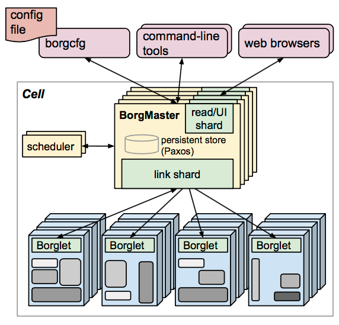
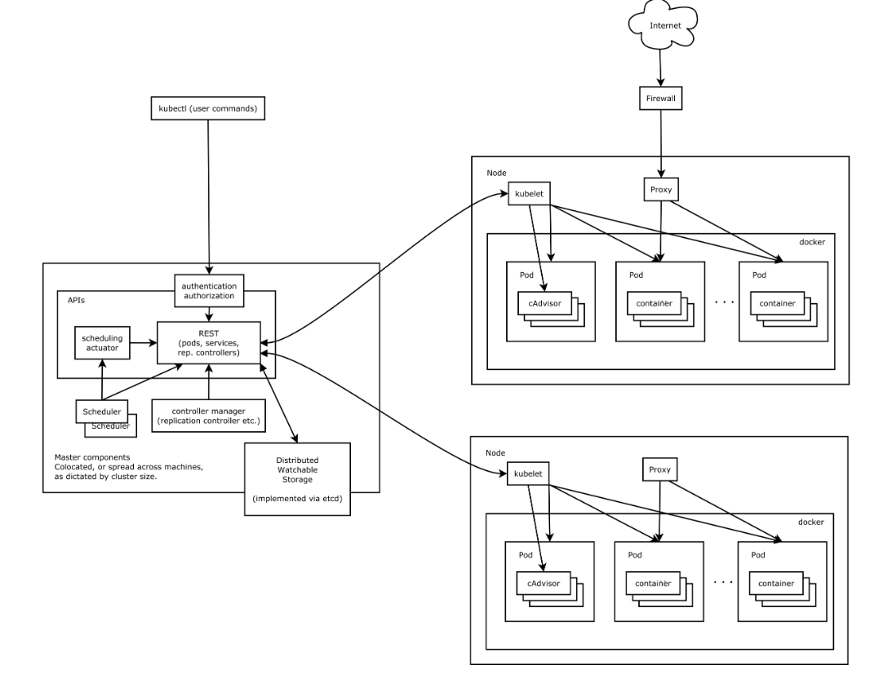
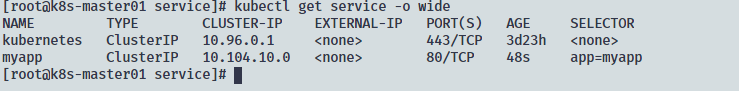
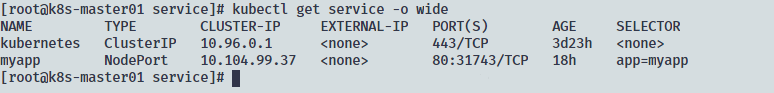
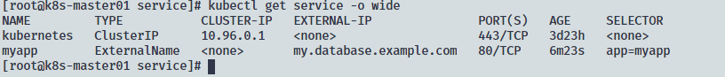
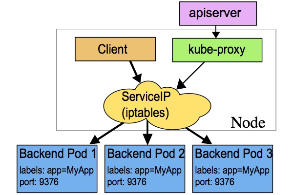
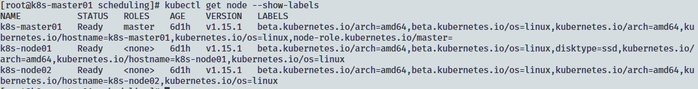

# Kubernetes

Kubernetes 提供了面向应用的容器集群部署和管理系统,最初起源于 Google 内部的 Borg 系统

## Kubernetes 架构

Kubernetes 借鉴了 Borg 的设计理念,整体架构于 Borg 非常像




Kubernetes 有以下几个核心组件构成:

* etcd 保存整个集群的状态;
* APIserver 提供资源操作的唯一接口,并提供认证,授权,访问控制,API注册和发现等级制;
* controller manager 负责维护集群的状态,比如故障检测,自动拓展,滚动更新等;
* scheduler 负责资源的调度,按照云顶的调度策略将 Pod 调度到相应的机器上;
* kubelet 负责维护容器的声明周期,同时负责 Volume(CSI) 和网络(CNI)的管理;
* Container runtime 负责镜像管理以及 Pod 和容器的运行(CRI);
* kube-proxy 负责为 Service 提供 cluster 内部的服务发现和负载均衡;

除了核心组件,还有一些推荐的插件:

* CoreDNS 负责为整个集群提供 DNS 服务;
* Ingress Controller 为服务提供外网入口;
* Prometheus 提供资源监控;
* Dashboard 提供 GUI
* Federation 负责跨可用区的集群

## Kubernetes 概念对象

### Pod

Pod 是 Kubernetes 中最基础的运行部署应用或服务的最小单元,可以是多容器的(支持在一个 Pod 的多个容器中共享网络地址和文件系统,通过进程间通信和文件共享完成服务)

### Replication Controller, RC

RC 是 Kubernetes 集群中保证 Pod 高可用的 API 对象,通过监控运行中的 Pod 来保证集权中运行指定数目的 Pod 副本;新版不建议使用

### Replica Set, RS

RS 是新一代 RC,提供同样的高可用能力,区别主要是 RS 能支持更多中种类的匹配模式,一般不单独使用,而是作为 Deployment 的理想状态参数使用

### Deployment

Deployment 表示用户对 Kubernetes 集群的一次更新操作,可以创建或更新一个新的服务,支持滚动升级一个服务(通过创建一个新服务,并增加副本数,将旧的 RS 副本减少到0)

### Service

稳定提供服务发现和均衡负载能力,每个 Service 对应一个集群内部有效的虚拟 IP,集群内部通过虚拟 IP 访问一个服务

### Job

Job 是 Kubernetes 用来控制批处理型任务的 API 对象,Job 管理的 Pod 根据用户的设置把任务成功完成就会自动退出

### DaemonSet

DaemonSet 的关注点在 Kubernetes 集群职工的节点,要保证每个节点都有一个此类 Pod 运行,典型的 DaemonSet 包括存储,日志和监控等

### StatefulSet

用于控制有状态服务,StatefulSet 中的每个 Pod 的名字都是事先确定的,不能更改;每个 StatefulSet 中的 Pod 挂载自己独立的存储,如果出现故障,启动一个新的 Pod 后要挂载原来的 Pod;典型服务包括数据库,集群化管理服务等有状态服务

### Federation

提供跨区域,跨服务商的集群服务;通过注册 Kubernetes Cluseter 实现负载均衡

### Volume

类似 Docker 的存储卷,但 Kubernetes 的卷的声明周期和作用范围是一个 Pod, 存储卷由 Pod 中的所有容器共享

### Persistent Volume, PV 和 Persistent Volume Claim, PVC

提供了存储的逻辑抽象,使得 Pod 在逻辑上可以忽略实际的存储技术;而 PV 提供资源, PVC 使用资源

### Node

实际提供计算能力,是所有 Pod 运行所在的工作主机,可以是物理机也可以是虚拟机

### Secret

用于保存和传递密码,密钥,认证凭据,避免把敏感数据写在明文中

### User Account 和 Service Account

User Account 为人提供账户标识, Service Account 为 Pod 提供账户标识;而 User Account 是跨 namespace 的,由于 Service Account 对应的是程序的身份,所以与特定 namespace 是相关的

### Namespace

为 Kubernetes Cluster 提供虚拟的隔离作用,初始有两个 namespace 分别是 default 和 kube-system

### RBAC 访问授权

Role-based Access Control 基于角色的访问控制,访问策略和角色关联,具体用户和一个或多个角色相关联

### Etcd 解析

Etcd 用于保存集群所有的网络配置和对象的状态信息

## K8s中的资源

|资源类型|具体资源|
|--|--|
|工作负载型,workload|Pod,ReplicaSet,Deployment,StatefulSet,DaemonSet,Job,CronJob|
|服务发现及负载均衡,ServiceDiscovery LoadBalance|Service,Ingress|
|配置与储存型|Volume,CSI|
|特殊类型的存储卷|ConfigMap,Secret,DownwardAPI|
|集群级资源|Namespace,Node,Role,ClusterRole,RoleBinding,ClusterRoleBinding|
|元数据|HPA,PodTemplate,LimitRange|

### 资源清单

资源清单是一个 yaml 文件,其中详细写明了资源的类型,所需的环境等信息,用于创建一个符合预期的 Pod;在使用时使用
kubectl 指定文件,kubectl 读取 yaml 文件后会将其序列化为 json 格式传递给 kubeapiserver 然后控制 kubelet 创建 pod

使用方式:

```shell
kubectl create -f <yaml文件>
```

资源清单的基本格式如下:

```yaml
apiVersion: group/apiversion    # 指定使用的apiversion
kind:                           # 资源类型
metadata:                       # 元数据
  name:                           # 资源名
  namespace:                      # 命名空间默认是 default
  lables:                         # 标签
  annotations:                    # 注解
spec:                           # 对资源期望的状态
status:                         # 最近状态,由 k8s 自动维护
```

每种资源的详细内容可使用以下命令查看:

```shell
kubectl api-versions            # 查看api-version
kubectl explain <资源>           # 查看资源文档
kubectl explain <资源.字段>      # 查看具体字段文档
```

Pod 资源清单示例:

```yaml
apiVersion: v1
kind: Pod
metadata:
  name: pod-demo
  namespace: default
  labels:
    app: myapp
spec:
  containers:
  - name: myapp-1
    image: harbor.hongfu.com/library/myapp:v1
  - name: busybox-1
    image: harbor.hongfu.com/library/busybox:v1
    command:
    - "/bin/sh"
    - "-c"
    - "sleep 3600"
```

## Pod 详解

Pod 是 Kubernetes 控制资源的最小单位, k8s 的大多服务以及应用都是运行在 Pod 中(kubelet 运行在主机中);Pod 中的容器共享网络和存储,Pod 中的容器可以使用 localhost 互相通信,可以直接通过进程间通信

Pod 是给定的应用的运行实例

### Pod 的生存周期

一个 Pod 从创建删除一般经过以下几个阶段: 创建 pause 容器,init 初始化,创建应用容器(可以有多个,并行启动),删除容器;其中创建应用容器还可以有两个 Hook PostStart 和 PerStop以及就绪探测和生存探测

* pause 容器: 用于共享网络栈,存储卷,生命周期与 Pod 等长
* init 初始化:在初始化阶段可先启动一些容器(initC)以生成应用容器所需要的资源
* PostStart: 在应用容器启动后进行动作
* PerStop: 在应用容器结束前进行动作
* 就绪探测: 在应用容器启动后,探测是否具备某些资源
* 生存探测: 在应用容器启动后,对其中的应用进行探测,伴随整个容器的生命周期

#### pause 容器

可以视为一个中间容器,首先会创建出 pause 容器,后面创建的应用容器通过加入 pause 容器的网络栈和分享存储卷,使得一个 Pod 中的容器有共同的网络栈和存储卷

#### Init 容器

通过在 spec 中使用`initContainers`字段,以标记容器为 initC

Init 容器为串行运行,前一个运行并成功退出后,才运行后一个

相比于应用容器,init 容器使用 Linux Namespace;因此能够访问 Secret

initC 示例:

```yaml
apiVersion: v1
kind: Pod
metadata:
  name: myapp-pod
  labels:
    app: myapp
spec:
  containers:                     # 应用容器,当所有 init 容器成功退出后运行
  - name: myapp-container
    image: busybox
    command: ['sh', '-c', 'echo The app is running! && sleep 3600']
  initContainers:                 # init 容器
  - name: init-myservice
    image: busybox
    command: ['sh', '-c', 'until nslookup myservice; do echo waiting for myservice; sleep 2; done;']                      # 检测myservice 服务,成功后退出
  - name: init-mydb
    image: busybox
    command: ['sh', '-c', 'until nslookup mydb; do echo waiting for mydb; sleep 2; done;']
```

## 控制器

对资源进行操作,使资源达到预期;控制 Pod 的具体状态和行为;控制器通过匹配 labels 来进行判断控制那些 Pod

### Deployment 详解

提供了一个声明式定义(declarative)方法,对应用进行操作,使应用符合预期,Deployment 通过创建 ReplicaSet, ReplicaSet 再创建 Pod 的方式管理 Pod

Deployment 典型的应用场景有:

* 定义 Deployment 来创建 ReplicaSet 和 Pod
* 滚动更新和回滚应用
* 扩容和缩容
* 暂停和继续 Deployment

Deployment 的 yaml 文件格式如下:

```yaml
apiVersion: extensions/v1beta1
kind: Deployment
metadata:
  name: nginx-deployment
spec:
  replicas: 3    # Pod 的副本数
  template:    # 嵌套了 Pod 的定义,少了apiVersion和kind
    metadata:
      labels:
        app: nginx
    spec:
      containers:
      - name: nginx
        image: nginx:1.7.9
        ports:
        - containerPort: 80
```

#### 创建 Deployment

可以通过以下命令创建一个 Deployment:

```shell
kubectl create -f example.yaml  --record  # 通过指定yaml 文件创建,--record 记录对该资源的更新
kubectl get deployment,replicaset,pod # 查看资源
```

Deployment 中的 ReplicaSet 的名称是 `<Deployment名>-<Pod模板hash值>`

#### 更新 Deployment

需要注意的是 Deployment 的 rollout 只有在 Deployment 的 pod template 中的 label 或镜像更新时被触发,其他更新,例如扩容并不会触发 rollout;Deployment 的更新方式是,删除旧的 Pod,创建新的 ReplicaSet 并新建 Pod,直到旧的 Pod 为零,,但 Deployment 会保留旧的 ReplicaSet 用于回滚

可以通过命令更新,或者修改yaml文件达到更新目的

```shell
kubectl set image deployment/nginx-deployment nginx=nginx:1.91    # 修改镜像
kubectl edit deployment/nginx-deployment      # 编辑资源在etcd中的信息
```

在更新后可以查看状态

```shell
kubectl rollout status deployment/niginx-deployment
```

Deployment 在更新时为了保证应用的可用,不会同时更新所有 Pod,而是按照一定比例来逐渐更新,直到全部更新

**Rollover**:在前一次更新还未完成时,就进行再次更新,会导致前次更新停止,并删除旧的 Pod,开始最近的更新

#### 回滚 Deployment

默认情况下, kubernetes 会保存前两次的 Deployment 的 rollout 历史记录,以便随时回滚

首先,检查 Deployment 的 revision:

```shell
kubectl rollout history deployment/nginx-deployment # 查看revision
kubectl rollout history deploymnet/nginx-deployment --revision=2 # 查看单个 revision 的详细信息
```

然后回滚:

```shell
kubectl roolout undo deployment/nginx-deployment --to-revision=2 # 回滚,--to-revision 指定回滚版本
```

**注意**:由于 kubernetes 只会记录触发 rollout 的操作,所以当手动进行扩容后回滚只有 Deployment 中的 Pod template 才会回滚

### ReplicationController & ReplicaSet

### DaemonSet 详解

### StatefulSet 详解

### Job & CronJob

Job 会创建一个或多个 Pod 运行直到成功退出,用于执行一次性任务

Job 的资源清单示例如下:

```yaml
apiVersion: batch/v1
kind: Job
metadata:
  name: pi
spec:
  template:
    spec:
      containers:
      - name: pi
        image: perl
        command: ["perl",  "-Mbignum=bpi", "-wle", "print bpi(2000)"]
      restartPolicy: Never           # 重启策略
  backoffLimit: 4                    # 尝试次数
```

重启策略有两种:

* Never,从不重启
* OnFailure, 失败时重启

CronJob 会重复地创建 Job

## 服务发现

kubernetes 为了实现**服务实例间的负载均衡和不同服务间的服务发现,创造了 Service 对象**,同时为了**从集群外部访问集群创建了 Ingress 对象**

### Service 详解

Kubernetes 中的 Pod 在每个生命周期中的 IP 地址不总是稳定可依赖的,所以如果一组 Pod (backend)为其他 Pod (frontend)提供服务,那么 frontend 该如何发现并连接到backend?

Service 定义了一种抽象: 一个 Pod 的逻辑分组,一种可以访问到它们的策略(微服务),这组 Pod 能够被 Service 访问到(通过 Label Selector 实现)

通过 yaml 问价定义 Service, 写法如下:

```yaml
kind: Service             # 资源类型
apiVersion: v1            # api 版本
metadata:
  name: my-service        # 名称
spec:
  selector:               # 选择标签
    app: MyApp
  ports:                  # 端口
    - protocol: TCP       # 协议类型
      port: 80            # 暴露端口
      targetPort: 9376    # 目标端口(backend 端口)
```

上述配置会创建一个名为 `my-service` 的 Service 对象,它会将请求代理到, 具有`app=MyApp` 并开放 TCP 9876 端口的 Pod

可以在 Service 中定义多个端口,需要注意的是使用多个端口时,必须给出所有端口的名称

```yaml
kind: Service
apiVersion: v1
metadata:
  name: my-service
spec:
    selector:
      app: MyApp
    ports:
      - name: http              # 端口名称
        protocol: TCP           # 协议
        port: 80                # 端口
        targetPort: 9376        # 目标端口
      - name: https             # 端口名称
        protocol: TCP
        port: 443
        targetPort: 9377
```

#### Service 类型

在资源清单中通过`spec.type`字段指定一个需要的类型的 Service, 默认是 `ClusterIP`

* ClusterIP: 通过集群内部 IP 暴露服务,仅在集群内部可以访问
* NodePort: 通过每个 Node 上的 IP 和静态端口( NodePort) 暴露服务, 通过 `<NodeIp>:<NodePort>`,可以从集群外部访问服务
* LoadBalancer: 使用云提供商的负载均衡器,向外部暴露服务
* ExternalName: 通过返回 `CNAME`,将服务映射到`ExternalName`字段内容



##### NodePort 类型

kubernetes master 会从给定的配置范围内(默认:30000-32767)分配端口,每个 Node 将从该端口代理到 `Service`,从外部访问集群的每个 node 都能访问到服务



##### LoadBalancer 类型

使用支持外部负载均衡器的云提供商的服务,为`Service`提供负载均衡器

```yaml
kind: Service
apiVersion: v1
metadata:
  name: my-service
spec:
  selector:
    app: MyApp
  ports:
    - protocol: TCP
      port: 80
      targetPort: 9376              # backend 端口
      nodePort: 30061               # Node 端口
  clusterIP: 10.0.171.239
  loadBalancerIP: 78.11.24.19       # 负载均衡器的IP
  type: LoadBalancer                # Service 类型
status:
  loadBalancer:
    ingress:
      - ip: 146.148.47.155
```

来自外部负载均衡器的流量将直接负载到 `backend pod`上,实际工作过程,依赖于云提供商

##### ExternalName 类型

ExternalName Service 是 Service 的特例,他没有 selector,也没有定义任何的端口和 Endpoint, 通过返回该**外部服务**的别名来提供服务

```yaml
kind: Service
apiVersion: v1
metadata:
  name: my-service
  namespace: prod
spec:
  type: ExternalName
  externalName: my.database.example.com       # 别名
```



#### Service 代理模式

在 Kubernetes 集群中,每个 Node 运行一个 kube-proxy 进程;kube-proxy 为 Service 实现了一种 VIP(虚拟IP)的形式

在 V1.0 版本,代理在 userspace; Service 是"四层"(TCP/UDP over IP) 概念

在 v1.1 版,新增了 iptables 代理;并新增了 Ingress API,用于表示"七层"(HTTP) 服务

从 v1.2 起,默认是 iptables 代理

在 v1.8.0 中,添加了 ipvs 代理;从 v1.14 默认使用,如果kube-proxy 检测到内核没有 ip_vs 模块,则会使用 iptables 代理模式

##### usersapce 代理模式

kube-proxy 会监控 Service 对象,对每个 Service,在本地 Node 打开一个端口,通过添加 iptables 规则捕获对 Service 的 clusterIP 的访问,然后将对代理端口的访问代理到 backend Pods 上


##### iptables 代理模式

kube-proxy 会监控 Service 对象,然后添加 iptables 规则捕获请求,利用 netfilter 进行重定向



##### ipvs 代理模式

kube-porxy 会监控 Service 对象,调用 netlink 接口创建 ipvs 规则,将流量重定向到一个后端 Pod

ipvs 相比 iptables, 同样基于 netfilter 的 hook 功能,但使用 hash 表作为底层数据结构并在内核空间中中作,因此性能更强;此外 ipvs 提供了更多的负载均衡算法


#### Headless Service

通过指定 `spec.clusterIP` 的值为"None" 来创建 Headless Service,两种情况:

* 配置 Selector
  如果配置了 selector, 通过 DNS 可以直接得到 backend Pods 的 IP,可以不通过 kubernetes 负载调度直接访问 Pod
* 不配置 Selector
  如果不配置 selector,DNS 会查找和配置

### Ingress 详解

通常情况下 Service 和 Pod 仅可在集群内部通过 IP 访问;而 Ingress 是授权入站连接到达集群服务的规则集合,通常是 HTTP;同时会提供负载均衡,SSL 终止和虚拟主机功能

**注意**: 为了使 Ingress 能正常工作,集群中 master 节点必须运行 Ingress controller,而 kubernetes 集群自身并不含有,所以需要选择适合自己集群的 Ingress controller 或自己实现一个

* kubernetes 当前支持并维护 GCE 和 nginx 两种
* F5 支持维护 F5 BIG-IP Controller for Kubernetes
* Traefik 是功能齐全的 Ingress controller
* Istio 使用 CRD Gateway 来控制 Ingress 流量

通过 yaml 文件创建 Ingress:

```yaml
apiVersion: extensions/v1beta1
kind: Ingress
metadata:
  name: test-ingress
  annotations:                  # 说明
spec:
  rules:                        # 入站规则
  - host:                       # 域名
    http:                       # 协议
      paths:                    # 路径
      - path: /testpath
        backend:                # 匹配的后端
          serviceName: test     # 服务名
          servicePort: 80       # 服务端口
```

Ingress 规则要包含以下信息:

* 可选的域名,如果没有域名,则通过指定的 IP 应用 HTTP 入站流量规则
* 路径列表,关联一个后端服务
* 后端服务,含有服务名和端口的 backend,HTTP 和 HTTPS 请求会匹配域名和路径发送都 backend

#### Ingress 类型

##### 单服务 Ingress

通过仅指定一个默认后端,同时不填写规则

```yaml
apiVersion: networking.k8s.io/v1beta1
kind: Ingress
metadata:
  name: test-ingress
spec:
  backend:
    serviceName: testsvc
    servicePort: 80
```

Ingress controller 会给 Ingress 分配一个 IP,用以进入

##### 扩展

通过书写多个规则和多个后端,使负载均衡器的数量减少

```yaml
apiVersion: networking.k8s.io/v1beta1
kind: Ingress
metadata:
  name: simple-fanout-example
  annotations:
    nginx.ingress.kubernetes.io/rewrite-target: /
spec:
  rules:
  - host: foo.bar.com
    http:
      paths:
      - path: /foo                # 不同的 URI 对应不同的 backend
        backend:
          serviceName: service1
          servicePort: 4200
      - path: /bar
        backend:
          serviceName: service2
          servicePort: 8080
```

基于 HTTP URI 请求,来配置多个后端服务

##### 基于域名的虚拟主机

通过配置不同的域名和对应的不同服务,做到基于域名的虚拟主机

```yaml
apiVersion: networking.k8s.io/v1beta1
kind: Ingress
metadata:
  name: name-virtual-host-ingress
spec:
  rules:
  - host: foo.bar.com                 # 不同的域名对应不同的服务
    http:
      paths:
      - backend:
          serviceName: service1
          servicePort: 80
  - host: bar.foo.com
    http:
      paths:
      - backend:
          serviceName: service2
          servicePort: 80
  - http:
      paths:
      - backend:
          serviceName: service3
          servicePort: 80
```

当有不指定域名的服务时,所有未指定域名的流量会被负载到这个服务,如上所示,对于`foo.bar.com`的访问会转发给`service1`;对`bar.foo.com`的访问会转发给`service2`;对于没有指定域名的访问会转发给`service3`

#### TLS

通过指定包含 TLS 私钥和证书的 Secret 对象,可以使 Ingress 支持 TLS 加密验证

Secret 对象包含以下信息:

```yaml
apiVersion: v1
kind: Secret                        # 资源类型
metadata:
  name: testsecret-tls
  namespace: default
data:
  tls.crt: base64 encoded cert      # base64 编码的证书
  tls.key: base64 encoded key       # base64 编码的私钥
type: kubernetes.io/tls
```

在 Ingress 中引用 Secret 会告知 Ingress controller 与 client 连接时使用 TLS

```yaml
apiVersion: networking.k8s.io/v1beta1
kind: Ingress
metadata:
  name: tls-example-ingress
spec:
  tls:                            # 使用 TLS 加密
  - hosts:                        # 域名
    - sslexample.foo.com
    secretName: testsecret-tls    # 域名的 Secret
  rules:
    - host: sslexample.foo.com
      http:
        paths:
        - path: /
          backend:
            serviceName: service1
            servicePort: 80
```

要注意的是,不同的 ingress controller 对 TLS 的支持特性有区别,请查看使用的 ingress controller 的参考手册

#### 更新 Ingress

通过编辑对象的 yaml 文件,然后应用即可更新 Ingress

#### 注意事项

要注意的是,**在大多数资源清单中`annotations`只起到注释作用,但在 ingress 中用于声明一些功能的实现和配置**

## 调度器

调度器用于监控*没有指定 Node 新建的 Pods*,通过一系列策略来将 Pod 运行在适合的 Node 上

kubernetes 中含有一个默认的调度器(kube-scheduler)运行在 control plane 之上,根据每个 Pod 需求得不同来进行调度;在合适的 Node(称为 feasible nodes)运行 Pod,如果没有合适的 Node,则不进行调度,直到有合适的 Node

在资源清单中,可以通过`spec.schedulername`指定调度器

### 调度过程

调度器通过两个步骤进行 Node 选择:

1. Filtering(过滤)
2. Scoring(得分)

第一个步骤会过滤掉不符合 Pod 运行条件的 Node,第二步则对符合运行条件的 Node 进行打分,然后调度 Pod 至得分最高的 Node,如果有多个相同最高得分的 Node 则随机选择其中一个

有两个方式来配置过滤和得分:

1. 调度策略,配置 Predicates(预选)来过滤,配置 Priorities(优选)来得分
2. 调度配置文件,配置实现不同的调度阶段,包括:排队,过滤,得分,绑定,备用,允许等

### 分配 Pods 到 Nodes

直接分配 Pod 到 Node 有两种方法,第一种使可以通过使用标签选择器来约束 Pod 只能运行在某些特定 Node 或者最好运行在某些 Node 之上,使用这种方法会跳过调度策略,直接分配 Node

在 Pod 的资源清单中,通过 `spec.nodeSelector` 字段来指定要匹配的标签,选择 Pod 运行的 Node

首先,给 Node 打上标签:

```shell
kubectl label nodes <node-name> <label-key>=<label-value>    # 给节点添加标签
kubectl label nodes k8s-node01 disktype=ssd
```

然后,在 Pod 的资源清单中添加标签选择器:

```yaml
apiVersion: v1
kind: Pod
metadata:
  name: nginx
  labels:
    env: test
spec:
  containers:
  - name: nginx
    image: nginx
    imagePullPolicy: IfNotPresent
  nodeSelector:
    disktype: ssd
```

在 kubernetes cluster 中,每个节点都有内建的标签,在不同的环境下标签的内容有所不同,依赖于部署环境



第二种是直接指定要运行 Pod 的 Node 名称,在资源清单中通过`spec.nodeName`指定

```yaml
apiVersion: v1
kind: Pod
metadata:
  name: nginx
spec:
  containers:
  - name: nginx
    image: nginx
  nodeName: kube-01           # 指定运行节点
```

使用`nodeName`指定 Node 有以下几条限制:

* 如果选择的 nodeName 不存在, Pod 不会运行,一些情况下会被自动删除
* 如果指定的 Node 没有足够的资源运行 Pod, Pod 会失败并显示原因,如:OutOfmemory 或者 OutOfcpu
* 在云环境中 nodeName 并不总是固定的

### 亲和性和反亲和性

亲和/反亲和提供了一种更宽泛的匹配机制来进行 Pod 的调度,将 Pod 调度到硬件环境和软件环境都能满足的 Node 节点

#### Node 亲和性

Node 亲和提供了两个类型:

* `requiredDuringSchedulingIgnoredDuringExecution` 需求,硬亲和
* `preferredDuringSchedulingIgnoredDuringExecution` 偏好,软亲和

硬亲和,是必须得到满足才会进行调度,得不到满足则不调度;而软亲和,在无法满足的情况下也会进行调度;在两者同时存在时,如果有多个 Node 满足硬亲和的条件,则通过计算满足软亲和的得分来调度 Pod(得分高的)

在资源清单中使用`spec.affinity.nodeAffinity`来指定 Node 亲和条件

```yaml
apiVersion: v1
kind: Pod
metadata:
  name: with-node-affinity
spec:
  affinity:                                             # 亲和性
    nodeAffinity:                                       # node 亲和性
      requiredDuringSchedulingIgnoredDuringExecution:   # 硬亲和
        nodeSelectorTerms:                              # Node 选择器条件
        - matchExpressions:                             # 匹配的语法
          - key: kubernetes.io/e2e-az-name              # 键
            operator: In                                # 操作符
            values:                                     # 值,可以是列表
            - e2e-az1
            - e2e-az2
      preferredDuringSchedulingIgnoredDuringExecution:  # 软亲和
      - weight: 1                                       # 权重分
        preference:                                     # 偏好
          matchExpressions:
          - key: another-node-label-key
            operator: In
            values:
            - another-node-label-value
  containers:
  - name: with-node-affinity
    image: k8s.gcr.io/pause:2.0
```

亲和性操作符有以下几种:

|操作符|描述|
|--|--|
|In|在范围中|
|NotIn|不在范围中|
|Exists|存在|
|DoesNotExist|不存在|
|Gt|大于|
|Lt|小于|

由于,调度策略是在运行 Pod 前执行,在 Pod 运行后,当 Node 变化使得不再满足调度策略时,Pod 不会移除,而是会继续运行

#### Inter-Pod(Pod 间)亲和性和反亲和性

Pod间 亲和/反亲和在 Node 中已存在 Pod 的情况下,可以考虑已存 Pod 对新建的 Pod 的影响,然后进行调度;相比于 Nod 亲和性,可以使用拓扑域(topology domain)对匹配的 Node 进行界定

和 node 亲和一样,Pod间亲和/反亲和也有两种类型:

* `requiredDuringSchedulingIgnoredDuringExecution`
* `preferredDuringSchedulingIgnoredDuringExecution`

在资源清单中使用`spec.affinity.podAffinity`来指定 Pod 间亲和/反亲和

```yaml
apiVersion: v1
kind: Pod
metadata:
  name: with-pod-affinity
spec:
  affinity:
    podAffinity:                                        # Pod 间亲和
      requiredDuringSchedulingIgnoredDuringExecution:
      - labelSelector:
          matchExpressions:
          - key: security
            operator: In
            values:
            - S1
        topologyKey: topology.kubernetes.io/zone        # 拓扑域
    podAntiAffinity:                                    # Pod间反亲和
      preferredDuringSchedulingIgnoredDuringExecution:
      - weight: 100
        podAffinityTerm:
          labelSelector:
            matchExpressions:
            - key: security
              operator: In
              values:
              - S2
          topologyKey: topology.kubernetes.io/zone
  containers:
  - name: with-pod-affinity
    image: k8s.gcr.io/pause:2.0
```

原则上,拓扑域的`topologyKey`可以是任意合法的标签值,但为了性能和安全因素,有以下几条约束:

1. 对于 Pod 亲和/反亲和,硬亲和与软亲和的`topologyKey`值都不能为空
2. 对于反亲和中的硬亲和,录取控制器(LimitPodHardAntiAffinityTopology)将`topology`限定为了`kubernetes.io/hostname`,如果要使用指定拓扑域,则需要修改或禁用控制器

### 污点和容忍

节点亲和是为了将 Pod 吸引到 Node,而污点(Taints)则相反,是为了拒绝 Pod 部署到 Node

使用污点和容忍是为了避免将 Pod 调度到不当的节点;Pod 不会调度到无法容忍的 Node 上

使用以下命令可以给 Node 加上污点:

```shell
kubectl taint nodes <node-name> <key-name>=<value-name>:<NoSchedule> # 设置污点和影响

kubectl taint nodes k8s-node01 cpu=amd:NoSchedule
```

要移除污点则在以上命令加上减号(-),即可:

```shell
kubectl taint nodes k8s-node01 cpu=amd:NoSchedule-
```

在Pod 的资源清单中`spec.tolerations`字段指定容忍项:

```yaml
apiVersion: v1
kind: Pod
metadata:
  name: nginx
  labels:
    env: test
spec:
  containers:
  - name: nginx
    image: nginx
    imagePullPolicy: IfNotPresent
  tolerations:                        # 容忍
  - key: "example-key"                # 键
    operator: "Exists"                # 操作符,不指定时默认是 Equal
    value: "master"                   # 操作符是 Exists 时,忽略
    effect: "NoSchedule"              # 影响
```

**Note**:有以下两种特殊情况:

1. 空的键和操作符为 Exists 会容忍所有污点
2. 空的影响匹配键值对的影响

污点的影响有以下三种:

|影响|描述|
|--|--|
|NoSchedule|不允许调度|
|PreferNoSchedule|尽量不调度|
|NoExecute|不许运行,驱逐已经运行的,禁止新运行|

一般情况下,如果一个 Node 被打上 NoExecute 的污点时,会立即驱逐不容忍的 Pod,可以通过添加`tolerationSeconds`字段,指定容忍时间

```yaml
tolerations:
- key: "key1"
  operator: "Equal"
  value: "value1"
  effect: "NoExecute"
  tolerationSeconds: 3600     # 容忍3600秒后被驱逐
```

污点和容忍可以灵活地拒绝或驱逐 Pod,有以下几个场景:

* 专用节点,例如 master 节点
* 特殊硬件,比如 GPU
* 基于污点驱逐,例如 Node 故障时

#### 基于污点的驱逐

在特定情况下, Node controller 会自动给 Node 打上污点和 NoExecute 影响:

* node.kubernetes.io/not-ready
* node.kubernetes.io/unreachable
* node.kubernetes.io/out-of-disk
* node.kubernetes.io/memory-pressure
* node.kubernetes.io/disk-pressure
* node.kubernetes.io/network-unavailable
* node.kubernetes.io/unschedulable
* node.cloudprovider.kubernetes.io/uninitialized

如果 Node 恢复正常,Node controller 则会自动去除污点

**Note**:对于`node.kubernetes.io/not-ready`和`node.kubernetes.io/unreachable` 会自动添加`tolerationSeconds=300`

在创建 DaemonSet pods 时添加两条没有时限的容忍以保证不会被驱逐:

* node.kubernetes.io/unreachable
* node.kubernetes.io/not-ready

DaemonSet controller 会自动创建不许调度的容忍,防止 DaemonSets 退出:

* node.kubernetes.io/memory-pressure
* node.kubernetes.io/disk-pressure
* node.kubernetes.io/out-of-disk (only for critical pods)
* node.kubernetes.io/unschedulable (1.10 or later)
* node.kubernetes.io/network-unavailable (host network only)
