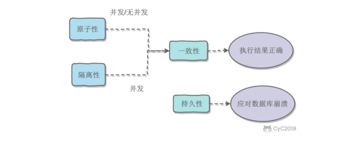

# 数据库

## 事务

指满足ACID特性的一组操作,可以通过Commnit 提交一个事务,也可以使用Roolback进行回滚

### ACID

1. 原子性(Atomicity)
   事务被视为不可分割的最小单元,事物的所有操作要么全部提交成功,要么全部失败回滚
2. 一致性(Consistency)
   数据库在事务执行前后都保持一致性状态,所有事务对一个数据的读取结果都是相同的
3. 隔离性(Isolation)
   一个事务所做的修改在最终提交以前,对其他事务是不可见的
4. 持久性(Durability)
   一旦事务提交,则其所做的修改将会永远保存到数据库中

MySQL 默认采用自动提交模式,如果不显式使用`START TRANSACTION`开始一个事务,那么每个操作都会被当成一个事务自动提交

### 并发一致性问题

并发环境下,事务的隔离性难以保证,可能出现以下问题(并发执行事务):

* 丢失修改
  两个事务对一个数据修改,第二个事务覆盖第一个的修改
* 脏读
  修改时读取数据,修改的事务撤销,读取的是脏数据
* 不可重复读
  在修改前后读取,结果不同
* 幻读
  在插入前后读取,结果不同

### 隔离级别

* 未提交读(read unconmmitted)
  未提交事务对其他事务可见
* 提交读(read committed)
  事务提交前不可见
* 可重复读(repeatable read)
  保证同一事务多次读取结果相同
* 串行化(serializable)
  强制事务串行执行

## 数据库分表

数据库中的表随使用逐渐变大,当优化SQL等操作无法缓解数据库的压力时就需要分库分表

### 分表方式

**垂直切分**是将一张表按照列切分为多个表

**水平切分**又称为 Sharding,它是将一个表中的数据拆分到多个结构相同的表中
