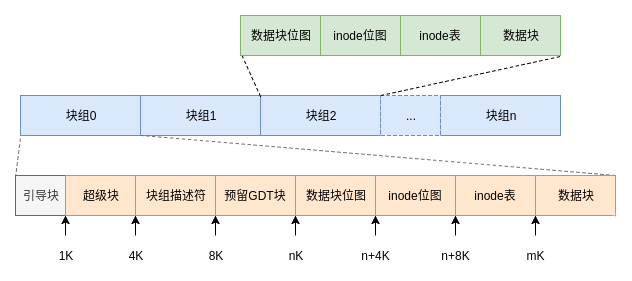

#  磁盘管理-磁盘管理基础

## 磁盘管理命令

```bash
df [选项] # 显示磁盘使用情况
    -a # 显示所有文件系统(包括特殊的proc)
    -h # 以合适单位显示大小
    -T # 显示文件系统类型
du [选项] 目录 # 显示文件占用空间
    -a # 显示每个子文件的磁盘占用量(默认只统计子目录的磁盘占用量)
    -h # 以合适单位显示大小
    -s # 统计总和占用,不在列出子文件的占用量
fsck 分区名 # 检查修复文件系统
    -y # 尝试自动修复出问题的文件系统(ext类)
dumpe2fs 分区名 # 显示ext类文件系统信息(不支持xfs系统)
    -h # 仅显示超级块信息
# 显示重点
#   卷标\挂载点\UUID\挂载参数\文件系统状态\inode总量/空闲\block总量\空闲\单block大小
stat 文件 # 显示文件的详细信息
    文件名\文件大小\占用block数量\单block大小\所在设备号\inode号\硬链接数\权限\属主\属组\访问时间\数据修改时间\状态修改时间
file 文件名 # 判断文件更详细的类型
type 命令 # 判断命令是否是内置命令

xfs_info 分区 # 显示 xfs 分区的详细信息
xfs_repair [选项] 分区 # 修复指定分区(分区处于卸载状态)
    -d # 针对 / 分区的修复,必须在单用户模式
mount # 挂载命令
blkid # 显示所有挂载分区的UUID和文件系统的类型
lsblk # 显示磁盘信息(分区\容量\挂载点)
```

# XFS

xfs 是一种高性能的日志文件系统,工作原理和 ext4 基本相同,但 xfs 的格式化速度较快

xfs 的三部分

* 数据区(Data section): 类似 ext4 的块组

    

* 文件系统活动登录区(Log section): 记录文件变化,最终将变化同步到数据块

* 实时运行区(Realtime section): 默认64K(4K-1G),作用类似缓存,数据先暂存于此,对应文件的块和 inode 分配完成后将数据移到指定位置

# 分区命令 fdisk & mkfs

## fdisk(MBR)

```bash
fdisk -l # 查看系统所有硬盘及分区
fdisk 磁盘名称 # 操作磁盘分区结构
# 交互命令
    p # 打印分区表
    n # 新建分区(可以选择主分区或扩展分区)
    d # 删除分区
    m # 帮助菜单
    q # 不保存退出
    w # 保存操作退出
```

## partprobe

```bash
partprobe 磁盘名 # 将磁盘的最新分区情况发送给内核
# 当提示Deivice or resource busy. The kernel still uses the old table. The new table will be used at the next reboot.可以使用 partprobe 或重启解决
```

## mkfs

```bash
mkfs 选项 分区 # 格式化指定分区(默认 ext2)
    -t # 指定文件系统类型
# 不能调整分区的默认参数
```

## mke2fs

```bash
mke2fs 选项 分区 # 创建 ext 类的文件系统
    -t # 指定文件系统
    -b # 指定 block 大小,单位为字节
    -i # 指定多少字节分配一个 inode 号,单位为字节(必须和-b 同时使用)
# 例子
mke2fs -t ext4 -b4096 -i4096 /dev/sdb1
```

## mkfs.xfs

```bash
mkfs.xfs 分区 # 创建 xfs 系统(mkfs -t xfs 实质是调用mkfs.xfs)
```

## 设备UUID

硬盘的唯一标识符,查看方式

```bash
dumpe2fs -h 分区
ls -l /dev/disk/by-uuid/
blkid
lsblk --fs
```

# 分区表

Linux 中常见分区表类型有两种: MBR\GPT(GUID)

* MBR:磁盘最大识别到2TB;最多四个主分区或三主分区和一个扩展分区
* GPT:可支持2TB以上的磁盘;分区数无限制,但Windows和Linux中都最多支持128分区,最大识别9.44ZB磁盘

寻址方式:

* 早期使用 CHS, 即磁头/柱面/扇区式寻址(从 n 柱面的1扇面开始数)
* 现在使用 LBA (逻辑区块地址)进行寻址, LBA 从 LBA0 开始向后计算

## GPT 分区表

GPT(GUID Partition Table) 其含义为"全局唯一标识磁盘分区表",主要用来代替 MBR 分区表,突破存储限制产生

### GPT 分区表构成

* LBA 0 ：GPT分区的最开头(第一个扇区),考虑兼容性问题,开头仍然存放MBR分区表,只是里面存放有0xEE标识,以此声明该磁盘使用的是GPT分区表。
* LBA 1 ：存储了硬盘的总存储空间,以及GPT分区表的信息,定义最多能创建128个分区,每个分区信息占用128字节；128个分区中有一个是用来存储备份分区表的,所以可以手动指定的分区数为127个分区。
* LBA 2-33：每个分区信息存放的位置,上边说了每个分信息占用的空间是128字节。2-33正好是32个扇区。32*512=16384,每个分区信息占用了128字节,16384/128=128个分区。
* LBA 34：后面是第一个分区的开始

## 分区命令 parted

```bash
parted 磁盘 # 操作实时生效
# 交互命令
    cp # 将文件系统复制到另一个分区 
    help # 帮助信息
    mklabel # 创建新的磁盘标签 (分区表)
    mkfs # 创建文件系统(默认 ext2 系统)
    mkpart # 创建一个分区 
    mkpartfs # 创建一个带有文件系统的分区 
    move # 移动分区 
    name # 将分区命名为“xx” 
    print # 打印分区表,或者分区 
    quit # 退出程序 
    resize # 改变分区中文件系统的大小 
    rm # 删除分区 
    select # 选择要编辑的设备 
    set # 改变分区的标志
    
mklabel msdos # 修改为 MBR
mklabel gpt # 将磁盘分区表修改为 GPT
mkpart # 创建新的分区
resize # 调整分区大小(不支持ext4,xfs)
```

## gdisk(GPT分区表)

```bash
gdisk 磁盘 # 对 GPT 分区进行操作
# 交互命令(基本与fdisk相同)
    l # 列出分区类型
```

### 创建 swap 分区

使用 gdisk 创建 swap 分区

1. 找出 swap 类型的分区编号(8200)

2. 创建 swap 分区

3. 格式化 swap

    ```bash
    mkswap /dev/sdc2
    ```

4. 启用 swap 分区

    ```bash
    swapon /dev/sdc2
    ```

5. 查看 swap 使用分区情况

    ```bash
    free -h # 显示内存和交换分区的使用情况
    ```

6. 设置自动挂载

    ```txt
    UUID=	swap	swap	defaults	0 0
    ```

将 swap 分区信息写入 /etc/fstab 后,不能使用 mount -a 进行挂载(因为 swap 分区没有挂载点)

