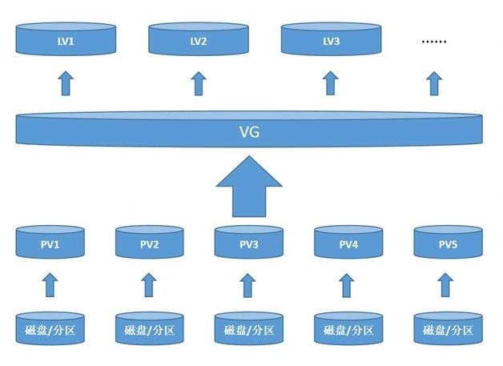
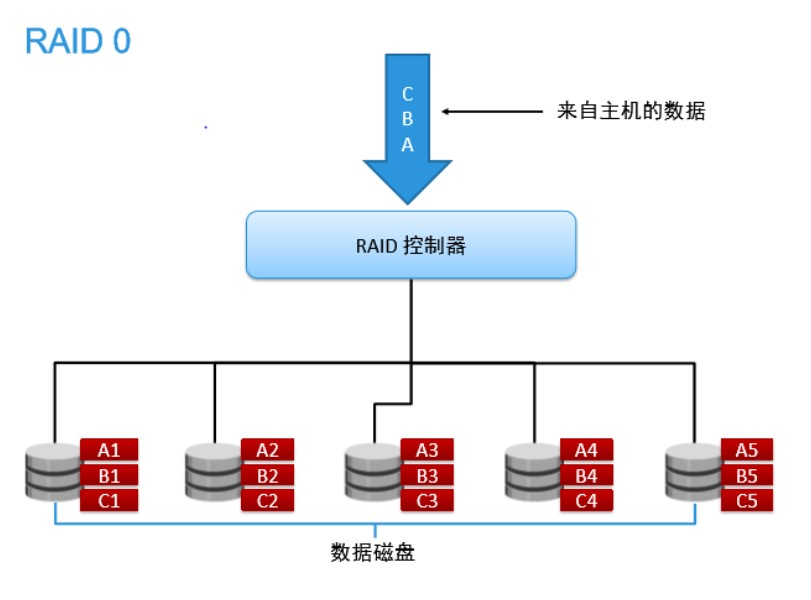
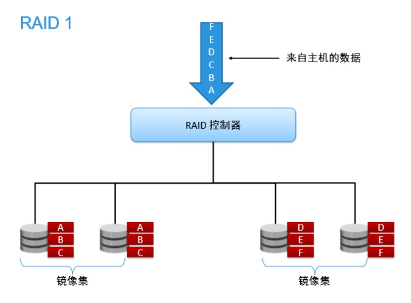
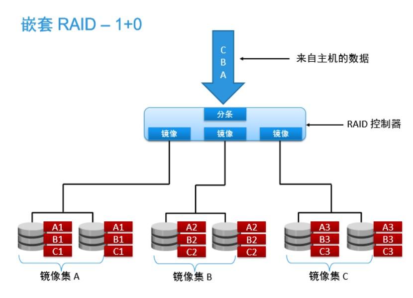
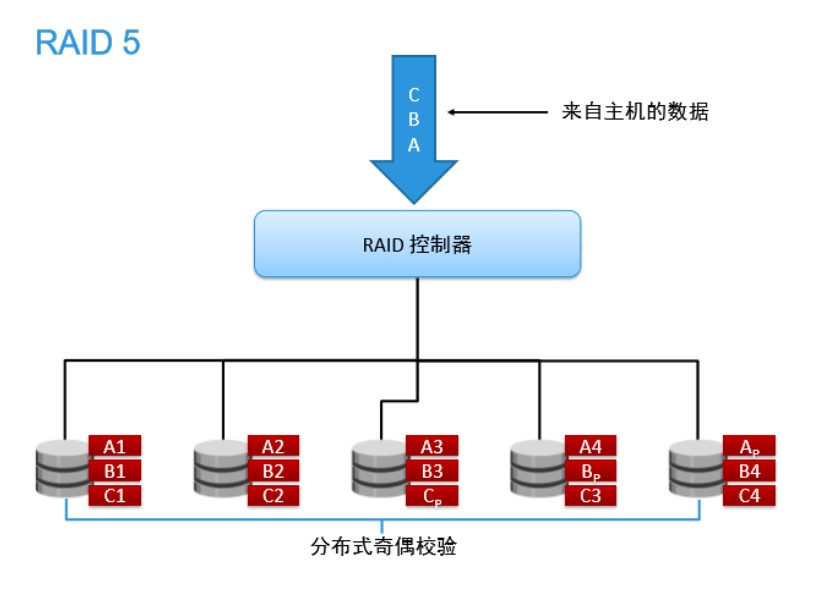

# LVM 逻辑卷管理

LVM (Logical Volume Manager)逻辑卷管理,将多个物理磁盘或分区组成一个虚拟存储池,然后按需划分空间使用



## LVM 组成

* 物理卷(Physical Volume,PV):由多个磁盘或分区转化而成
* 卷组(Volume Group,VG):将多个物理卷组合在一起组成卷组,即为存储池
* 逻辑卷(Logical Volume,LV):逻辑卷可以看作是分区,可以进行格式化,是存储数据的场所
* 物理拓展(Physical Extend,PE):卷组的最小存储单元,类似扇区的概念

## 创建 LVM

1. 将磁盘分区,或整块磁盘不分区
2. 将分区或整块磁盘转化为物理卷(PV)
3. 将物理卷合并成为卷组(VG)(可以通过添加或者删除物理卷,调整卷组大小)
4. 将卷组划分成逻辑卷(LV),逻辑卷需要写入文件系统和挂载使用(可以动态调整大小)

### 物理卷管理

使用 gdisk 分区后,将分区类型修改为 Linux LVM (IDCentOS 6为:8eCentOS 7为:8e00)

```bash
# 创建物理卷
pvcreate 分区

# 查看物理卷
pvs # 显示简要信息
pvscan # 显示简要信息和总计空间
pvdisplay # 显示详细信息

# 删除物理卷
pvremove
```

### 卷组管理

```bash
# 创建卷组
vgcreate 卷组 分区

# 查看卷组
vgs # 显示简要信息
vgscan
vgdisplay # 显示详细信息

# 卷组缩容(剔除物理卷)
vgreduce 卷组 物理卷

# 卷组扩容(添加物理卷)
vgextend 卷组 物理卷

# 删除卷组
vgremove 卷组
```

### 逻辑卷管理

```bash
# 创建逻辑卷
lvcreate -L 5G -n 卷名 卷组
    -L # 指定卷大小
    -l # 可以指定剩余空间百分比
    -n # 指定卷名
# 逻辑卷查看
lvs # 显示简要信息
lvscan
lvdisplay # 显示详细信息

# 逻辑卷需要格式化和挂载后才能使用
mkfs.xfs /dev/卷组/逻辑卷
mount /dev/卷组/逻辑卷 挂载点

# 逻辑卷扩容
lvextend -L [大小|增量] 逻辑卷
# 在对逻辑卷进行扩容后,要将文件系统信息也进行更新
# CentOS 7
xfs_growfs 逻辑卷
# CentOS 6
resize2fs -f 逻辑卷

# 逻辑卷缩容
# xfs文件系统不支持缩容
# CentOS 7
1. 先对数据进行备份,然后卸载分区
2. 缩小逻辑卷
3. 格式化逻辑卷
4. 挂载逻辑卷
5. 恢复数据

# CentOS 6
# ext4 文件系统支持缩容,但要先卸载逻辑卷
e2fsck -f 逻辑卷 # 检查文件系统
resize2fs 逻辑卷 新大小 # 文件系统缩容
lvreduce -L [大小|减量] 逻辑卷 # 逻辑卷缩容
```

### xfs 备份与恢复

```bash
xfsdump -f 文件名 备份文件 # 备份
# 在备份目录时,目录结尾不能带/

xfsrestore -f 备份文件名 恢复路径
```

### fuser

```bash
fuser -km 分区 # 终止所有与分区有关的进程
```

## RAID 磁盘阵列

提供冗余/校验/加速功能,提高存储的稳定性

### 简介

#### RAID 0 条带卷

数据分片存储,提高读取效率



#### RAID 1 独立冗余阵列(镜像卷)

在存储时,镜像备份,但使用率只有50%



#### RAID 10

结合 RAID 1 和 RAID 0,同时提高速度和安全性



#### RAID 5

使用奇偶校验的分布式存储


#### RAID 6

存储方式于 Raid 5相同,但采用两种校验方法

| 名称    | 使用磁盘数量 | 磁盘利用率 | 允许磁盘损坏数量                | 磁盘容错       | 读写速度(相比于不使用RAID) |
| ------- | ------------ | ---------- | ------------------------------- | -------------- | -------------------------- |
| Raid 0  | n>=2         | 100%       | 0                               | 无             | n 倍读写                   |
| Raid 1  | 2n(n>=1)     | 50%        | 最多一半,但不能是存储相同数据的 | 有（镜像）     | 写慢,读快                  |
| Raid 5  | n>=3         | n-1/n      | 最多损失1块                     | 有（奇偶检验） | 较快                       |
| Raid  6 | n>=4         | n-2/n      | 最多损失2块                     | 有(两种校验)   | 较快(比Raid 5 慢)          |
| Raid 10 | 4n(n>=1)     | 50%        | 与Raid 1 相同                   | 有(镜像)       | 读同 Radi 0,写同 Raid 1    |
| Raid 50 | 3n(n>=2)     | n-1/n      | 最多每个Raid 5组1块             | 有(奇偶校验)   | 读写快于Raid 5             |
