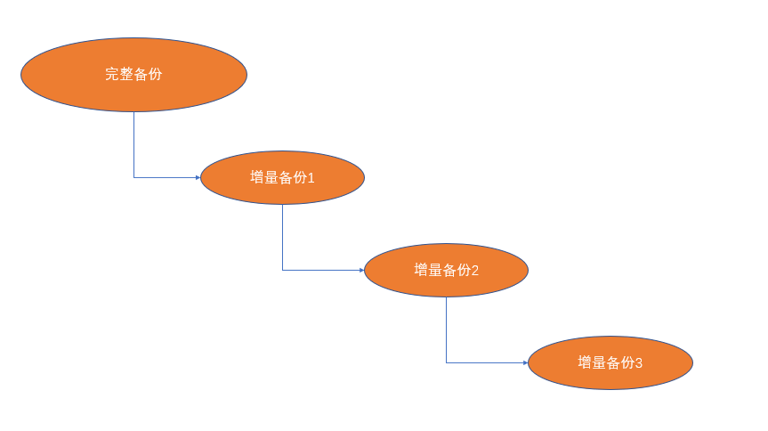
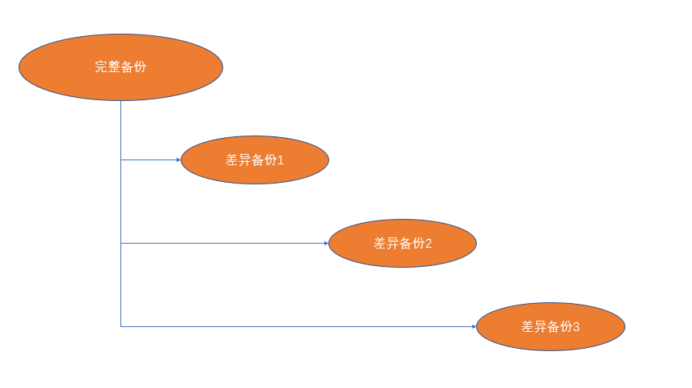

# 备份管理

## 要备份的数据

### Linux 系统自带配置文件

* /etc 目录下的众多常用配置文件,尤其是修改过后的配置文件
* root 用户和普通用户家目录下的相关配置文件

### 用户管理脚本及用户上传的文件

* 各类管理服务器的脚本工具
* 用户家目录或者自定义目录下用户上传的重要文件

### 各类服务的运行日志文件

* 系统自带日志: /var/log/\*
* 第三方软件日志: 例如 /usr/local/apache2/logs/\*

### web 服务器的网页及静态资源文件

* Apache/Nginx/Tomcat等常见 web 服务器所分享的网页及静态资源文件

### 数据库内保存的数据

* MySQL/Mariadb/Oracle 等数据库保存的数据文件

## 备份策略

### 备份工具

命令:

```bash
diff(patch)/cpio/cp/tar/zip/rsync/scp/dump/mysqldump
```

工具:一般为第三方开源软件

参考因素: 效率/安全性/稳定性

### 备份级别

* 同端备份:在同一主机内不同分区或磁盘备份,数据不是特别重要时使用
* 多端备份:在同一地理区域,使用多机备份,防止单机出现灾难性故障
* 异地备份:又称异地容灾备份,防止某一地理区域出现灾难性故障,适合数据比较重要的情况
* 云端多重备份:多数据中心云端备份,异地备份的升级版,但如果不是私有云,安全性需要考量

### 备份时机

* 热备份:数据不断变化时备份,备份快,将新增内容备份;缺点,备份过程不能出错,否则恢复很难
* 冷备份:俗称离线备份,在数据停止变化时备份,安全性高,备份容易恢复,速度较快;缺点,冷备份时需要停止数据变化;数据量较大时,备份耗时较长
* 选择在服务器压力负载最低的时候进行备份,减少对服务器正常运行的影响,一般在夜间或凌晨

### 备份后检查

**检查备份策略是否正常执行**

**不定时测试备份的文件是否可以用于恢复**

## 备份模式

进行数据备份时会消耗一定的系统资源,选择合适的模式可以降低对服务器运行的影响

### 完整备份

备份时,将所有数据进行备份,备份之间都是独立的,每个备份都是完整的


### 增量备份

首先进行一次完整备份,之后的备份只备份相对于前次备份新增的内容,新备份依赖于旧备份

### 差异备份

首次进行完整备份,之后的备份仅备份的是对于首次备份的新增内容,新备份只依赖首次的完整备份



在实际使用中常使用差异备份+备份轮替,以周为单位进行差异备份,然后轮替