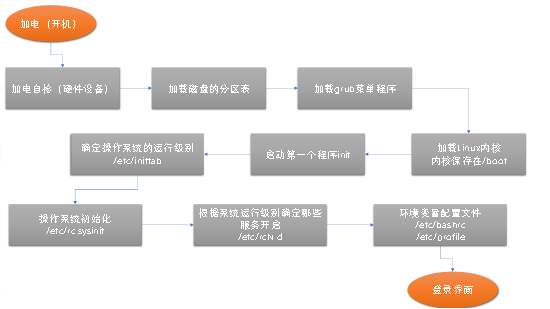
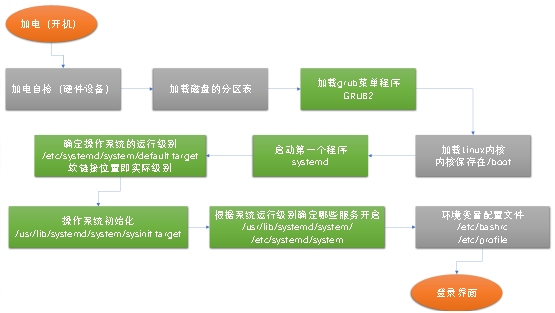

# 系统启动管理

## CentOS 6 启动流程

1. 开机加电自检

    (Power-OnSelf-Test,POST),在设备上电后,检测所有设备是否可用

2. 磁盘分区表引导

    通过 BIOS 确定引导哪一个存储设备后,尝试读取该设备上的分区表(MBR 或 GPT),将主引导记录加载到内存

3. grub 菜单引导

    grub 菜单引导程序

4. 加载内核

    将菜单中选择的内核加载到内存中,解压运行内核

5. 运行 init 进程

    内核执行 Linux 中的第一个进程 init 进程,即初始进程(系统守护进程)

6. 加载系统运行级别

    加载 /etc/inittab 文件,确定对应的系统运行级别,然后启动完整的操作系统

7. 初始化系统

    加载 /etc/rc.sysinit 文件完成初始化,主要包括设置主机名,设置ip等操作

8. 根据启动级别开启服务

    根据系统运行级别加载对应目录下 /etc/rcN.d 的服务脚本

9. 登录系统

    显示登录提示,然后登录系统

## CentOS 7 启动流程

1. 开机加电自检

2. 磁盘分区引导

3. grub2 引导菜单加载

4. 加载内核

5. 运行第一个进程 systemd

6. 确定系统的运行级别

    定义在 /lib/systemd/system

7. 初始化系统

    加载指定文件完成初始化: /usr/lib/systemd/system/sysinit.target

8. 启动各种服务

    由于 systemd 的特性可以并行启动

9. 登录系统

## CetnOS 6 和 CentOS 7 启动流程对比

| CentOS 6                                       | CentOS 7                                        |
| ---------------------------------------------- | ----------------------------------------------- |
| 开机上电                                       | 开机上电                                        |
| BIOS 自检                                      | BIOS 自检                                       |
| 分区表引导                                     | 分区表引导                                      |
| GRUB 菜单(选取内核,单用户模式)                 | GRUB2 菜单 (救援模式 resuce.target)             |
| 加载内核                                       | 加载内核                                        |
| 运行第一个进程 init                            | 运行第一个进程 systemd                          |
| 读取运行级别 /etc/inittab                      | 读取运行级别 /etc/systemd/system/default.target |
| 初始化 /etc/rc.d/rc.sysinit (设置主机名,ip 等) | 初始化 /usr/lib/systemd/system/sysinit.target   |
| 根据运行级别运行脚本 /etc/rc.d/rcN.d           | 并行启动服务                                    |
| 启动 mingetty, 显示 login 界面                 | 启动 getty.target,显示 login 界面               |

### 运行级别对比

| CentOS 6-run level   | CentOS 7-target              |
| -------------------- | ---------------------------- |
| 0 关机状态           | Poweroff.target 关机状态     |
| 1 单用户模式         | resuce.target 救援模式       |
| 2 多用户模式,没有NFS | -                            |
| 3 完整多用户模式     | multi-user.target 多用户模式 |
| 4 待开发             | -                            |
| 5 图形界面           | graphical.target 图形界面    |
| 6 重启               | reboot.target 重启           |

## GRUB & GRUB2

CentOS 6 使用 grub 作为引导程序,而 CentOS 7 使用 grub2 作为引导程序

### grub

grub 有四个重要的文件

1. stage1 安装在第一扇区,负责加载在第二扇区的 start 程序,start 程序用于加载 stage1_5

2. stage1_5 负责识别文件系统和加载 stage2,在安装grub时,会根据当前 /boot 分区类型,加载相应的 stage1_5 到第三扇区

3. stage2 负责显示启动菜单和提供用户交互接口,并加载系统内核,位置在 /boot/grub下

4. menu.lst(/boot/grub/grub.conf 的链接),grub.conf 是一个基于脚本的文本文件,其中包含了操作系统的内核加载配置

    | 关键词      | 描述                                                         |
    | ----------- | ------------------------------------------------------------ |
    | default     | 默认启动的操作系统                                           |
    | timeout     | 菜单等待时间                                                 |
    | splashimage | 菜单背景图                                                   |
    | hiddenmenu  | 隐藏菜单,只有按下 enter 键后才出现菜单                       |
    | title       | 操作系统标识                                                 |
    | root        | 指定/boot 所在硬盘                                           |
    | kernel      | 指定内核文件                                                 |
    | initrd      | 帮助内核完成系统启动                                         |
    | passwd      | 设定密码,放在title外表示进入操作系统等待菜单的编辑模式需要密码,而放在title内表示启动对应的操作系统需要密码,密码可以是明文或是用MD5进行加密过的。 |

### grub2

grub2的功能类似于grub,不过配置文件进行了重大调整

* 无 stage1 stage1.5 stage2

* 配置文件采用新语法,支持脚本,假如新的命令,配置文件名为 grub.cfg

* 分区号不再从 0开始,而是从 1开始

* 支持更多到文件系统,如：ext4,hfs,ntfs,并可以直接从 lvm和raid中读取文件

* grub2有更可靠的方法在磁盘上有多系统时发现文件和目标内核,可以用命令发现系统设备号或者UUID。

* 引入了设备模块,使得 core 镜像保持更小到尺寸

* 在启动时没有选择菜单的话,按住shift即可强制显示菜单
