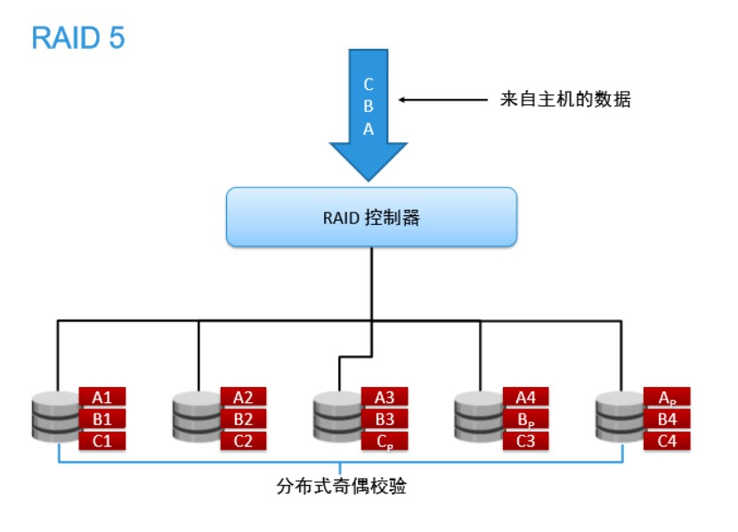
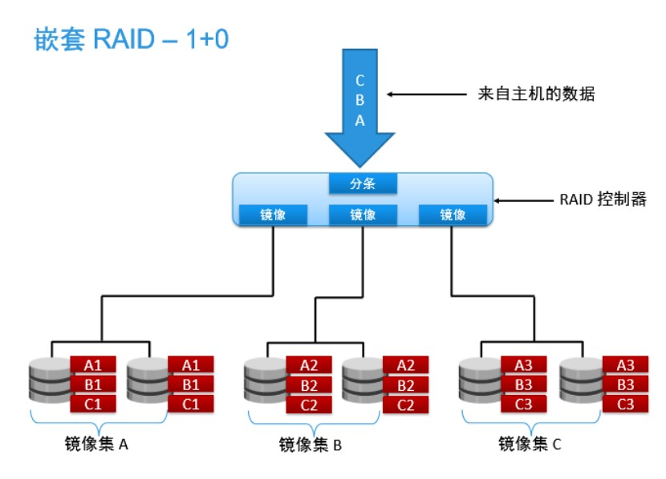

# 权限通用原则

权限设置的基础：多用户,多任务操作系统。（DOS是单任务,单用户的,默认拥有管理员权限,无法进行设置）

Windows权限分类：

* 无权限
* 允许
* 拒绝

1. 网络权限与本地权限（Windows,Linux一致）（Samba,FTP,NFS）

    本地访问：本地权限生效

    网络访问：网络权限和本地权限同时生效

2. 拒绝权限优先（Windows和Linux一一致）

    在属于多个组的用户行使权限或网络访问时,拒绝权限优先发挥作用

3. 权限的累加（Windows特有）

    由于Windows的权限绑定在用户组上,如果用户属于多个用户组,那么这个用户的权限是多个用户组的权限的累加

4. 权限的继承（Windows特有）

    下级目录会继承上级目录的权限,保证新建文件都有默认权限。

## Windows磁盘管理

基本分区：

局限：不能在不损失数据的情况下,动态调整分区大小（第三方工具可以,强制调整,不稳定,不支持复杂调整）

动态磁盘：（Linux：LVM：逻辑卷管理）

| 名称            | 使用磁盘数量 | 磁盘利用率 | 动态扩容          | 磁盘容错       | 写入速度 |
| --------------- | ------------ | ---------- | ----------------- | -------------- | -------- |
| 简单卷          | 1            | 100%       | 无                | 无             | 正常     |
| 跨区卷          | n            | 100%       | 有                | 无             | 正常     |
| 带区卷（Raid0） | n            | 100%       | 有                | 无             | 最快     |
| 镜像卷（Raid1） | 2n           | 50%        | 有                | 有（镜像）     | 最慢     |
| Raid5           | n>3          | n-1        | 有（最多损失1块） | 有（奇偶检验） | 较高     |

1. 简单卷

    只能使用一块硬盘

    拥有分区动态扩容功能

    没有磁盘容错功能

2. 跨区卷

    使用两块以上硬盘组成

    每个硬盘提供的空间大小不一致

    拥有动态扩容功能

    没有磁盘容错功能

3. 带区卷（RAID 0）（磁盘阵列）(独立硬盘冗余阵列)

    使用两快以上硬盘组成

    每块硬盘提供的空间大小一致

    读写速度最快

    损坏几率最大

    没有磁盘容错功能

    

4. 镜像卷（RAID 1）

    由两块或两块的倍数硬盘组成

    每块硬盘提供的空间大小必须一致

    拥有磁盘容错功能

    理论写入速度最慢

    磁盘利用率只有50%

    

5. RAID 5

    由三块或多于三块硬盘组成

    每块硬盘提供的空间大小必须一致

    拥有磁盘容错功能（最多损失1块硬盘）

    磁盘利用率是n-1块硬盘
    

RAID 0和RAID 1组合使用,可以获得两者优势

逻辑运算：

​逻辑 与（and）有0为0

​逻辑 或 （or） 有1为1

​异或 相同为0,不同为1
