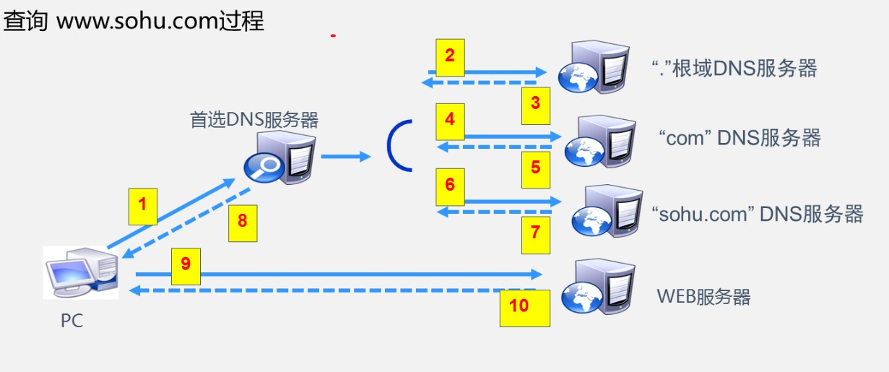

# DNS服务

## 域名分级

### 根域名：`.`

全球13组根域服务器，每一个DNS服务器都知道跟服务器的IP

### 一级域名：`.com`

国际组织规定，不能随意申请

### 二级域名：`baidu.com`

个人组织申请，要求二级域名+一级域名全 球唯一

### 三级域名：`www.baidu.com`

个人或组织自定义

### FQDN（Fully qualified domain name）：完全合格域名： 例如：(`www.baidu.com.`)

## DNS查询过程

1. 个人PC访问`www.sohu.com`，查询首选DNS服务器（浏览器或本机若有缓存，则直接获取IP）

2. 首选DNS服务器无缓存（如果有则直接返回对应IP），查询根域DNS服务器

3. 根域服务器返回一级域DNS服务器地址

4. 首选DNS服务器查询一级域DNS服务器

5. 一级域服务器返回二级域DNS服务器地址

6. 首选DNS服务器查询二级域DNS服务器

7. 二级域DNS服务器返回`www.sohu.com`对应IP地址

8. 首选DNS服务器将查询结果返回给个人PC

9. 个人PC访问`www.sohu.com`的IP地址

10. WEB服务器返回网站内容

**注**：1,6过程为递归查询，客户端向首选DNS查询，DNS服务器返回准确地址，如果不知道可以查询其他DNS服务器

2,4过程为迭代查询，首选DNS向后端DNS查询，迭代查询允许返回近似结果



### 查询分类

正向查询：由域名查找IP地址

反向查询：由IP地址查找域名

### 资源记录类型

| 资源记录                                      | 说明                                                         |
| --------------------------------------------- | ------------------------------------------------------------ |
| **SOA（Start Of Authority）（起始授权机构）** | 定义了该域中的权威名称服务器                                 |
| **NS（Name Sever）（名称服务器）**            | 表示区域的权威服务器和SOA中指定的该区域的主要服务器和辅助服务器 |
| *A（主机）*                                   | 列出了区域中域名到iP地址的映射                               |
| *PTR（PoinTer Record）（指针）*               | 相对于A资源记录，PTR记录是把IP地址映射到域名                 |
| MX（Mail eXchange）（邮件交叉记录）           | 邮件交换记录，向指定的邮件交换主机提供消息路由               |
| SRV（（服务）                                 | 列出了正在提供特定服务的服务器                               |
| CNAME（Canonical Name record）（别名）        | 将多个名字映射到同一台计算机上，便于用户访问                 |

### 区域（保存数据的目录）

正向区域：

​   sc.com： 记录类型（数据）

反向区域：

​   15.168.192（网段反写）：记录类型

### DNS服务实验

1. 安装DNS服务器
2. 添加正向查找区域（默认存在SOA和NS记录）
3. 添加A记录（域名->IP）
4. 添加反向查找区域（默认存在SOA和NS记录）
5. 添加PTR（IP->域名）

| 区域类型 | 说明                                               |
| -------- | -------------------------------------------------- |
| 主要区域 | 可以手动更新域名，允许客户端连接                   |
| 辅助区域 | 不能手动更新域名，可从主服务器更新，允许客户端连接 |
| 存根区域 | 只允许客户端连接，提供根DNS服务器                  |

#### 命令

```bash
nslookup # 查询DNS的记录，查询域名解析是否正常
```

DNS服务和IIS服务都配置完成后，可从域名访问WEB服务
