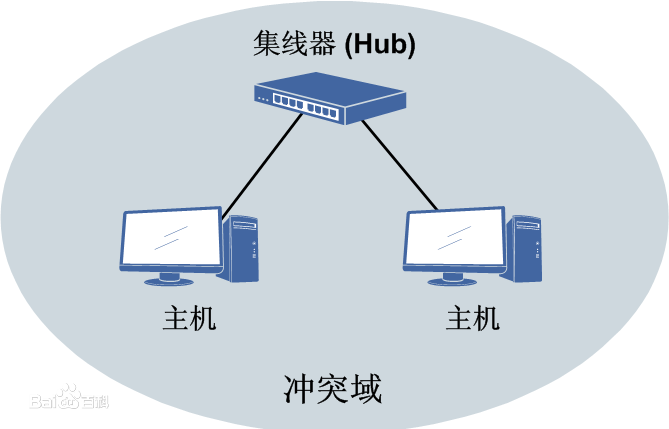
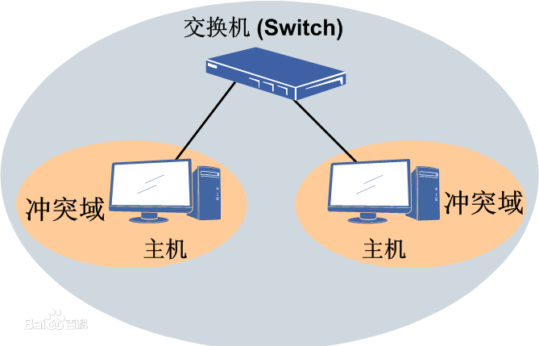
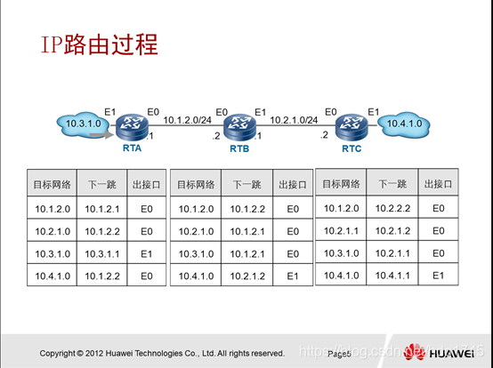

# ISO/OSI七层模型

开放式系统互联通信参考模型

## 每层的作用

| 层数 | 名称       | 作用                                                         |
| ---- | ---------- | ------------------------------------------------------------ |
| 7    | 应用层     | 为用户提供服务,给用户一个操作界面                           |
| 6    | 表示层     | 数据提供表示；加密；压缩                                     |
| 5    | 会话层     | 确定数据是否需要进行网络传递                                 |
| 4    | 传输层     | 对报文进行分组（发送时）,组装（接收时）；提供传输协议选择：UDP,TCP；端口封装；差错校验 |
| 3    | 网络层     | IP地址编址；路由选择：静态路由；动态路由                     |
| 2    | 数据链路层 | MAC地址编址；MAC地址寻址；差错校验                           |
| 1    | 物理层     | 数据实际传输；电气特性定义                                   |

表示层加密（Windows）：

1. 使用压缩工具的加密（对称加密。zip：128位；rar：256位）

2. Windows自带加密（1024位）：右键属性-高级,Windows文件加密权限是绑定在用户上的

### TCP和UDP

| 传输层协议            | 优点                                        | 缺点                           |
| --------------------- | ------------------------------------------- | ------------------------------ |
| TCP（传输控制协议）   | 可靠的,面向连接的传输协议（TCP的三次握手） | 慢                             |
| UDP（用户数据报协议） | 快                                          | 不可靠的,面向无连接的传输协议 |

### 冲突域

冲突域：计算机可以直接互相产生冲突的范围

以太网：工作在数据链路层的网络是以太网

CSMA/CD：载波监听/多路访问

>HUB：集线器,带宽共享
>
>网桥：分割冲突域
>
>中继器：信号还原

以上三个设备被交换机取代

## 路由器通信原理

路由器访问未知IP：

查询路由表

    直连网段,不需要配置,可以直接通信

    非直连网段,需要配置：

| 方式       | 特点                                                         |
| ---------- | ------------------------------------------------------------ |
| 静态路由表 | 消耗路由资源最少,优先级最高；手工配置比较麻烦,适合小型网络 |
| 动态路由表 | （通过组播获取）消耗较多资源；根据路由协议自动建立,简单,方便（有许多不同的协议） |

