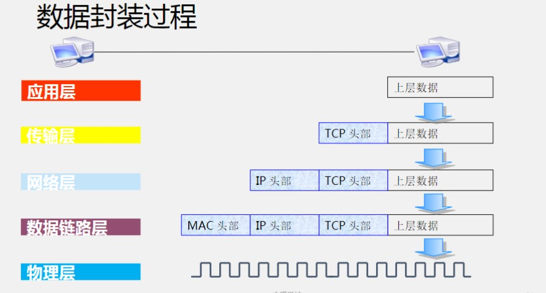
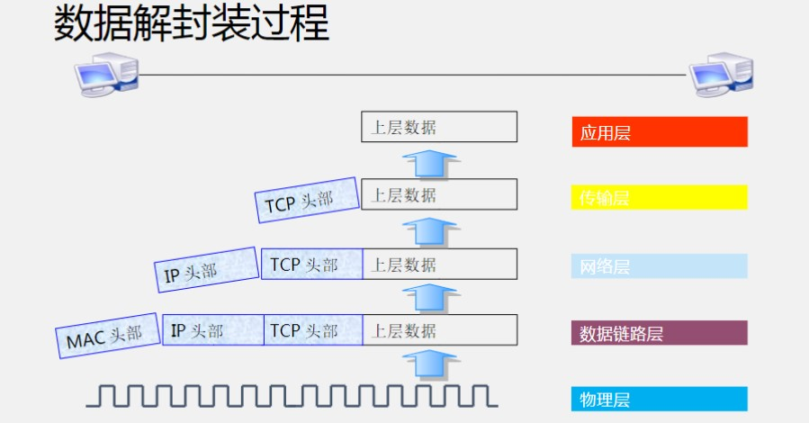
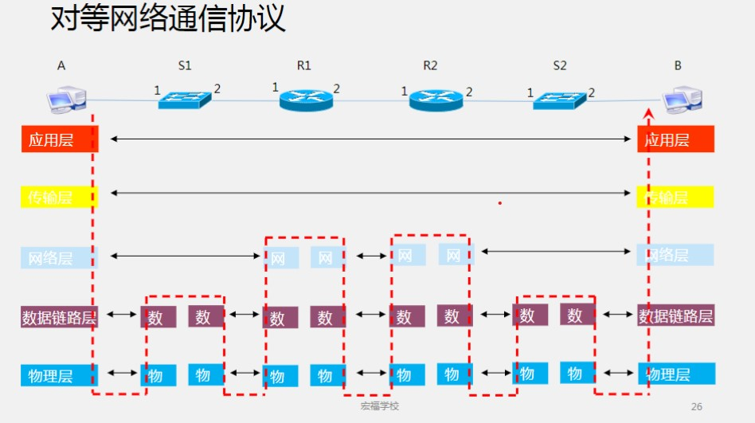

# TCP/IP四层模型和通信原理

## OSI模型 vs TCP/IP模型

## TCP/IP协议族的组成

| 层名称     | 协议                            | 网络设备           | 传输   |
| ---------- | ------------------------------- | ------------------ | ------ |
| 应用层     | HTTP,FTP,TFP,SMTP,SNMP,DNS | 计算机             |        |
| 传输层     | TCP,UDP                        | 防火墙             | 数据段 |
| 网络层     | ICMP,IGMP,IP,ARP,RARP       | 路由器,三层交换机 | 数据包 |
| 数据链路层 | PPP,PPPOE                      | 二层交换机         | 数据帧 |
| 物理层     |                                 | 网卡               | 比特流 |

### 应用层常见协议

* HTTP(80)：超文本传输协议（网站访问WEB）（Apache,Nginx,IIS）
* FTP(20/21)：文件传输协议（网络文件传输）
* TFTP：简单文件传输协议（交换机和路由器系统重装）
* SMTP：简单邮件传输协议（发信）
* POP3：邮局协议3代（收信）
* SNMP：简单网络管理协议（服务器监控）
* DNS：域名系统（域名与IP解析）

### 传输层协议

* TCP：传输控制协议（面向连接的,可靠的传输协议）
* UDP：用户数据报协议（面向无连接,不可靠的传输协议）

### 网络层协议

* IP：网际协议
* ICMP：互联网控制消息协议（网络探测,ping,tracert）
* IGMP：互联网组管理协议
* ARP：地址解析协议（IP——》MAC）
* RARP：反向地址解析协议（MAC——》IP）

### 数据链路层协议

* PPP：点对点协议
* PPPOE：点对点拨号协议

### 物理层

通信类相关协议,和网络工程师,运维工程师关系不大

### 防火墙

数据包过滤（IP,MAC,端口,协议类型,数据包中数据（软件模拟防火墙））

### 交换机

二层交换：整个交换有一个MAC地址,不是用于网络通信（不能作为访问目标）,用于交换机特殊换算（例如：STP（生成树协议）

三层交换：每一个网口有一个独立MAC地址,可以作为访问目标

### 数据封装过程

1. 应用层产生数据
2. 传输层封装TCP头部
3. 网络层封装IP头部
4. 数据链路层封装MAC头部
5. 物理层传输封装好的数据

### 数据解封过程

1. 物理层接收封装好的数据
2. 数据链路层拆下MAC头部
3. 网络层拆下IP头部
4. 传输层拆下TCP头部
5. 应用层使用数据

## 网络通信原理

### 对等网络通信原理

公网IP<==>公网IP

私有IP<==>私有IP

通信过程中**IP地址永不变,MAC地址经过一次路由,重新计算**

网关：首先是路由器,是默认路由（路由表是从上到下查询,默认路由在最下面）

#### 私有IP地址

* 10.0.0.0 - 10.255.255.255

* 172.16.0.0 - 172.31.255.255

* 192.168.0.0 - 192.168.255.255

#### 对等网络通信过程

1. 主机A发送数据（包含源端口,目的端口；源iP：A,目标IP：B；源MAC：A,目的MAC：R1-1（查路由表,没有B的MAC,默认发给网关））
2. 交换机S1转发给R1（查MAC表,转发给对应端口）
3. 路由器R1对比目的MAC地址,拆下MAC头,查看IP,转发（查路由表,源MAC换为R1-2的MAC,目的MAC换为R2-1）
4. 路由器R2对比目的MAC地址,拆下MAC头,查看IP,转发（查路由表,源MAC换为R2-2的MAC,目的MAC换为B）
5. 交换机S2转发给主机B（查MAC表,转发给对应端口）
6. 主机B收到数据

### 非对等网络

私有IP==>公网

网关：首先是路由器,是默认路由,NAT（网络地址转换）（将私有IP转换为公网IP）

#### 非对称网络通信过程

通信过程与对称网络通信过程相似,但在主机发送的数据通过路由器时,路由器会通过NAT将私有IP转换为公有IP（表现为整个网段中的主机与外部通信时使用同一个公网IP）

## 补充

常见协议和对应端口

|端口  |协议  | 功能|
|------|-----|-----|
|20/21|ftp|文件共享|
|22|ssh|安全远程管理|
|23|telnet|不安全的远程管理|
|25|smtp|简单邮件传输协议|
|465|smtp(ssl)|加密的邮件传输|
|110|pop3|邮局协议|
|143|imap4|收信|
|993|imap4(ssl)|收信|
|80|http|www服务|
|443|https|加密www服务|
|3306|mysql|数据库端口|
|53|DNS|域名解析|
