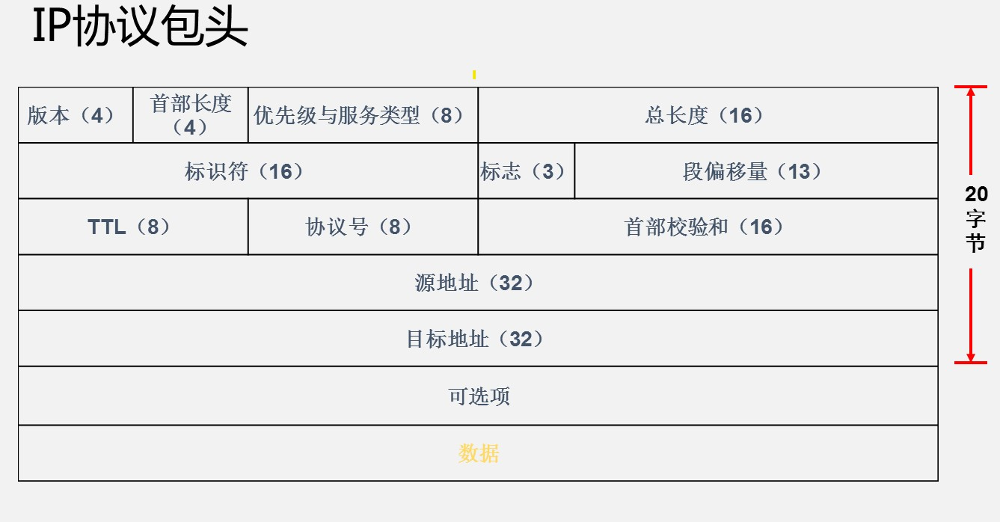

# 网络通信协议

## TCP/IP模型对应协议

### 网络层协议

ARP协议（Address Resolution Protocol）,地址解析协议。将一个已知的IP地址解析成MAC地址

主机A在局域网中广播（ARP Request）,主机B单播（ARP Reply）回复（其他主机丢弃）,主机A将主机B的IP和MAC记录在ARP缓存表（重启清空）中。

#### MAC地址

长度为48位（6字节）,通常用12个十六进制数表示。固化在网卡的ROM中,早期规定MAC地址前24位为厂商代码,后24位为序列号。

#### Windows系统中ARP相关命令

``` shell
arp -a #查看ARP缓存表

arp -d #清除ARP缓存
```

## 局域网常见故障

1. MAC地址冲突

    局域网中两台主机MAC地址相同,两台主机无法通信,与其他主机通信会丢包。不同网段内的相同MAC可以正常通信

2. 交换机环线——广播风暴

    交换机对广播包的处理,是不管从哪个端口收到广播包,都完整地**复制**一份**转发**到其他端口（除接收到的端口外）。产生广播风暴会影响通信,直至交换机瘫痪。在网络规划要避免出现环路

3. VLAN技术（虚拟局域网）

    应用在交换机上（对端口进行分配）,可以分割广播域。在实际使用中VLAN技术或者三层交换机实现

## IP协议

IP协议包头



可选项长度为40字节

### IP地址分类

| 类别          | 定义                 | 区间                                                         |
| ------------- | -------------------- | ------------------------------------------------------------ |
| A类           | 二进制地址以0开头    | 00000001.00000000.00000000.00000000-01111111.11111111.11111111.11111111（1.0.0.0-126.255.255.255） |
| B类           | 二进制地址以10开头   | 10000000.00000000.00000000.00000000-10111111.11111111.11111111.11111111（128.0.0.0-191.255.255.255） |
| C类           | 二进制地址以110开头  | 11000000.00000000.00000000.00000000-11011111.11111111.11111111.11111111（192.0.0.0-223.255.255.255） |
| D类（组播IP） | 二进制地址以1110开头 | 11100000.00000000.00000000.00000000-11101111.11111111.11111111.11111111（224.0.0.0-239.255.255.255） |
| E类（保留）   | 二进制地址以1111开头 | 11110000..00000000.00000000.00000000-11111111.11111111.11111111.11111111（240.0.0.0-255.255.255.255） |

#### 特殊地址

0.0.0.0 全零地址不使用

127.0.0.1 本地回环IP地址,可以通过ping 127.0.0.1确认本机TCP/IP是否正常

D类IP地址不能直接使用,用于组播地址
