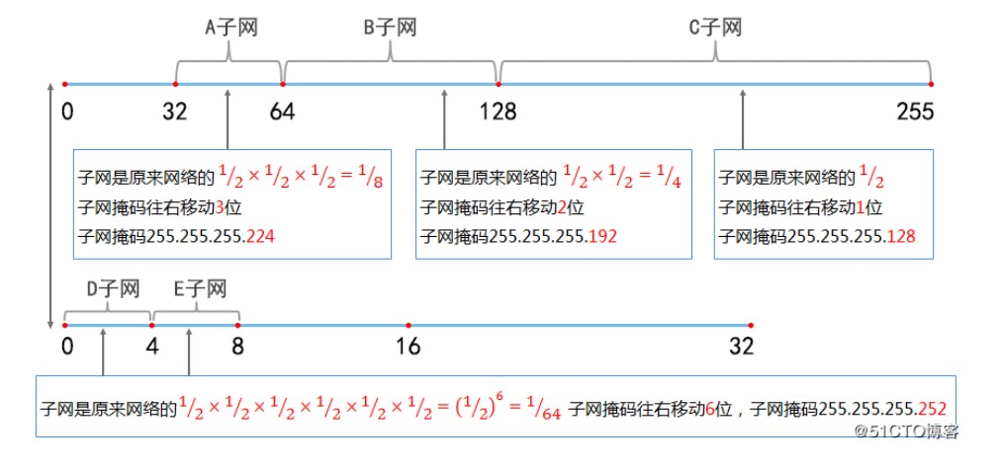
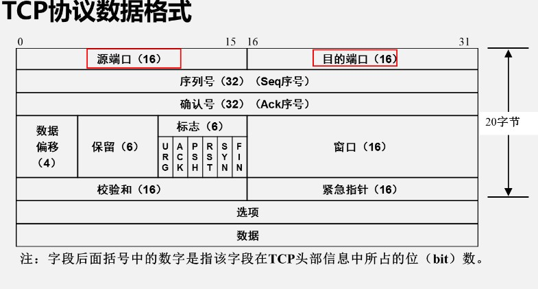
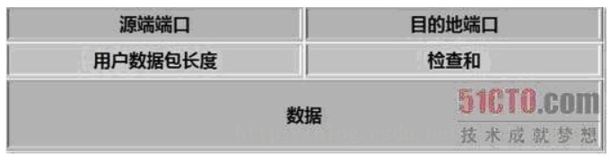

# 子网划分和传输层协议

## VLSM

可变长子网掩码划分

不同子网使用不同的子网掩码,划分出长度不等的子网

可以视作在等长子网的划分上,分别取不同的等长子网的某个或多个子网



## IPv6

地址数量大幅提升,拥有$2^{128}$ 地址数量
IPv6使用更小的路由表,提供了路由转发的速度
简化了数据包头,并拥有固定大小,加快了分组转发
更好支持QoS（服务质量）,能确保特定服务不受延迟或丢弃
IPv6加入了对全自动配置的支持
IPv6拥有更高的安全性

### IPv6地址表示

#### 首选格式

8组,用冒号隔开,每组4个十六进制数的形式

2001:8C63:3234:5678:90AB:CDFE:1324:0001

#### 零压缩法

把连续的一段0压缩为 :: ,即用冒号表示,但在地址中只能出现一次

2001:0000:0000:0000:AB3A:1324:5768:91A2

2001::AB3A:1324:5768:91A2

### IPv6地址分类

单播地址：传统的点到点的通信
组播地址：一点到多点的通信
任播地址：目标地址是一组网络接口中的一个接口（离发送方最近或最容易访问的地址）

取消了IPv4中的广播地址,在IPv6中广播是通过组播地址实现的

## 传输层协议

## TCP协议

传输控制协议

### TCP包头



端口号：TCP端口和UDP端口是不同的

0-1023：系统端口,也叫公认端口,只有系统特许的进程才能使用

 序列号：Seq序号,占32位,用来标识从TCP源端向目的端发送的字节流,发起方发送数据时对此进行标记

确认序列号：Ack序号,占32位,只有ACK标志为1时,确认序号字段再有效,Ack=Seq+1

标志位：共6个,具体含义如下：

BAK：确认序号有效

SYN：发起一个新连接

FIN：释放一个连接

#### TCP三次握手

1. 第一次握手：Client将标志位SYN置为1,随机产生一个值seq=J,并将该数据包发送给Server,Client进入SYN_SENT状态,等待Server确认。

2. Server收到数据包后由标志位SYN=1知道Client请求建立连接,Server将标志位SYN和ACK都置为1,ack=J+1,随机产生一个值seq=K,并将该数据包发送给Client以确认连接请求,Server进入SYN_RCVD状态。

3. Client收到确认后,检查ack是否为J+1,ACK是否为1,如果正确则将标志位ACK置为1,ack=K+1,并将该数据包发送给Server,Server检查ack是否为K+1,ACK是否为1,如果正确则连接建立成功,Client和Server进入ESTABLISHED状态,完成三次握手,随后Client与Server之间可以开始传输数据了。


#### TCP四次挥手

1. Client发送一个FIN,用来关闭Client到Server的数据传送,Client进入FIN_WAIT_1状态。

2. Server收到FIN后,发送一个ACK给Client,确认序号为收到序号+1（与SYN相同,一个FIN占用一个序号）,Server进入CLOSE_WAIT状态。

3. Server发送一个FIN,用来关闭Server到Client的数据传送,Server进入LAST_ACK状态。

4. Client收到FIN后,Client进入TIME_WAIT状态,接着发送一个ACK给Server,确认序号为收到序号+1,Server进入CLOSED状态,完成四次挥手。


#### 查询本机网络连接状态命令

```powershell
netstat -an  
 -a  # 所有信息
 -n  # 用数字显示查询到的信息
```

## UDP

用户数据报协议


