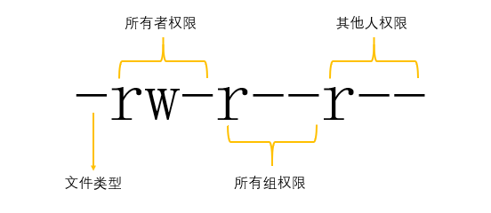

## 链接

~~~shell
ln # 创建链接（默认为硬链接）
	-s # 创建软连接（符号链接）
# 格式
ln 选项 源文件 目标文件
# 例子
ln -s /root/lol /tmp/ # 在/tmp目录下创建/root目录下的lol文件的软连接
# 创建链接时，要使用绝对路径
~~~

在ls -l的长列表中，对于软链接，标注了指向的源文件；第二列则显示了引用计数

第五列，对于普通文件显示的是文件大小，对于设备类文件，显示的是主从设备号

主：代表设备类型

从：同类型中，第几个设备

>   引用计数：
>
>   普通文件：硬链接数量和源文件的和
>
>   目录文件：代表当前目录内一级子目录的数量

~~~shell
# 拓展
ls -lsh # 显示了一个文件实际占用的磁盘空间大小（data block的独占性）
~~~

### 软链接（符号链接）

源文件和软连接各自拥有不同的Inode号和Block块
软连接是一个指向源文件的文件，在进行修改时实际修改的是源文件
删除源文件，软链接失效；删除软链接，源文件无影响
软链接文件大小不受源文件变化影响，仅仅记录源文件的位置信息
软连接文件权限为：rwxrwxrwx，但最终生效的权限以源文件为准
软连接既可以链接文件，也可以链接目录，并且可以跨分区创建

### 硬链接

源文件和硬链接文件拥有相同的Inode号和Block块（实际为同一个文件）
两个文件不管修改哪一个均可同步（实际修改的是同一真实数据）
无论删除哪一个，都互不影响
**不能对目录创建硬链接，并且不能跨分区创建**

## 权限管理

在ls -l命令中展示第一列是文件类型和权限的表示位

第一位是文件类型，后面每三位一组对应三组权限：文件所有者权限、文件所属组权限、文件其他人权限

### 权限类型

文本类文件

    r：内容查看权限（cat more less head tail）
    w：内容编写权限（echo vi vim）
    x：执行权限（设置执行权限的一般都是脚本或程序）

    Linux中普通文件不管是新创建还是新上传的都不允许有x权限，保证系统安全性

目录类文件

    r：查看目录下文件列表权限（ls）
    w：目录内文件创建删除权限（文件改名）
    x：进入目录权限（cd）

若指定位置有字母代表拥有该权限，若没有权限则使用-代替，例如：

rw-r--r--（代表所有者有读写权限，所属组和其他人有读权限）

### 权限修改

~~~shell
chmod # 修改权限
	-R # 递归修改（针对目录使用）
# 格式
chmod 选项 权限类型 目标文件
# 所有者：u -- user
# 所属组：g -- group
# 其他人：o -- other
# 所有人：a -- all
# 读：r
# 写：w
# 执行：x
# 用数字表示权限位
# r：4
# w：2
# x：1
# 例子
chmod o+r file # 为其他人添加读权限
chmod u-w file # 为所有者删去写权限
chmod +x file # 为所有人添加执行权限，相当于a+x
chmod 644 file # 所有者权限为读写，所属组为读，其他为读
~~~

添加用户：useradd username

设置密码：passwd username

**要删除一个文件，不需要看文件本身的权限，需要查看文件所在目录是否有w权限，如有，则可删除该目录下的所有文件（root创建的也能删除）**

