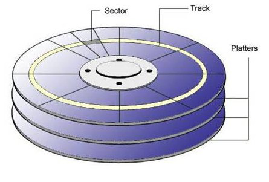
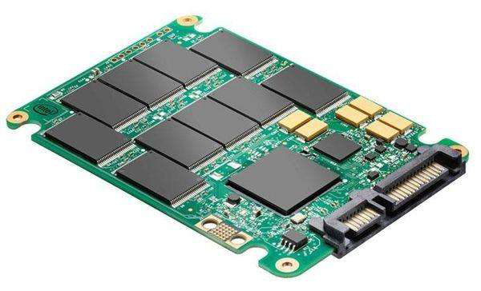
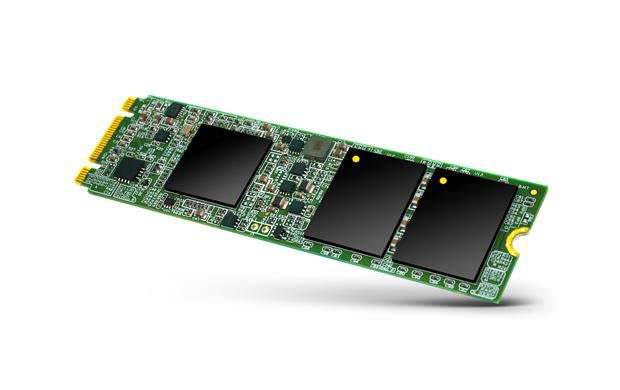

冯诺依曼体系计算机的五大组成部分:运算器/控制器/存储器(cpu的三级缓存/内存)/输入设备/输出设备

硬盘属于外部存储

# 常见存储类型

## 分类

本地设备:

*   软盘(已淘汰)

*   光盘(基本淘汰)

*   机械硬盘

*   U盘

*   闪存卡(SD卡/TF卡)

*   固态硬盘等

网络设备:NAS/SAN等

## 硬盘接口类型

*   IDE

*   SAS

*   SCSI

*   SATA

*   PCI-E

*   mSTAT

*   m.2(sata/nvme)等

## 磁盘结构类型

*   机械硬盘(HDD)

*   固态硬盘(SSD)

*   混合硬盘(HHD)(使用盘片存储数据/使用闪存颗粒做缓存)等

## 磁盘尺寸

*   3.5英寸(台式/服务器)

*   2.5英寸(服务器/笔记本)

*   1.3/1.0/0.85英寸(迷你硬盘)等

## 制造商

*   IBM
*   希捷
*   西部数据
*   日立
*   东芝
*   三星
*   Intel
*   闪迪等

# 磁盘相关参数

## 容量

GB/TB/PB/EB等(目前量产都在20T以下)

## 传输速率(接口)

*   SATA3:500+MB/s

*   SCSI:320+MB/s
*   SAS:500+MB/s
*   PCI-E:1200+MB/s
*   mSATA:500+MB/s
*   m.2(nvme):700+MB/s

## 磁盘缓存

读缓存:提高数据读取速度

写缓存:提高数据写入速度

## 机械磁盘转速

台式机:7200rpm

笔记本:5400rpm

服务器:7200rpm/10000rpm/15000rpm or more

## 固态颗粒类型

SLC:1bit/cell,速度最快/容量较小/价格昂贵/读写次数高

MLC:2bit/cell,速度较快/容量中等/价格适中

TLC:3bit/cell,速度较慢/容量较大/价格低

QLC:4bit/cell,容量大/

# 磁盘内部构造

## 机械硬盘

### 物理组成

盘片/电机/机械臂/磁头/接口电路

### 逻辑构成

磁道/扇区/柱面

**寻道时间:**磁头移动到指定存储数据的磁道所需的时间

**扇区大小:**磁道被等分为若干弧段,这些弧段便是扇区;硬盘的读写以扇区为基本单位,扇区的固定大小为512字节(byte)

## 固态硬盘

### 物理构成

主控芯片/闪存颗粒/接口

### 逻辑构造

特点:读写快,噪音低/温度低/防震/轻薄

但有写入次数限制/容量较小/价格高

# 主引导记录

主引导记录(MBR, Main Boot Record)是位于磁盘最前端的一段引导代码,占用了磁盘的第一个扇区,结构为:

*   主引导程序(boot loader) 占用了 466byte
*   分区表(Partition table) 占用了 64byte
*   有效标志符(magic number) 占用了 2byte(55AAH代表有效)

主引导扇区的读取流程：

1.  **BIOS 加电自检 ( Power On Self Test -- POST )。**BIOS执行内存地址的跳转指令，跳转到固化在ROM中的自检程序处，对系统硬件(包括内存)进行检查。

2.  **读取主引导记录(MBR)。**当BIOS检查到硬件正常并与 CMOS 中的设置相符后，按照 CMOS 中对启动设备的设置顺序检测可用的启动设备。BIOS将相应启动设备的第一个扇区(也就是MBR扇区)读入内存。

3.  **检查MBR的结束标志位是否等于55AAH**，若不等于则转去尝试其他启动设备，如果没有启动设备满足要求则显示“NO ROM BASIC”然后待机。

4.  当检测到有启动设备满足要求后，BIOS将控制权交给相应启动设备。**启动设备的MBR将自己复制到内存中，然后继续执行。**

5.  **根据MBR中的引导代码启动引导程序。**

# 文件系统结构

**super block：超级块**，记录每个块组的block的大小、数量；块位图（已使用和未使用的inode和block的数量）；文件系统挂载时间，最后修改时间，最近检查时间。

**data block：数据块**，保存真实数据的位置，block的大小和数量在格式化成文件系统时已经固定，除非重新格式化，否则不能修改。单个文件占用小于一个block的大小时，单独占用一个block，剩余空间不会被利用。

**inode：别名i节点；记录inode号**、权限、属主属组、时间戳、大小、占了哪几个block
inode显示的数据又叫文件的元数据