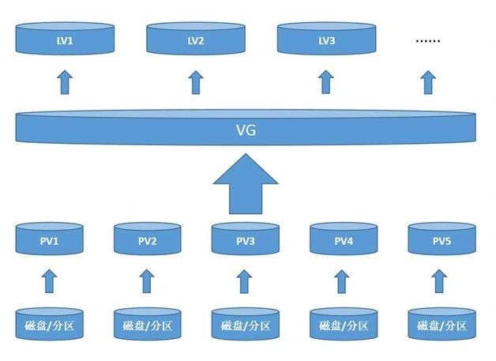

# LVM 逻辑卷管理

LVM (Logical Volume Manager)逻辑卷管理,将多个物理磁盘或分区组成一个虚拟存储池,然后按需划分空间使用

## LVM 组成

*   物理卷(Physical Volume,PV):由多个磁盘或分区转化而成
*   卷组(Volume Group,VG):将多个物理卷组合在一起组成卷组,即为存储池
*   逻辑卷(Logical Volume,LV):逻辑卷可以看作是分区,可以进行格式化,是存储数据的场所
*   物理拓展(Physical Extend,PE):卷组的最小存储单元,类似扇区的概念

## 创建 LVM

1.  将磁盘分区,或整块磁盘不分区
2.  将分区或整块磁盘转化为物理卷(PV)
3.  将物理卷合并成为卷组(VG)(可以通过添加或者删除物理卷,调整卷组大小)
4.  将卷组划分成逻辑卷(LV),逻辑卷需要写入文件系统和挂载使用(可以动态调整大小)

