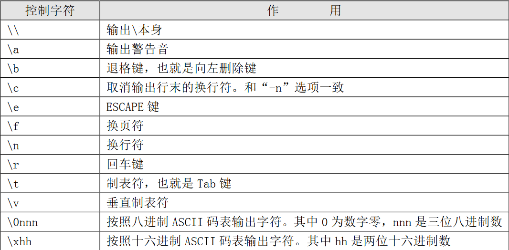
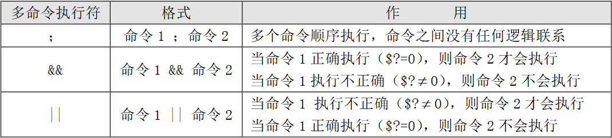
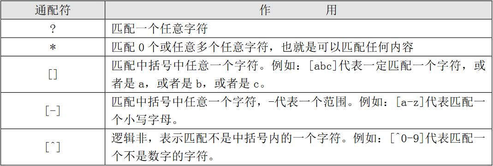
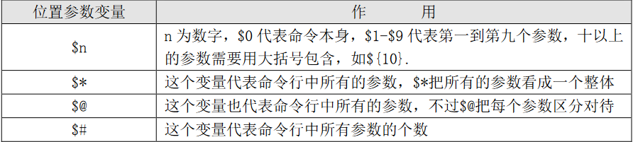

# shell 编程

## shell 简介

shell 是一个命令解释器,它解释用户输入给内核,并有着自己的编程语言----shell script

## shell 分类

常用的 shell 有两个系列, 一个是 Bourne shell 以及其衍生的 bash, dash 等;另一个是 C shell 以及衍生的 tcsh 等

查看 Linux 中安装的 shell 类型

```shell
cat /etc/shells
```

## shell 脚本

### 执行方式

1.  添加执行权限后,使用相对或绝对路径执行(也可以添加环境变量,直接执行)
2.  使用 bash 命令,调用脚本

### shell 脚本格式

shell 脚本一般以 .sh 作为后缀,也可以不写

第一行要指明使用的 shell 类型,如:

```shell
#!/bin/bash
```

### echo 命令

```shell
echo [options] 
	-e # 支持控制字符
	-n # 取消输出换行
```



echo 显示颜色

格式

```shell
echo -e "\e[Nm balabalabala \e[Nm" # \e[Nm 是标志, N 为功能代码
```

文字颜色:

30=黑色,31=红色,32=绿色,33=黄色,34=蓝色,35=紫色,36=天蓝,37=白色,39=结束

背景颜色:

40=黑色,41=红色,42=绿色,43=黄色,44=蓝色,45=紫色,46=天蓝,47=白色,49=结束

特殊:

0=关闭所有属性,1=增加亮度,4=下划线,5=闪烁,7=反转显示,8=消隐

多个条件之间使用分号隔开,同时生效

### bash 基本功能

#### 历史命令

##### 查看

```shell
history [options]
	-c # 清空历史命令
	-w # 将缓存中的历史命令保存到文件中
```

##### 调用

*   使用上下按键
*   使用 !n 调用第 n 条
*   使用 !! 调用上一条
*   使用 !字符串 ,调用以 字符串 开头的

##### 补全

使用 tab 键,对命令和路径进行补全

**注意:目录会自动补上 / 符号**

##### 别名

```shell
alias 别名='命令'
```

##### 配置文件

~/.bashrc 局部配置文件

/etc/bashrc 全局配置文件

##### 不同类型的命令

1.  绝对路径或相对路径执行
2.  别名
3.  bash 内置命令
4.  环境变量中的

##### bash 快捷键

常用:

| 快捷键 | 作用              |
| ------ | ----------------- |
| ctrl+c | 终止当前命令      |
| ctrl+l | 清屏,相当于 clear |
| ctrl+r | 在历史命令中搜索  |
| ctrl+d | 退出当前终端      |

### 输入输出重定向

bash 的标准输入和输出

| 对应设备 | 设备文件    | 文件描述符 | 类型         |
| -------- | ----------- | ---------- | ------------ |
| 键盘     | /dev/stdin  | 0          | 标准输入     |
| 显示器   | /dev/stdout | 1          | 标准正确输出 |
| 显示器   | /dev/stderr | 2          | 标准错误输出 |

```shell
command &> filename # 将错误和正确输出同时输出到一个文件中
```

##### 输入重定向(cpio/wc/...) <

```shell
wc [options] [filename]
	-c # 统计字数
	-w # 统计单词数
	-l # 统计行数
```

### 多个命令顺序执行



### grep 命令

```shell
grep [options] "keyword" filename
	-A number # 列出符合条件的行,以及后续 n 行
	-b number # 列出符合条件的行,以及前面 n 行
	-c # 统计含有关键词的行数
	-i # 忽略大小写
	-n # 输出行号
	-v # 反向查找
	--color=auto # 结果中高亮关键词
```

### 通配符



### 管道符

```shell
command1 | command2 # 将命令1的结果作为命令2的输入

command1 | xargs command2 # 同上,但将结果拆分,逐个处理
```

## Bash 中的其他特殊符号

### 单引号和双引号

单引号会取消所有其中的特殊符号的含义,所有都视为字符串

双引号(" ")与单引号(' ')基本相同,但 \$ \` \\ 等都保留特殊含义

```shell
name=shanchuan # 变量 name 赋值为 shanchuan
echo $name # 输出 shanchuan
echo '$name' # 输出 $shanchuan
echo "$name" # 输出 shanchuan
```

反引号: (\` \`),用于引用系统命令,在使用时会先执行它,并保留结果

\$ ( ),作用和反引号相同

```shell
echo `date` # 会输出 date 的结果

echo $(date) # 会输出 date 的结果
```

小括号 ( ), 在执行小括号中命令时,会在当前 shell 中开启一个子 shell,用于执行括号中的命令

```shell
(name=laowang; echo $name) # 括号中的变量赋值,在括号外无法使用
```

花括号{ },在括号中命令是在当前 shell 执行的,使用分号隔开

```shell
{ pwd; echo hello; } # 括号中的命令会顺序执行
```

小括号和花括号的区别:

*   () 执行一串命令时,需要重新开一个子 shell 进行执行
*   {} 执行时,是在当前 shell 执行
*   () 和 {} 中的命令都是使用分号隔开
*   () 最后一个命令要用分号结尾
*   {} 的第一个命令和左括号之间必须有一个空格
*   () 里的命令不必和括号有空格

## Bash 的变量和运算符

### 变量定义

变量名称可以由字母,数字和下划线组成,但是不能以数字开头,变量中间不能有空格

```shell
a1 abc aa_bb a3aa # 都是可以使用的变量
```

在 bash 中,变量的默认类型都是字符串型,不能直接进行数值运算,必须修改变量类型为数值型

在进行变量赋值时,等号左右两侧不能有空格

```shell
name=shanchuan
```

变量的值可以有空格,但需要使用引号(单双都可)包括,引号的作用也会生效

```shell
name="li si" or name='zhang san'
```

变量叠加

在一个变量的值增加新的,可以进行变量的叠加

```shell
# 格式
variable="$variable newvalue"
variable="${variable} newvalue"
```

如果是要将命令的结果作为变量值赋给变量,则要使用反引号或者 \$() 包含

```shell
variable=$(date) # 括号中的是命令,而不是字符串
echo $variable # 输出的是 date 的结果
```

### 变量的分类

*   自定义变量:由用户自定义变量名和变量的值
*   环境变量:一般是系统预先设定的,主要保存的是操作系统环境相关的数据,比如当前登录用户,用户的家目录,命令的提示符等
*   位置参数变量:按照位置顺序保存的向脚本传递的参数,变量有固定用法
*   预定义变量:是 bash 中定义好的变量,不能修改,作用固定

#### 用户自定义变量

1.  变量调用

    ```shell
    echo $variable
    ```

2.  变量查看

    ```shell
    set [options] # 开启针对变量的某些特定功能,不使用选项时显示所有变量
    	-u # 调用没有声明的变量时报错
    	-x # 命令执行前,会输出一次完整命令
    ```

3.  变量删除

    ```shell
    unset 变量名
    ```

#### 环境变量

个人环境配置文件: ~/.bash_profile

全局环境配置文件: /etc/profile

在终端中修改变量只是临时的,重启后失效;要永久生效需要写入配置文件

1.  环境变量设置

    ```shell
    export AGE=18 # 使用 export 声明变量是环境变量
    ```

2.  环境变量查询

    ```shell
    env # 查看环境变量
    ```

3.  系统默认的环境变量(PATH,PS1,LANG)

    *   PATH 变量:可执行文件路径,变量值使用冒号(:)隔开,路径中的可执行文件可以通过文件名直接执行,可以忽略路径

        通过将可执行脚本放入 PATH 对应路径中,或将所在路径添加至 PATH 中,可以使得脚本直接通过脚本名执行,忽略路径

    *   PS1 变量: 定义命令行提示符,在自定义 PS1 变量值时要使用单引号,否则不生效.可用选项如下

        | 选项 | 作用                                      |
        | ---- | ----------------------------------------- |
        | \d   | 显示日期,格式为"星期月日"                 |
        | \H   | 显示完整的主机名,"localhost.localdomain"  |
        | \h   | 显示简写主机,如"localhost"                |
        | \t   | 显示时间,二十四小时制,格式"HH:MM:SS"      |
        | \T   | 显示时间,十二小时制,格式"HH:MM:SS"        |
        | \A   | 显示时间,二十四小时制,格式"HH:MM"         |
        | \@   | 显示时间,十二小时制,格式"HH:MM am\pm"     |
        | \u   | 显示当前用户名                            |
        | \v   | 显示 bash 版本信息                        |
        | \w   | 显示当前所在目录的完整名称                |
        | \W   | 显示当前所在目录的最后一个目录            |
        | \\#  | 执行的第几个命令                          |
        | \\$  | 提示符,如果是 root 提示符"#",普通用户"\$" |

    *   LANG 变量:定义 Linux 的语言编码

        查看支持的语言编码

        ```shell
        localectl list-locales # 查看所有支持的语言编码
        ```

        配置文件位置: /etc/locale.conf,也可以使用命令修改

        ```shell
        localectl set-locale LANG=en_US.utf8
        ```

#### 位置参数变量



其中,\$\* 是将所有参数作为一个整体使用,所以不能使用循环迭代逐个输出

而,\$@ 可以使用迭代循环输出

```bash
#!/bin/bash

# 统计一共多少个
echo $#
n=1
# 循环输出变量
for i in "$@"
do
	# 按照对应位置输出
	echo "Value of position $n:$i"
	# n + 1 指明位置
	let n=n+1
done
```

#### 预定义变量

| 预定义变量 | 作用                                                         |
| ---------- | ------------------------------------------------------------ |
| \$?        | 返回上一个命令的返回状态码,一般0,代表正确执行;其他数字代表执行出错 |
| \$$        | 当前进程的进程号(PID)                                        |
| \$!        | 后台运行的最后一个进程的进程号(PID)                          |

可以在命令最后添加 &符号, 将命令放入后台执行

### read 命令

```shell
read [options] variable # 交互式操作,接收键盘信息并赋给变量
	-p # 显示提示信息
	-t # 等待时间,自动跳过
	-n # 接收字符数量(数量足够即跳过)
	-s # 隐藏输入信息
# 其中有些选项不会自动换行,可以使用 echo 来换行
read -p "this is tips" variable
read -t 10 # 等待10秒
read -n 3 # 接收3个字符
read -s # 接收时隐藏信息
```

read 特点:

*   变量名可以自定义,如果没有指定变量,存入默认变量 REPLY
*   如果指定了一个变量,多个输入,则会将所有输入赋给该变量
*   如果指定了多个变量,而输入比变量多,则会把多的都赋给最后一个变量

### shell 的运算符

#### 使用 declare 声明变量类型

```shell
declare [+/-] [options] variable
	- # 给变量设定类型
	+ # 取消变量的类型
# 选项
	a # 声明变量为数组型
	i # 声明变量为整数型
	r # 声明变量为只读(不能修改值,也不能删除,并且无法取消)
	x # 声明变量为环境变量,作用和 export 相同
	-p # 显示变量的类型及内容
```

##### 数组型

可以看作多个元素的集合,数组的名字就是变量的名字,使用下标来区分变量的每一个值,因此数组变量又称下标变量

```shell
array[0]=aaa
array[1]=bbb
array[2]=ccc

array=( aa bb cc dd ee ff )
echo $array # 输出 array[0] 的值
echo ${array[@]} # 输出完整的数组
echo ${#array[@]} # 获取数组长度(值个数)
echo ${#array[1]} # 数组中元素的长度(字符数)
# 数组的下标从0开始,调用数组的值时,使用 ${array[value]} 的形式
# 不需要用 declare 声明, shell 自动识别为数组
# 数组遍历
for i in ${array[@]};do
	echo "$i"
done

# 数组切片(取值)
# 格式
${数组名[@]:下标:数量}
${array[@]:1} # 从下标为1的位置开始取值到结束
${array[@]::3} # 从下标为0的位置开始取三个值
${array[@]:(-2):2} #从倒数第二个下标取两个值

# 元素切片(取字符串)
# 格式
${数组名[下标]:下标:数量} # 等同于 cut -c 效果
${array[1]:1} # 从字符位置1开始取值到最后
${array[1]::3} # 从字符位置为0的位置开始取三个值
${array[@]:(-2):2} # 从倒数第二个下标取两个值

# 数值替换
#格式
${数组名[@|*]/old/new} # 使用新的字符串替换旧的
${数组名[@|*]//old/new}
# 旧字符前的"/"数量为1时,只替换第一个旧字符;为2时,替换所有
${数组名[1]/#/} # 字符串首部
${数组名[1]/%/} # 字符串尾部
```

 ##### 整数型

将变量声明为整数型后,可以进行数值运算,

```shell
declare -i a=100
declare -i b=200
declare -i s=$a+$b # 在实际使用中,仅声明 s 即可
```

##### 环境变量

作用和 exprot 相同

```shell
declare -x var1="lol"
env | grep var1 # 查看环境变量
```

##### 只读变量

设置了只读属性的变量只能进行调用,无法删除和修改,并且不能取消只读选项

#### 使用 expr 或 let 进行数值运算

不需要进行变量类型的声明

```shell
expr 300 + 100 # 运算符两侧又有空格,否则会当成一个字符串

let s=200+100;echo $s # 形式几乎没有要求

# 使用 let 进行变量的自增或自减
n=1
let n++ || let n--
let n=n+1 || let n=n-1
let n+=1 || let n-=1
# 还可以指定增减量
let n=n+N ||let n=n-N
```

#### 使用 \$(()) 或 \$[] 格式进行运算

两种格式都能实现数值的运算,效果相同

```shell
echo $((200+100))
echo $[200+100]
```

#### 浮点运算

```shell
c=$(echo "scale=2;5/3"|bc)
```

scale 关键词指定小数点长度

```shell
c=$(awk 'BEGIN{printf 5/3}')
```

awk 支持进行浮点运算

### shell 常用的运算符

| 优先级 | 运算符 | 功能描述         |
| ------ | ------ | ---------------- |
| 1      | + -    | 正 负 (不是加减) |
| 2      | \* / % | 乘 除 取余       |
| 3      | + -    | 加 减            |
| 4      | += -=  | 自增 自减        |

一个运算式,要按照优先级进行运算,有括号,优先算括号

拓展:

>   取模和取余
>
>   计算公式都是相同的: 
>
>   1.  c = a / b
>
>   2.  r = a - c \* b
>
>   但商的取值原则不同,取余是向0舍入,而取模是向无穷小舍入
>
>   当 a 和 b 的符号一致时,取余和取模的结果一致,但 a b 的符号不同时,结果不同

#### 逻辑与

有0为0,全1为1

## 环境变量的配置

文件

1.  /etc/profile
2.  ~/.bash_profile
3.  ~/.bashrc
4.  /etc/bashrc

文件按照顺序调用,相同的变量会覆盖生效

*   USER:当前用户名
*   LOGNAME变量;根据 USER 变量的值,给变量赋值
*   MAIL: 用户邮箱
*   PATH:可执行文件目录
*   HOSTNAME:主机名
*   HISTSIZE:历史命令保存条数

在修改后使用 source 使其生效

### 注销专用的配置文件

~/.bash_logout在用户退出时,会自动调用文件中的命令.可以将清除历史命令或备份命令写入,使得在退出时,自动执行

### shell 登录信息

在登录本地终端时,会有几行提示信息,保存在 /etc/issue 文件中

```shell
# issue 文件内容
\S
Kernel \r on an \m
# 标识含义,更多信息可以通过 man agetty 查看
	\d # 显示当前系统日期
	\s # 显示操作系统名称
	\l # 登录终端号
	\m # 硬件架构
	\n # 主机名
	\o # 域名
	\r # 内核版本
	\t # 系统时间
	\u # 当前登录用户的序列号
```

在登录成功后,会显示欢迎信息,保存在 /etc/motd 文件,远程登录和本地登录都会显示

### bash 的快捷键

查看已存在的快捷键

```shell
stty -a 
```

修改快捷键(尽量不要修改服务器的快捷键)

```shell
stty keyword hotkey
```

