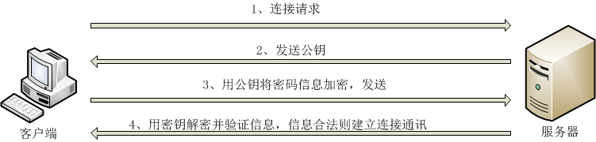

# 网络服务基础

## 网络服务概述

网络服务:是指一些在网络上运行的,面向服务的软件模块;使用各种协议进行远程访问,为用户提供特定服务

### 常见网络服务

* 域名解析服务(DNS)
* 动态主机配置服务(DHCP)
* 文件传输服务(FTP/SAMBA)
* 网络文件系统服务(NFS)
* 万维网服务(APACHE/NGINX/TOMCAT)
* 邮件服务(MAIL)
* 数据备份服务(RSYNC)
* 数据库服务(MYSQL/REDIS)

## 基础知识

[网络地址(IP),物理地址(MAC),IP/TCP模型和协议,常见端口(/etc/services)](/运维基础学习日志/20-9-07TCPIP模型和网络通信原理.md)

### 常见网络配置

临时配置:使用命令进行调整,重启失效

固定配置:修改配置文件,持续生效

#### ip 地址配置

```bash
ifconfig # 网卡管理命令
# 实例
ifconfig eth0 192.168.12.250 netmask 255.255.255.0
ifconfig eth0 192.168.12.250/24
ifconfig eth0:0 102.168.12.251/24 # 设置永久的子接口(ifcfg-eth0:0)
```

网卡配置文件:**/etc/sysconfig/network-scripts/ifcfg-eth0**

```txt
DEVICE=eth0             # 设备名称
NAME=eth0               # 网卡名称
BOOTPROTO=static        # 连接方式(dhcp/static)
ONBOOT=yes              # 是否开机加载
IPADDR=192.168.12.250   # 子网掩码(PREFIX=24)
GATEWAY=192.168.12.1    # 网关
DNS1=8.8.8.8            # 首选DNS
DNS2=114.114.114.114    # 备用DNS
```

重启网络服务

```bash
service network restart
```

启动/关闭网卡

```bash
ifup 网卡名 # 启动网卡
ifdown 网卡名 # 关闭网卡
ifdown eth0;ifup eth0 # 重启 eth0 网卡
```

#### 主机名配置

临时生效

```bash
hostname 主机名
```

永久生效,修改配置文件 **/etc/sysconfig/network**

#### 网关配置

```bash
route # 查看系统中的路由表信息
# 添加和删除路由信息
route add default gw ip # 添加
route del default gw ip # 删除
```

永久修改,配置文件 **/etc/sysconfig/network-scripts/ifcfg-eth0**

#### DNS 配置

配置文件

局部 **/etc/sysconfig/network-scripts/ifcfg-eth0**

```txt
DNS=ip
```

全局 **/etc/resolv.conf**

```txt
nameserver ip
```

测试 DNS 命令

```bash
nslookup 域名
```

主机域名映射文件 **/etc/hosts**

用于保存主机名和 IP 地址的映射,但只是本机的映射;优先级高于 DNS 解析

### 网络常用命令

#### 网络信息查看

```bash
netstat # 查看系统的网络连接状态,路由信息,接口等
    -a # 显示所有活动连接
    -n # 以数字形式显示
    -t # 查看 TCP 协议相关
    -u # 查看 UDP 协议相关
    -p # 显示 PID 和进程名
    -l # 监听
```

#### 网络节点测试

```bash
traceroute # 测试从当前主机到目的主机之间经过的网络节点,默认使用 ICMP 协议,数据包大小为40字节
    -p # 使用 UDP 端口进行测试,默认端口为33434
    -q # 指定测试时发送的数据包个数(测试次数)
    -n # 以 IP 的方式进行测试,避开 DNS 解析
```

#### 网络联通性测试

```bash
ping # 测试目标主机的连通性
    -i # 指定间隔时间
    -c # 指定 ping 的次数
    -s # 指定数据包的大小
```

#### 地址解析命令

```bash
arp # 地址解析,将 ip 解析成 mac 地址
    -a # 查看所有
    -d # 删除 ARP 记录
```

#### 网络探测命令

```bash
nmap
    -sP # 探测网段内活动主机
    -sT # 探测主机开放的 TCP 端口
```

## ssh 安全远程管理

### ssh 概述

ssh 是一个建立在应用层的安全远程管理协议,采用密文传送数据,更加安全;默认使用 TCP 端口 22

### ssh 的登录验证模式

ssh 提供了基于账户密码和密钥对（优先级更高）两种登录方式,

#### 账户密码验证方式

1. Client 发起连接请求
2. Server 收到请求,发送公钥给 Client
3. Client 保存公钥,使用公钥加密密码,发送给 Server
4. Server 收到密码,使用私钥解密,并验证信息,合法则建立通讯

步骤中出现一步错误,就会拒绝连接



#### 密钥对验证

要使用密钥对进行验证,需要在建立连接之前就将本机的公钥发送给服务器保存在对应用户目录(~/.ssh/authorized_keys),**其中如果是普通用户则要修改权限: .ssh 目录的权限为 700,authorized_keys 文件的权限为 600**

1. Client 发起连接请求,并发送自己的公钥(A),请求使用密钥对进行安全验证
2. Server 将接收到的公钥(A)与本机保存(用户目录)的公钥对比,相同则使用用户公钥(A)加密一段质疑信息,发送给 Client
3. Client 使用自己的私钥(A)解密质疑信息,使用 Sever 的公钥(B)加密后,发送给 Server
4. Server 使用自己的私钥(B)解密,对比信息是否一致,一致则验证成功,建立通信

步骤中出现一步错误,Server 就会拒绝连接


### ssh 服务

#### 使用 ssh 远程连接

在 Unix 和 类 Unix 系统中都默认安装了 ssh,可直接使用

```bash
ssh username@IPadress # 如果使用密码登录则会要求输入密码,使用密钥对则会直接登录
    -p # 指定端口(默认是22)
```

#### 生成密钥对

使用 ssh 工具即可生成密钥对

```bash
ssh-keygen -t rsa -b 2048
    -t # 指定加密类型(rsa/dsa等)
    -b # 指定密钥加密长度
# 在创建过程中会询问保存位置,和是否对密钥文件进行加密,如果加密则在使用文件时需要提供密码
```

ssh 也提供了上传公钥文件的工具(Windows10 的 openssh 没有)

```sehll
ssh-copy-id username@IP # 用户名和要登陆的一致
    -i # 指定上传的公钥文件位置和名字(不指定时是:id_rsa.pub)
```

在 Windows 中可以使用第三方工具 Xshell 等,如果是 Windows 10 则可以使用系统集成的 openssh

#### 配置 sshd 服务

sshd 是 ssh 的服务,配置文件位于 /etc/ssh/sshd_config,通过修改其中关键词的值,可以修改设置;文件中的关键字有些被注释掉的是默认就生效的,修改要取消注释然后修改

1. 禁止使用密码登录
   PasswordAuthentication no
2. 禁止使用 root 远程登录
   PermitRootLogin no
3. 修改默认端口
   Port 5952
4. 限制监听 IP
   ListenAddress [IPaddress]

### ssh 的相关命令

#### 安全的远程文件复制命令 scp

scp (secure copy),使用加密传输的远程拷贝

```bash
scp [file] username@Ip:[path]
    -p # 指定端口
```

#### 安全的文件传输 sftp

sftp (Secure FileTransferProtocol),与 ftp 语法和功能基本相同,但使用了加密技术

```bash
sftp username@IP
    -oPort=[Port] # 指定端口
# sftp 的交互命令
    help # 查看交互模式下的帮助
    pwd/lpwd # 查看路径;lpwd 是查看本机的路径
    ls/lls # 查看服务器中的文件列表;lls 查看本机文件liebiao
    put # 上传文件
    get # 下载文件
    rm # 删除服务器中的文件
    quit # 退出 sftp;断开连接
```

## TCP Wrappers (简单防火墙)

### TCP Wrappers 简介

TCP Wrappers 是一个工作在第四层(传输层)的安全工具,对 TCP 的特定服务进行安全检测并实现访问控制,方式是对调用 `libwrap.so` 库文件的程序进行检测,主要共功能是控制访问

判断程序是否能被 TCP Wrappers 控制

1. 查看程序位置
   which sshd
2. 查看命令执行时是否调用 `libwrap.so`文件

   ```bash
   ldd /usr/sbin/sshd | grep libwrap.so
   ```

### TCP Wrappers 工作流程

在/etc/hosts.allow 文件中编写允许的规则;在/etc/hosts.deny 文件中编写拒绝规则;当有 TCP Wrappers 监控的程序接收到连接请求时

1. 查看/etc/hosts.allow 文件中是否有匹配条件,如果有则允许;如果没有则执行2
2. 查看/etc/hosts.deny 文件中是否有匹配条件,如果有则拒绝
3. 以上两个文件都没有,则允许

默认规则是,允许所有连接,而 allow 的优先级高于 deny

### TCP Wrappers 规则

配置文件编写格式

```txt
service_list@host:client_list
```

service_list:是服务的列表,可以是多个,使用逗号隔开

@host:允许从哪个网口进入,空为全部

client_lsit:访问者地址,多个用空格或逗号隔开,可以使用IP,域名,IP/mask;内置ACL,ALL(所有主机),LOCAL(本地主机)

### 案例

拒绝单个 IP 使用 ssh 连接,配置

```txt
hosts.deny: sshd:192.168.88.20
```

拒绝某一网段使用 ssh 连接,配置

```txt
hosts.deny: sshd:192.168.88.0
```

仅允许某一 IP 使用 ssh 连接,配置

```txt
hosts.allow: sshd:192.168.88.20
hosts.deny: sshd:ALL
```

## 补充

### CentOS 6 与 CentOS 7 不同之处对比

|不同|CentOS 6|CentOS 7|
|----|--------|--------|
|内核|2.6|3.10|
|文件系统|ext4|xfs|
|防火墙|iptables|firewalld|
|默认数据库|MySQL|MariaDB|
|时间同步|ntpdate 域名|chronyc sources|
|修改时区|/etc/sysconfig/clock|timedatectl set-timezone Asia/Shanghai|
|修改语言|/etc/sysconfig/i18n|localetcl set-locale LANG=zh_CN.UTF-8|
|主机名|/etc/sysonfig/network|/etc/hostname(可用 hostnamectl 设置)|
|服务管理|service|systemctl|
|服务启动|chkconfig|systemctl|
|网络设置|ifconfig/setup|ip/nmtui|
|网络服务|network|network/NetworkManager(优先级高)|

## ssh 实验

### 实验目的

密钥对登录, sshd 配置,scp 使用,sftp 使用
window 使用 Xshell 连接 Linux
Linux 连接 Linux

### 实验环境

虚拟机:两台 CentOS6(关闭防火墙/selinux);使用 NAT 模式
真实机:Windows10 软件 Xshell

### 实验过程

1. 生成密钥对
   Linux 中使用 ssh-keygen 命令(保存在~/.ssh 中)
   Windows 中使用Xshell自带的工具生成(保存在 Xshell 的工具中)
2. 发送公钥
   Linux 中使用 ssh-copy-id 命令(需要用户密码)
   Windows 中由于没有 ssh-copy-id 命令,需要手动将公钥上传到虚拟机中
3. 登录验证
   使用 ssh 命令登录(要登陆发送时对应的用户)
4. 修改 sshd 的配置后,进行连接

### 实验结果

**遇到问题**:

在连接时,sshd 服务器响应很慢

**原因**:

虚拟机配置了 DNS 服务器,并且 sshd 开启了 DNS 验证,但由于没有网络 sshd 会多次尝试连接 DNS,导致响应缓慢

**解决办法**:

1. 删除虚拟机中的 DNS 配置
2. 修改 sshd 的配置文件关闭 DNS 验证,将/etc/ssh/sshd_config 中的 "UseDNS yes" 取消注释,并且修改为 "no"
