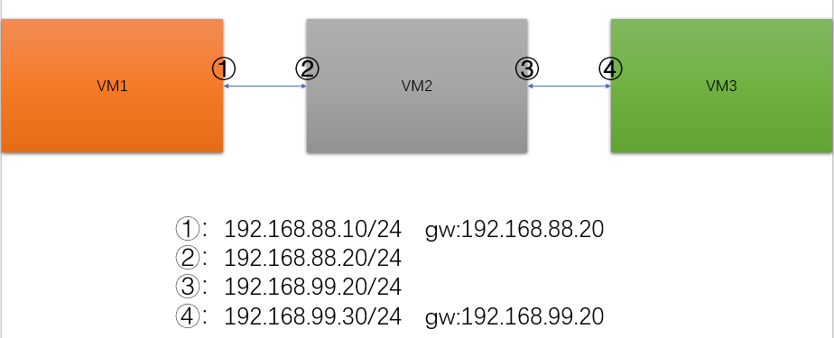
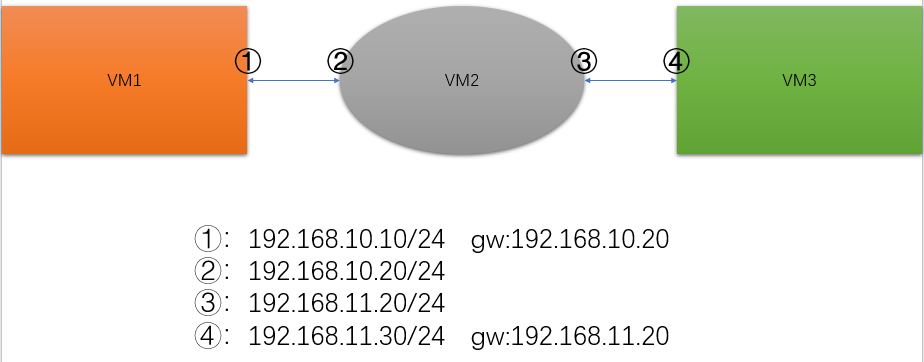
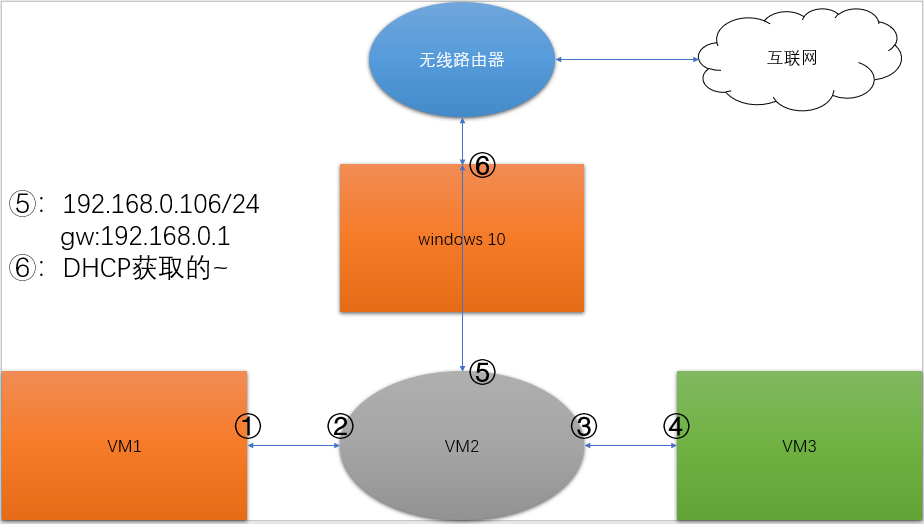

# 使用 Linux 模拟路由器

使用 Linux 模拟路由器,使得不同网段的主机之间可以互相通信

模拟实际中的主机连接方式

## 实验环境

虚拟机:3台 Linux A,B,C (都关闭防火墙,selinux)

## 实验一 vlan 下实现跨网段主机通信

A: vmnet8 模式; ip:192.168.10.10/24 gw:192.168.10.20
B: vmnet8 模式; ip1:192.168.10.20/24 ip2:192.168.20.20/24
C: vmnet8 模式; ip:192.168.20.10/24 gw:192.168.20.20

借助主机 B 进行路由转发,由于主机 B 的两块网卡在同一物理设备,所以可以互相通信;而主机 A 与主机 B 的一个网卡在同一网段;主机 C 和 主机 B 的一个网卡在同一网段;由此使得不同网段的主机 A 和 B 可以通信


1. 主机 A 和主机 C 分别配置 ip 和网关
   修改 /etc/sysconfig/network-scripts/ifcfg-ens*

   ```txt
    A:  IPADDR=192.168.10.10
        PREFIX=24
        GATEWAY=192.168.10.20
    B:  IPADDR=192.168.20.10
        PREFIX=24
        GATEWAY=192.168.20.10
    ```

2. 主机 B 添加网卡到两块,然后分别配置 ip;并开启路由转发功能

    ```txt
    IP1: IPADDR=192.168.10.20
    IP2: IPADDR=192.168.20.20
    ```

    ```bash
    echo "net.ipv4.ip_forward=1" >>/etc/sysctl.conf
    ```

3. 效果验证

### 实验二

VM1:vmnat10模式 kens33:192.168.10.10/24 gw:192.168.10.20
VM2:vmnat10模式 rens33:192.168.10.20/24
    vmnat11模式 kens37:192.168.20.20/24
VM3:vmnat11模式 ens33:192.168.20.10/24 gw:192.168.20.20

主机 A 的网卡与 B 的网卡1直连;主机 C 的网卡与 B 的网卡2直连


1. 主机 A 网络连接模式选择 vmnet10,设置 ip 及网关

   ```txt
   IPADDR=192.168.10.10
   PREFIX=24
   GATEWAY=192.168.10.20
   ```

2. 主机 C 网络连接模式选择 vmnet11,设置 ip 及网关

   ```txt
   IPADDR=192.168.20.10
   PREFIX=24
   GATEWAY=192.168.20.20
   ```

3. 主机 B 的网卡1模式选择 vmnet10, 网卡2模式选择 vmnet11;设置 ip 及网关,开启路由转发功能

   ```txt
   # 网卡1
   IPADDR=192.168.10.20
   PREFIX=24
   # 网卡2
   IPADDR=192.168.20.20
   PREFIX=24
   ```

   修改 /etc/sysctl.conf 文件
   net.ipv4.ip_forward = 1

4. 效果验证

### 实验三 连接互联网

在实验二的基础上给主机 B 添加第三块网卡并选择桥接模式,使其可以连接互联网


1. 添加新的网卡选择桥接模式,网卡配置选择 dhcp

2. 给三台主机都配置 DNS 服务器

3. 给主机 B 添加一条防火墙规则

   ```bash
   iptables -t nat -A POSTROUTING -s 192.168.0.0/16 -j SNAT --to 192.168.x.x
   # 配置 NAT 转换,使得内网可以访问互联网,能够正常接收
   # --to 指定能上网的ip
   ```

4. 效果验证

### 实验总结

使用 Linux 模拟路由器,在主机内部开启路由转发,使得内部多个网卡间可以通信,对于其他主机来说就像是连接在路由器上;并且添加了 NAT 转换规则后,可以连接互联网,模拟真实情况下的网络

在实验时,要注意对应网卡的 IP 配置,需要联网一定要配置 DNS

**问题**: A 与 C 的通信失败

**原因**: 1. 在添加 B 的网卡配置文件时,没有清除 UUID,导致设备冲突;2. 直连的网卡配置了不同的网段

**解决办法**: 在添加网卡的配置文件时,要清除 MAC 和 UUID,对对应的网卡要配置同网段 IP

## 补充

### 单臂路由

单臂路由是指使用同一网卡,为不同网段的两台甚至多台主机提供连接服务;以应对网口不足的请况; 配置方法与一般路由配置相同,不同之处是在网口中使用子接口的方式提供连接服务
