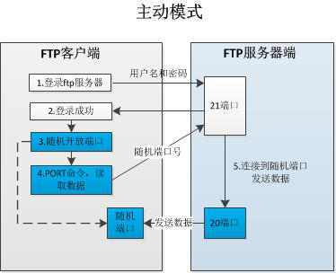
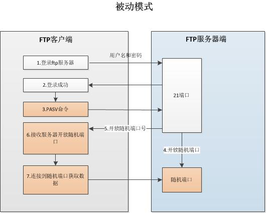

# FTP 服务

## 概述

FTP(File Transfer Protocol)文件传输协议,用于 Internet 上文件的双向传输,使用明文方式传输

VSFTP是一个基于 GPL 协议发布的类 Unix 系统上使用的 FTP 服务器软件,全称是 Very Secure FTP

## VSFTP

### 安全特性

1. vsftp 程序的运行者一般是普通用户,降低了进程权限,提高了安全性
2. 任何需要执行较高权限的指令都需要上层程序许可
3. ftp 所需的绝大多数命令都被整合到了 VSftp 中,基本不需要系统额外提供命令
4. 拥有 chroot 功能,可以改变用户的根目录,限制用户只能在自己的家目录

### VSFTP 连接类型

|类型|端口|作用|
|----|----|----|
|控制连接(持续)|TCP 21(命令信道)|用户收发 FTP 命令|
|数据连接(按需)|TCP 20(数据信道)|用于上传下载数据|

### VSFTP 工作模式

#### Port 模式

FTP Clent 首先与 Server 的 TCP 21 端口建立连接,用来发送命令,在需要数据传送时 Client 发送 PORT 命令，其中包含了 Client 用来接收数据的 Port;Server 使用自己的 TCP20 来,建立连接发送数据



#### Passive 模式

建立控制信道方式与 PORT 模式相同,不同的是建立数据信道时,Client 发送 PASV 命令给 Server,Server 开启一个临时端口(端口号在1023和65535之间)并通知 Client,然后建立连接进行数据传输



**注意**:由于 Passive 模式是开放随机端口,在设置防火墙时要放行

### VSFTP 传输模式

*Binary模式*:不对数据进行任何处理,适合传输可执行文件,压缩文件,图片等

*ASCII模式*:进行文本传输时,自动适应目标操作系统的结束符,如回车等

切换方式:在 ftp> 提示符下,输入ascii和bin 即可切换到对应模式

## VSFTP 软件

**Server 软件**: vsftpd

**Client 软件**: ftp

**服务名**: vsftpd

**端口号**: 20 和 21或随机

**配置文件**: /etc/vsftpd/vsftpd.conf

### 登录验证方式

1. 匿名用户

   账户名: ftp 或 anonymous

   密码: 无

   工作目录: /var/ftp

   权限: 默认可下载不可上传,上传权限分为两部分(主配置文件和文件系统)

2. 本地用户

   账户名: 本地用户(/etc/passwd)

   密码: 用户密码(/etc/shadow)

   工作目录: 登录用户的家目录

   权限: 最大权限(drwx------)

3. 虚拟(virtual)用户

   * 创建虚拟用户代替本地用户,减少本地用户保管率
   * 使用本地用户作为映射用户,为虚拟用户提供工作目录和权限控制
   * 可以独立设置权限(每个用户单独配置)

## 实验一 匿名用户权限控制

**匿名权限控制**:

   ```txt
   anonymous_enable=YES            # 启用匿名访问
   anon_umask=022                  # 匿名用户上传文件的权限掩码
   anon_root=/var/ftp              # 匿名用户的根目录
   anon_upload_enable=YES          # 允许上传文件
   anon_mkdir_write_enable=YES     # 允许创建目录
   anon_other_write_enable=YES     # 开放其他写入权限(删除,覆盖,重命名)
   anon_max_rate=0                 # 限制最大传输速率(0为不限速,单位:bytes/s)
   ```

1. 实现可以上传

   anon_upload_enable=YES

   在/var/ftp下创建上传目录

   修改上传目录权限,让匿名用户有写入权限

2. 实现创建目录和文件其他操作

   anon_mkdir_write_enable=YES

   anon_other_write_enable=YES

3. 用户进入文件夹时,显示提示信息

   在对应目录下创建 .message 文件,并写入内容

   dirmessage_enable=YES

   尝试切换目录查看效果(同一次登录仅提示一次)

4. 实现上传的文件可以下载

   设置 anon_umask=022;在默认情况下,上传的文件没有 r 权限,无法下载,修改掩码有可以使权限有 r 权限

## 实验二 本地用户权限控制

**本地用户权限控制**:

   用户文件: ftpusers(黑名单,优先级最高); user_list(可以选择作用)

   ```txt
   local_enable=YES                             # 是否启用本地系统用户
   local_umask=022                              # 本地用户上传文件的权限掩码
   local_root=/var/ftp                          # 设置本地用户的根目录
   chroot_local_user=YES                        # 是否将用户禁锢在主目录
   ftpd_banner=Welcome to blah FTP service      # 用户登录时显示的欢迎信息
   userlist_enable=YES && userlist_deny=YES     # 禁止 user_list 中的用户登录
   userlist_enable=YES && userlist_deny=NO      # 仅允许 user_list 中的用户登录
   ```

1. 创建本地用户(不许登录操作系统)

   ```bash
   useradd -s /sbin/nologin <username>
   ```

2. 禁锢所有用户在自己的家目录

   chroot_local_user=YES

3. 允许用户不被禁锢

   chroot_list_enable=YES                       # 开启 chroot 白名单

   chroot_list_file=/etc/vsftpd/chroot_list     # 白名单位置

4. 配置文件: /etc/vsftpd/ftpusers

   所有写入此文件内的用户名都不允许登录 ftp,立即生效

5. 修改被动模式数据传输使用接口

   pasv_enable=YES

   pasv_min_port=30000

   pasv_max_port=35000

## 实验三 虚拟用户

1. 建立 FTP 的虚拟用户的用户数据库文件(在 /etc/vsftpd)

   ```bash
   touch vsftpd.user                                # 自定义名字,写入用户信息;奇数行用户名,偶数行密码
   db_load -T -t hash -f vsftpd.user vsftpd.db      # 将用户文件转换为数据库文件
   chmod 600 vsftpd.db                              # 修改权限,提高安全性
   ```

2. 创建 FTP 虚拟用户的映射用户,并指定家目录

   ```bash
   useradd -d /var/ftproot -s /sbin/nologin virtual
   ```

3. 创建支持虚拟用户的 PAM 认证文件,添加虚拟用户支持

   ```bash
   cp -a /etc/pam.d/vsftpd /etc/pam.d/vsftpd.pam
   ```

   编辑生成的文件 vsftpd.pam (清空后,添加)

   ```txt
   auth     required    pam_userdb.so   db=/etc/vsftpd/vsftpd
   account  required    pam_userdb.so   db=/etc/vsftpd/vsftpd
   ```

   修改主配置文件

   pam_service_name=vsftpd.pam

   guest_enable=YES

   guest_username=virtual

   user_config_dir=/etc/vsftpd/dir

4. 为虚拟用户建立独立的配置文件(文件名即用户名),启动服务测试

**注**: 在配置虚拟用户配置文件时,将主配置文件中的自定义的匿名用户相关设置注释掉

   ```txt
   anon_upload_enable=YES               # 允许上传文件
   anon_mkdir_write_enable=YES          # 允许创建目录
   anon_other_write_eanble=YES          # 允许重名和删除文件
   ```

## 实验四 登录加密验证

**拓展**: 使用 tcpdump 工具可以对指定端口进行抓包,来抓取 ftp 登录过程中的数据包

```bash
tcpdump -i eth0 -nn -X -vv tcp port 21 and ip host 来源IP
   -i # interface,指定 tcpdump 需要坚挺的接口
   -n # 以数字形式显示地址,否则显示为主机名
   -nn # 在 -n 基础上显示数字端口,否则显示服务
   -X # 输出包头的数据,以十六进制和 ASCII 两种方式同时输出
   -vv # 产生更详细的输出
```

1. 查看 openssl 是否安装

   ```bash
   rpm -q openssl
   ```

2. 查看 vsftpd 是否支持 openssl

   ```bash
   ldd /usr/sbin/vsftpd | grep libssl
   ```

3. 生成加密信息的密钥和证书文件,位置: /etc/ssl/certs/

   ```bash
   openssl genrsa -out vsftpd.key 1024                # 生成 RSA 密钥,用于对证书进行签字
   openssl req -new -key vsftpd.key -out vsftpd.csr   # 生成未签字的证书,需要输入国家,地区,城市,组织,单位,Email 等信息;其中 common name 可以写名字或域名
   openssl x509 -req -days 365 -sha256 -in vsftpd.csr -signkey vsftpd.key -out vsftpd.crt # 生成签字证书,包含签证机构和有效期等信息
   ```

   **注意1**:在生成密钥和证书后,将目录 /etc/ssl/certs/ 权限改为 500
   **注意2**:在生产环境中证书要在CA机构签发,才能使用;否则浏览器不识别

4. 修改主配置文件 /etc/vsftpd/vsftpd.conf

   ```txt
   ssl_enable=YES                   # 启用 ssl 认证
   ssl_tlsv1=YES
   ssl_sslv2=YES
   ssl_sslv3=YES                    # 开启 tlsv1,sslv2,sslv3 支持
   allow_anon_ssl=YES               # 允许匿名用户(虚拟用户)
   force_anon_logins_ssl=YES
   force_anon_data_ssl=YES          # 强制匿名登录时和传输数据时使用 ssl
   force_local_logins_ssl=YES
   force_local_data_ssl=YES         # 强制本地登录和数据传输使用 ssl
   rsa_cert_file=/etc/ssl/certs/vsftpd.crt # 证书位置
   rsa_private_key_file=/etc/ssl/certs/vsftpd.key # 密钥位置
   # 注意: 在配置文件中密钥文件要单独一行(不能行内注释,会报错)
   ```

5. 重启服务

   ```bash
   service vsftpd restart
   ```

6. 测试(使用支持证书验证的客户端)

   FileZilla-FTP

   连接选择:

   服务器类型: 显示 TLS/SSL
   登录类型: 一般或匿名
