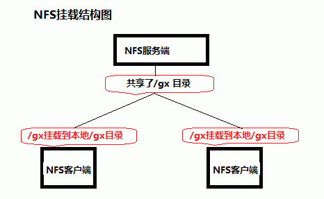
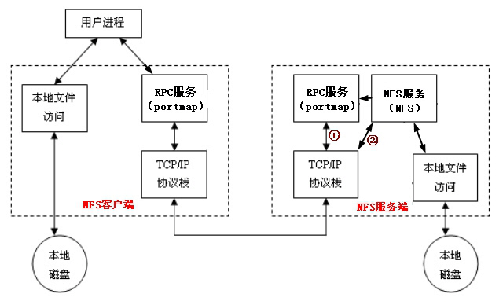

# NFS

## NFS详解

NFS(Network File System),即网络文件系统;通过网络让不同的机器不同的操作系统能彼此共享文件和目录;NFS 服务器允许客户端将共享目录挂载到本地



### NFS 挂载原理

由于 NFS 服务使用了随机端口,所以 Client 无法直接与 Server 直接建立连接;所以 NFS 服务借用 RPC(Remote Procedure Call) 协议/服务,来传递端口信息;以此来建立连接

1. Server 启动 RPC 服务,并开启111端口
2. Server 启动 NFS 服务,并向 RPC 注册端口信息
3. Client 启动 RPC 服务,向 Server 的 RPC 服务请求 NFS 的端口
4. Server 的 RPC 服务 反馈 NFS 端口给 Client
5. Clinet 通过获取的 NFS 端口来建立和 Server 的连接



### NFS 相关协议和软件

协议: RPC(Remote Procedure Call Protocol),远程过程调用协议

软件: nfs-utils-\*: 包括 NFS 命令与监控程序; rpcbind-\*: 支持安全 NFS RPC 服务的连接

注:通常情况下,作为系统的默认包安装;CentOS 6 之前 rpcbind 叫 portmap

### NFS 守护进程

* nfs : 基本的 NFS 守护进程,主要管理客户端是否能登录服务器
* rpcbind: 主要进行端口映射工作,为客户端提供服务的端口

### NFS 服务器配置

配置文件为 /etc/exprots(如不存在,则手动创建)

文件格式:  

```txt
共享目录 客户端1(访问权限,用户映射,其他) 客户端2(访问权限,用户映射,其他)
```

客户端指定方式:  
ip: 192.168.0.200  
网段: 192.168.88.0/24  
主机: www.kernel.com  
域: \*.kernel.com  
所有: \*

设置共享目录的访问权限和用户映射等:

访问权限:  
ro, 只读  
rw, 读写

用户映射:  
root_squash: 将 root 用户映射为(nfsnobody)用户(默认生效)  
no_root_squash: 保留管理员权限  
all_squash: 将远程访问的用户及所属组都映射为指定用户;
anonuid=xxx,映射为指定uid的用户;
anongid=xxx,映射为指定gid的zu

其它选项:

sync,将数据同步写入缓冲区和磁盘(同步)

async,将数据先保存到缓冲区,必要时才写入磁盘(异步)

## 实验

1. 将NFS服务器的/home/zhangsan共享给192.18.x.0网段,rw权限  

   修改 /etc/exports,并且修改目录权限(否则客户端无权限)

   ```txt
   /home/zhangsan 192.168.x.0/24(rw)
   ```

2. 重启rpcbind和nfs服务  

   ```bash
   service rpcbind restart
   service nfs restart
   exportfs
   ```

3. 服务器端查看nfs共享状态

   ```bash
   showmount -e 本机ip
   ```

4. 客户端查看nfs共享状态

   ```bash
   showmount -e nfs服务器ip
   ```

5. 客户端挂载nfs服务器共享目录

   ```bash
   mount 192.168.x.x:/home/zhangsan/ /mnt/zhangsan/
   mount |grep nfs
   mount -o vers=3 共享 本地 # 指定使用v3版本
   ```

6. nfs 共享权限和访问控制

   1. 客户端root用户
   2. 客户端普通用户

7. 卸载和自动挂载

   卸载:
   1. 卸载客户端的挂载目录

      ```bash
      umount 挂载点
      ```

   2.停止服务器端的共享

      ```bash
      exportfs -au
      ```

   自动挂载: /etc/fstab

   ```txt
   192.168.x.x:/home/zhangsan /mnt/zhangsan nfs defaults 0 0
   ```

8. 相关命令

   ```bash
   exportfs    # 对nfs共享目录进行操作
      -a       # 全部挂载或卸载
      -r       # 重新读取/etc/exports的信息,并同步更新/etc/exports和/var/lib/nfs/xtab
      -u       # 卸载单一目录,和 -a 同时使用时卸载全部
      -v       # 在export时,将详细信息输出

   rpcinfo     # 查看rpc提供的端口映射极其服务
      -p       # 显示端口
   ```
