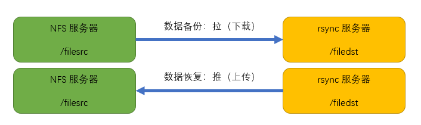

# RSYNC

rsync 是类 unix 系统下的数据镜像备份工具,支持快速完全备份和增量备份的工具,支持本地复制,远程同步等,用法类似 scp 命令; rsync 可以使用两种协议进行数据同步,ssh 协议和 rsync 协议

## rsync 特性

* 能更新整个目录树和文件系统
* 有选择性的保留符号连接,硬链接,文件属性,权限,设备以及时间等
* 无特殊权限要求
* 对多文件传输效率高
* 能使用 ssh 或自定义端口作为传输端口

## rsync 工作原理

rsync 在进行数据同步之前要进行用户身份验证,验证方式取决于使用的连接方式

* ssh登录验证方式: 使用 ssh 协议作为基础进行用户身份验证和数据同步
* rsync 登录验证方式: 使用 rsync 协议进行用身份认证(非系统用户)和数据同步

数据同步方式: 推送(上传),拉取(下载)



## 实验

### ssh 协议数据同步,将 NFS 服务器数据同步备份到 rsync 服务器

下行同步(下载):  

```shell
rsync -avz Server:/PATH/* /LOCALPATH
    -a # 归档模式,递归并保留对象属性
    -v # 显示同步过程
    -z # 在传输文件时进行压缩
# 示例
rsync -avz root@192.168.88.10:/filesrc/* /filedst
```

上行同步(上传)

```shell
rsync -avz /localpath/* user@ServerIP:/path
# 示例
rsync -avz /filedst/* root@192.168.88.10:/filesrc
```

在生产环境中,使用普通用户进行数据传输,赋予相应用户目录权限

**免密数据同步**: 做好 ssh 密钥对登录即可

### rsync 协议数据同步,将 NFS 服务器数据同步备份到 rsync 服务器

创建 rsync 服务的主配置文件 /etc/rsyncd.conf

```txt
address = 192.168.88.10                     # rsync 服务绑定IP
port 873                                    # 默认服务端口873
log file = /var/log/rsyncd.log              # 日志文件位置
pid file = /var/run/rsyncd.pid              # 进程号文件位置
[web]                                       # 共享名(类似samba)
    comment = web directory backup          # 共享描述
    path = /filesrc                         # 共享目录
    read only = no                          # 是否只读
    dont compress = *.gz *.bz2              # 不压缩文件类型
    auth users = user1                      # 登录用户名(非系统用户)
    secrets file = /etc/rsyncd_users.db     # 认证所需账户密码文件
```

创建认证所需账户密码文件 /etc/rsyncd_users.db,并修改权限为 600

```txt
# 格式-- username:password
user1:1234556
```

启动服务

```shell
rsync --daemon
netstat -antp |grep :873
```

设置映射用户对共享目录有权限(r)

```shell
setfacl -m u:nobody:rwx /filesrc
```

下行同步(下载)

```shell
rsync -avz rsync://user@ServerIP/shared /localpath
    --delete # 删除本地比服务器多的文件
# 示例
rsync -avz rsync://user1@192.168.88.10/web /filedst
```

上行同步(上传)

```shell
rsync -avz /localpath/* rsync://user@ServerIP/shared
# 示例
rsync -avz /filedst/* rsync://user1@192.168.88.10/web
```

拓展: rsync 协议的免密,通过在客户端添加一个环境变量实现

```shell
export RSYNC_PASSWORD=nobody:123456
```

### 配置 rsync+inotify 实时同步

定期同步的缺点:  
  执行备份的时间固定,延期明显,实时性差  
  当同步源长期不变时,密集的定时任务是不必要的(浪费资源)

实时同步的优点:  
  一旦同步源出现变化,立即启动备份,实时性好
  同步员无变化,则不执行备份,节省资源

#### inotify 简介

inotify是一个 Linux 内核特性,它监控文件系统,并及时向专门的应用程序发出相关的时间警告

inotify 两个监控命令:

```shell
inotifywait # 持续监控,实时输出结果
inotifywatch # 短期监控,任务结束后输出结果
```

inotify 部署

```shell
yum -y install gcc*
tar -xf inotify-tools-*.tar.gz
cd inotify-tools-*
./configure && make && make install
```

inotifywait 命令格式

```shell
inotifywait -mrq -e action1,action2 /DIR &
# 示例
inotifywait -mrq -e create,delete /filesrc &
    -m # 始终保持事件监听状态
    -r # 递归查询目录
    -q # 只打印监控事件的信息
# 监控动作包括: modify(改动), create, attrib(权限), move, delete
```

#### 利用 rsync+inotifywait 结合脚本实现单向实时同步

```bash
#!/bin/bash
a="inotifywait -mrq -e create,delete /filesrc"
b="rsync -avz /filesrc/* root@192.168.88.20:/filedst"
$a | while read directory event file;do
    $b
done
```

**拓展**: 调整 inotify 监控的文件数量(/etc/sysctl.conf)

```txt
mak_queue_events            # 监控队列大小
mak_user_instances          # 最多监控实例数
max_user-watches            # 每个实例最多监控文件数
```

### 配置 unison+inotify 实现双向实时同步

rsync 在单向同步上支持的非常好,且效率很高,但在双向同步支持较差; unison 则双向同步优秀,但同步效率较低

#### 部署(客户端和服务端都要部署)

1. 安装 inotify

   ```shell
   tar -xf inotify-tool-*.tar.gz
   cd inotify-tools-*
   ./configure && make && make install
   ```

2. 安装 ocaml

   ```shell
   tar -xf ocaml-*.tar.gz
   cd ocaml-*
   ./configure              # 忽略过程中的报错
   make world opt
   make install
   ```

3. 安装 unison

   ```shell
   tar -xf unison-*.tar.gz
   cd unison-*
   make UISTYLE=text THREADS=true STATIC=true   # 已存在Makefile文件,不用./configure
   cp unison /usr/local/bin/                    # 不安装,将生成的脚本拷贝

#### 配置脚本

filesrc 端:

```bash
#!/bin/bash
a="inotifywait -mrq -e create,delete,modify,move /filesrc"
b="/usr/local/bin/uniso -batch /filesrc/ ssh://192.168.88.20//filedst/"
$a | while read directory event file;do
    $b
done
```

filedst 端:

```bash
#!/bin/bash
a="inotifywait -mrq -e create,delete,modify,move /filedst"
b="/usr/local/bin/uniso -batch /filedst/ ssh://192.168.88.20//filesrc/"
$a | while read directory event file;do
    $b
done
```

将脚本分别置入后台执行;然后操作目录里的文件,测试是否能够双向实时同步
