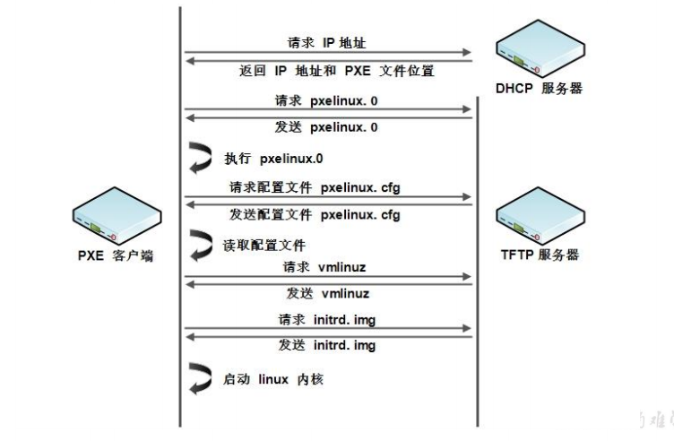

# PXE 网络装机

预启动执行环境(Preboot eXecution Environment,PXE),提供了一种使用网络接口启动计算机的机制



要使用 PXE 网络启动,需要在网络中有 dhcp 服务和 tftp 服务, dhcp 服务在提供 IP 的同时,指定 TFTP 服务地址, PXE 客户端从 TFTP 服务器获取启动操作系统所需的文件,但要安装一个操作系统需要有系统文件,可以使用ftp 或 web 服务提供

## PXE 服务配置

1. 安装 PXE 需要使用的工具

   ```bash
   yum -y install vsftpd dhcp tftp syslinux tftp-server
   ```

2. 拷贝镜像文件到 FTP 服务的共享目录

   ```bash
   cd /var/ftp/pub
   mkdir dvd
   chown ftp:ftp dvd
   cp -rf /mnt/cdrom/* dvd/                     # 复制镜像中所有系统文件
   ```

3. 配置 DHCP 服务,修改`/etc/dhcp/dhcpd.conf`文件

   ```conf
   subnet 192.168.6.0 netmask 255.255.255.0 {
       range 192.168.6.100 192.168.6.200;
       next-server 192.168.6.11;                  # tftp server ip
       filename "pxelinux.0";                       # file name
   }
   ```

4. 配置 tftp 服务,修改`/etc/xinetd.d/tftp`

   ```conf
   service tftp
   {
       socket_type  = dgram
       protocol     = udp
       wait         = yes
       user         = root
       server       = /usr/sbin/in.tftpd
       server_args  = -s /tftpboot
       disable      = no
       per_source   = 11
       cps          = 100 2
       flags        = IPv4
   }
   ```

5. 创建目录并拷贝所需文件

   ```bash
   mkdir -p /tftpboot/pxelinux.cfg
   cp /var/ftp/pub/dvd/isolinux/isolinux.cfg /tftpboot/pxelinux.cfg/default
   cp /usr/share/syslinux/pxelinux.0 /tftpboot/
   chmod 644 /tftpboot/pxelinux.cfg/default
   cp /var/ftp/pub/dvd/isolinux/* /tftpboot/
   ```

6. 开启服务,设置开机自启

   ```bash
   service dhcpd restart
   chkconfig dhcpd on
   service xinetd restart
   chkconfig xinetd on
   service vsftpd restart
   chkconfig vsftpd on
   ```

7. 配置 kickstart 无人值守安装脚本, kickstart 工具需要图形化环境

   ```bash
   yum -y install system-config-kickstart
   system-config-kickstart                      # 使用kickstart工具生成安装脚本 ks.cfg
   cp ks.cfg /var/ftp/pub/
   ```

8. 修改`/tftpboot/pxelinux.cfg/default`

   ```conf
   label linux
       menu label ^Install or upgrade an existing system
       menu default
       kernel vmlinuz
       append initrd=initrd.img  ks=ftp://192.168.6.11/pub/ks.cfg     # ks script position
    label vesa
        ...
   ```
