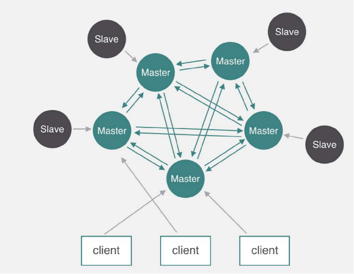

# Redis-Cluster

Redis 基于数据分片[^1]的方式在内部实现了一个集群化的方案,无需部署其他服务即可实现一个集群;但该方案至少需要三个主节点(三对主从服务器),所以适用于中大型服务



[^1]: 数据通过计算hash值(0-16383)然后分配给某一节点进行存储

## Reids 集群部署

### 主机规划

准备三对主从服务器,本次实验使用多实例的方法(一台主机部署一对主从服务)使用三台虚拟机进行集群的部署

|主机|IP|主端口|从端口|
|----|--|------|------|
|centos6-1|192.168.6.11|6379|6378|
|centos6-2|192.168.6.12|6379|6378|
|centos6-3|192.168.6.13|6379|6378|

### 部署 Redis

本次实验使用源码包安装 redis-3.2.12(实验操作适用于redis 4 版本,但 redis 5及更高版本的操作区别较大),安装目录 `/usr/local/redis`;安装后会获得几个 redis 命令

* redis-server: redis 服务端的启动程序
* redis-cli: redis 客户端程序
* redis-benchmark: redis 性能测试工具(读写性能)
* redis-check-aof: 数据修复
* redis-check-dump: 检查导出工具

### redis 内存分配策略优化

```bash
echo 'vm.overcommit_memory=1' >>/etc/sysctl.conf            # 内核功能设置
sysctl -p
# vm.overcommit_memory 可选参数有 0 1 2 含义如下
# 0 表示在分配内存前进行检查,然后分配可用内存,无可用内存则返回错误给应用进程
# 1 表示分配所有物理内存,不管内存状态如何
# 2 表示允许超量分配内存(一般在虚拟化环境下使用)
```

### 配置 redis-cluster

Redis Cluster 需要至少3个 Master 节点才能正常工作,为保证数据的高可用性,加入 Master-Slave 模式;因此需要创建6个节点(3对 Master-Slave 节点)

1. 创建存放多个 redis 实例文件的目录

   ```bash
   mkdir -p /redis_data/{6378,6379}
   ```

2. 配置 redis.conf 文件

   ```conf
   port 6378                           # 实例运行端口
   daemonize yes
   pidfile /data/6378/redis.pid
   logfile /data/6378/redis.log
   loglevel notice
   dir /data/6378
   dbfilename dump.rdb
   #禁用保护模式（避免影响主从复制）
   protected-mode no
   #开启cluster模式
   cluster-enabled yes
   #记录集群信息，cluster集群自动维护，不用手动更新、创建
   cluster-config-file nodes.conf
   #节点超时时间，目标节点超过指定时间没响应，就标记为FAIL或PFAIL（可能宕机）
   cluster-node-timeout 5000
   appendonly yes
   bind 0.0.0.0
   ```

   拷贝文件到 6379 实例目录并**修改**

3. 启动全部 redis 实例

   ```bash
   redis-server /data/6378/redis.conf
   redis-server /data/6379/redis.conf
   # 查看进程端口
   netstat -antp |grep redis
   ```

   redis cluster 中的的每个实例会开启两个端口,指定端口和指定端口加10000(例如: 6379和16379),其中更大的端口用于 Cluster bus; 而 Cluster bus 用于故障检测,故障转移授权,配置更新等;

4. 创建 Redis Cluster

   在 redis 5 或更高版本中,redis-cli 命令集成了集群创建的工具,可以直接使用 redis-cli 创建和管理集群;而在 redis 3 和 4 中需要使用 ruby 编写的一个工具(redis-trib.rb,包含在源码包中)来创建集群

   1. 安装 ruby 和 rubygems

      ```bash
      yum -y install ruby rubygems -y
      ```

   2. 修改 ruby 库的源地址

      ```bash
      gem sources --add http://mirrors.aliyun.com/rubygems/ --remove http://rubygems.org/
      # 检查源
      gem sources -l
      ```

   3. 安装 redis 的 ruby 库

      ```bash
      gem install redis -v3.3.3
      ```

   4. 创建一个包含6个(3对主从)节点的集群

      ```bash
      cp /root/redis-3.2.12/src/redis-trib.rb /usr/local/redis/bin/
      redis-trib.rb create --replicas 1 192.168.6.11:6378 192.168.6.11:6379 192.168.6.12:6378 192.168.6.12:6379 192.168.6.13:6378 192.168.6.13:6379
      # create 创建一个新的集群
      # --replicas 每个主节点有一个从节点
      ```

   5. 连接集群进行测试

      ```bash
      redis-cli -c -p 6378                      # 连接任意节点进行数据管理
      > cluster keyslot key                     # 查看数据分片
      > cluster slots                           # 查看数据分配关系
      ```

### 集群管理

#### 故障转移

集群在被访问时默认只从Master拉取数据,当主节点挂掉以后,集群会通过下线检测的方式,由 Slave 节点中选举(多个 Slave 节点时)一个充当 Master 节点,实现故障转移,从而保证集群正常运行

1. 停止一个主节点的服务进行测试

   ```bash
   redis-cli -c -h 192.168.6.11 -p 6378 shutdowm
   ```

2. 检查集群节点状态

   ```bash
   redis-cli -c -p 6378 cluster nodes
   ```

3. 删除失效节点

   ```bash
   redis-tribes.rb del-node existing_IP:PORt 'node-ID'
   ```

#### 节点管理

添加节点

```bash
redis-trib.rb add-node --slave --master-id '主机点ID' new_host:new_port existing_host:existing_port
# --slave 以从节点身份加入集群
# --master-id 主节点ID
# new_host:new_port 新节点地址和端口
# existing_host:existing_port 集群中任意一个节点的地址
```

检查节点状态

```bash
redis-cli -c -p 6378 cluster nodes
```

移除 noaddr 节点

```bash
redis-cli -c -p 6378 CLUSTER FORGET 'node-id'
```

### 使用 Python 连接 Redis-Cluster 测试

1. 安装 Python3 支持

   使用源码安装,安装后检查

   ```bash
   ./configure
   make
   make install
   ```

2. 安装 Redis-py 库

   下载源码解压,进入解压目录后执行

   ```bash
   python3 setup.py install
   # 测试
   python3                      # 进入python环境
   >>> import redis             # 不报错即成功
   >>>
   ```

3. 安装 Redis-py-cluster 库

   下载源码后,安装方式与 Redis-py 相同

   ```bash
   python3 setup.py install
   python3
   >>> import rediscluster
   >>>
   ```

4. 使用 py 脚本测试

   脚本内容如下

   ```python
   from rediscluster import StrictRedisCluster        # 从库中导入类
   # 节点信息
   startup_nodes = [
       {"host":"192.168.6.11", "port":6378},  # 主
       {"host":"192.168.6.11", "port":6379},  # 从
       {"host":"192.168.6.12", "port":6378},  # 主
       {"host":"192.168.6.13", "port":6379},  # 从
       {"host":"192.168.6.12", "port":6379},  # 主
       {"host":"192.168.6.13", "port":6378}   # 从
   ]
   # 实例化 StrictRedisCluster 对象
   redis_store= StrictRedisCluster(startup_nodes=startup_nodes, decode_responses=True)
   # 设置key键为 name,money
   redis_store.set('name', 'zhangsan')
   redis_store.set('money', '1000')
   # 获取键为name,money
   print("My name is: ", redis_store.get('name'))
   print("I have money: ", redis_store.get('money'))
   ```
