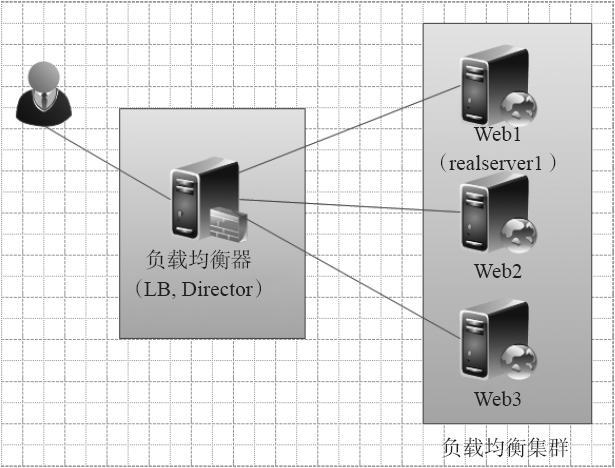
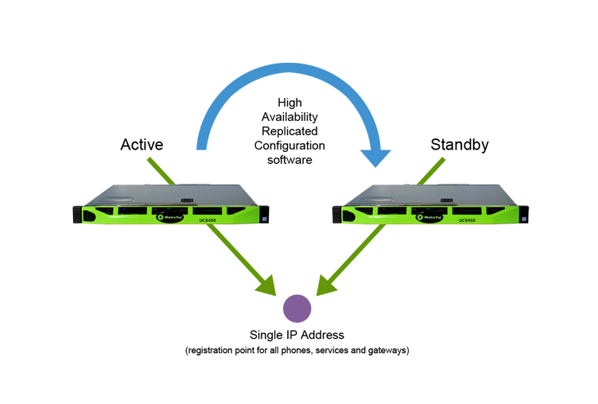
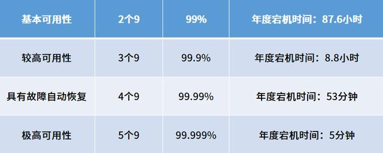

# 集群(Cluster)

提高服务性能的两种方式: 垂直扩展和水平扩展

其中垂直扩展指的是通过使用性能更高的硬件提升单机服务的性能,但这种方式成本较高,并且对性能的提升上限较低

水平扩展一般则使用集群技术,在成本较低的情况下可以获得较高的性能提升,并且提升的上限很高

集群是一组互相独立,通过高速网络连接地,协同工作的计算机

## 集群的分类

* 负载均衡集群(Load balance cluster, LBC)
* 高可用集群(High availability cluster, HAC)
* 高性能集群(High Performance cluster, HPC)

### 负载均衡集群

负载均衡集群可以提供更高的并发能力,一般分为前端**负载调度器**,后端**真实服务器(Real Server,RS)**和**共享储存**三个部分,负载调度部分负责把客户的请求按照不同的策略分配给后端的服务节点,后端服务节点负责提供服务,共享存储则提供一致的数据

负载均衡器是该集群的唯一对外访问入口

#### 负载均衡器分类

负载均衡按照软硬件分类:

* 软件: amoeba, nginx, HAProxy(Linux-HA), LVS(Linux Virtual Server)
* 硬件: ROSE, F5, 安瑞科

OSI模型工作层分类:

* 二层: 数据链路层(F5),通过不同的网卡(MAC)进行数据包的发送
* 四层: 传输层(LVS, HAProxy, 新版Nginx),传输层可以识别MAC地址,IP地,端口进行转发
* 七层: 应用层(Nginx, HAProxy),可以识别应用层协议(http),域名,主机名

四七层区别:

* 四层要完成一次完整的TCP连接,客户端和负载均衡器之间建立连接,负载均衡器只负责请求和响应地转发,无需获取完整数据包内容
* 七层要完成两次完整的TCP连接,客户端和负载均衡器之间建立连接,负载均衡器和RS之间建立连接,负载均衡器需要根据用户请求内容进行请求转发,需要获得数据包完整内容

|特性|四层|七层|
|----|----|----|
|安全性|无法拦截SYN攻击|可以拦截SYN攻击|
|范围性|使用TCP,UDP协议都可进行负载|只能负载应用层协议|
|并发能力|高|较低|

在实际应用可以使用四七层负载(多级负载),四层负载在上,七层在下

### 高可用集群

尽可能地提高服务器的稳定性和鲁棒性

在某一个节点发生故障时,进行故障转移(Failover),实现不间断的提供服务

实现技术:**心跳检测**

一般情况下,Active 和 Standby 是一对主从备份服务器,Standby 对 Acive 进行心跳检测(ACK包),如果 Active 无法应答,则认为 Active 故障,将Active 下线, 使用 Standby 进行替换,维持服务的不间断

可能的问题: **脑裂(Brain Split)**

Active 没有故障但没有及时应答造成 Standby 和 Active 同时上线

解决办法:

* 冗余心跳线
* 多次间歇性探测
* 电源交换机(强制下线 Active)

高可用标准:

实现方案:

软件: heartbeat(Linux-HA), Keepalived

硬件: ROSE, F5

### 高性能集群

通过集群技术,提高计算能力,用于计算量大应用环境,比如气象预测,影视渲染等

一般由任务分发节点和任务处理节点构成,任务分发节点负责任务的分解分配
