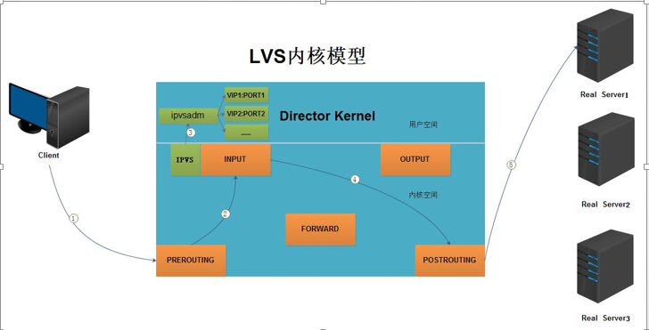
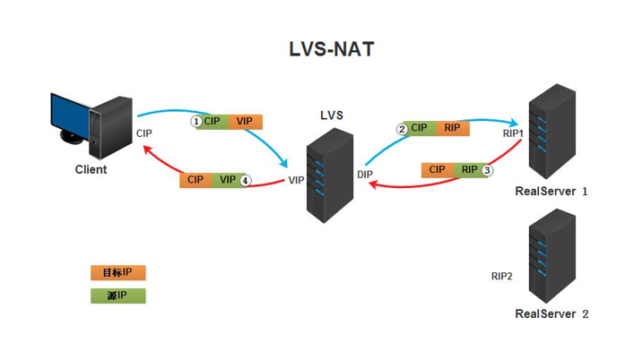
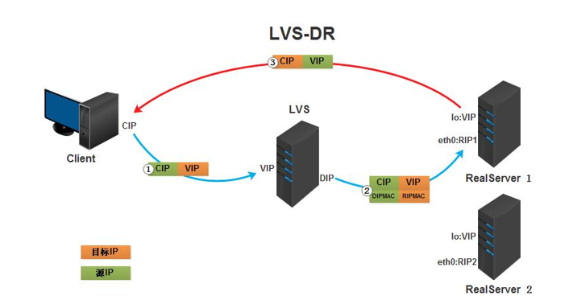
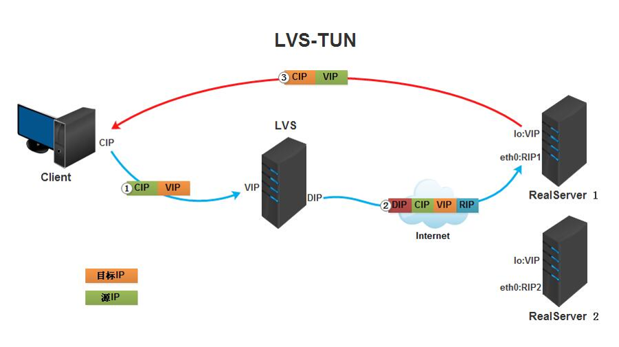
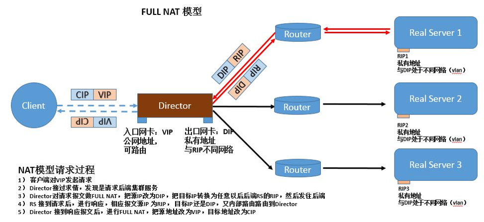

# LVS 负载均衡集群

LVS(Linux Virtual Server),有工作在 Linux 内核空间的 IPVS 和用户空间的 ipvsadm 组成;在 Linux 2.4 版本内核之后内置,可以直接使用

LVS 基于内核网络层工作,对内存和CPU的资源消耗极低,有很高的并发能力;工作在网络模型的第四层,可以对所有基于TCP和UDP的应用做负载均衡

LVS 常见术语
|名称|解释|
|----|----|
|ipvsadm|用户空间的命令行工具,编写集群规则|
|IPVS|内核空间的调度工具|
|VS|Virtual Server,虚拟服务器|
|Director,Balance|负载均衡器|
|RS|Real Server 真实服务器,提供服务|
|CIP|Clinet IP,客户端IP|
|VIP|Virtual IP,虚拟IP(VS的IP)|
|DIP|Director IP,负载均衡器的IP|
|RIP|Real Server IP,后端真实服务器的IP|

## LVS 工作原理



1. 当客户端的请求到达负载均衡器的内核空间时,首先会到达PREROUTING链
2. 当内核发现请求数据包的目的地址是本机时,将数据包送往INPUT链
3. LVS由用户空间的ipvsadm和内核空间的IPVS组成,ipvsadm用来定义规则,IPVS利用ipvsadm定义的规则工作,IPVS工作在INPUT链上,当数据包到达INPUT链时,首先会被IPVS检查,如果数据包里面的目的地址及端口没有在规则里面,那么这条数据包将经过INPUT链送至用户空间,交给用户空间的进程来处理
4. 如果数据包里面的目的地址及端口在规则里面,那么这条数据报文将被修改目的地址为事先定义好的后端服务器,并送往POSTROUTING链
5. 最后经由POSTROUTING链发往后端服务器

## LVS 调度算法

LVS 支持多种调度算法,一般分为两类: **静态调度算法**和**动态调度算法**;静态算法只按照规则进行调度,不考虑服务器状态,而动态算法根据服务器状态进行调度

算法有以下几种:

* 轮询(Round-Robin,RR),顺序平等分配任务给RS
* 加权轮询(Weighted Round-Robin,WRR),给RS添加权重,按照权重使用RR
* 最少连接(Least-Connection,LC),优先将任务分配给连接数少的RS
* 加权最少连接(Weighted Least-Connection,WLC),给RS添加权重,按照权重使用LC
* 局部最少连接(Locality-Based Least-Connection,LBLC),如果RS可用并没有超载则将任务分配给相同RS,否则分配给任务少的RS,并且保持分配
* 克隆局部最少连接(Locality-Based Least-connection with Replication,LBLCR),
* 源地址散列(Source Hash,SH),
* 目标地址散列(Destination Hash,DH),
* 最低期望延迟(Shortest Expected Delay,SED),
* 永不排队(Never Queue,NQ),

### LVS 持久化连接

在一段时间内将相同的客户端请求分配到之前处理请求的RS被称为 LVS 持久化连接;优先级高于调度算法

由于 HTTP 是无状态协议,请求完毕就会断开;要保存客户端的信息时常用的两种方法是,使用 cookie 或session; 而 cookie 保存在客户端导致安全性较低,而 session 保存在服务器端,而在不使用持久化连接的集群中,客户端每次访问都会负载到不同的服务器,而服务器会保存相同的 session,造成资源的浪费和访问的延时

如果配置了持久化连接, IPVS 会将请求的信息记录在 hash 表中,并设置保存时间 persistence_timeout 单位为秒,

持久化分为三种:

* PCC(持久客户端连接): 同客户端的所有请求定向到此前的相同RS
  
  ```bash
  ipvsadm -A -t 192.168.6.11:0 -s rr -p 120        # 0端口代表所有服务
  ```

* PCC(持久端口连接): 同客户端的相同端口请求定向到此前的相同RS
  
  ```bash
  ipvsadm -A -t 192.168.6.11:80 -s rr -p 120
  ```

* PFMC(持久防火墙标记连接):使用防火墙对请求进行标记,有相同标记的请求定向到此前的相同RS,可以将不同端口定义为一个集群
  
  ```bash
  IP tables -t mangle -A PREROUTING -d 192.168.6.11 -p tcp -dport 80 -j MARK --set-mark 10
  service iptables save
  ipvsadm -A -f 10 -s wlc -p 120
  ```

## LVS 工作模式

LVS 有四种工作模式, NAT, DR, TUN, FULLNAT;常用的是 NAT 和 DR 模式

### NAT 模式



### DR 模式



### TUN 模式



### FULLNAT 模式



## LVS 集群部署

使用三台 Linux 虚拟机完成部署,一台作为负载均衡器,两台作为真实服务器

### NAT 模式集群

#### NAT-RS 配置

1. 添加到负载均衡器的 VIP 的默认路由

   ```bash
   route add default gw VIP
   ```

2. 安装 httpd 并编写 `index.html` 文件用于测试

   ```bash
   yum -y install httpd
   echo 'RS1(RS2)' >>/var/www/html/index.html
   ```

#### NAT-Director 配置

1. Linux 内核加载 ip_vs 模块

   ```bash
   modprobe ip_vs
   cat/proc/net/ip_vs
   ```

2. 安装 ipvsadm 工具

   ```bash
   yum -y install ipvsadm
   ```

3. 开启路由转发功能

   ```bash
   echo net.ipv4.ip_forward=1
   sysctl -p
   ```

4. 添加 NAT 转换规则

   ```bash
   iptables -t nat -A POSTROUTING -s '内网网段' -o '外网网卡' -j SNAT --to-source 'VIP'
   ```

5. 编辑集群设置

   ```bash
   ipvsadm -A -t 'VIP:PORT' -s rr
   ipvsadm -a -t 'VIP:PORT' -r 'RIP1' -m            # -m 为 NAT 模式
   ipvsadm -a -t 'VIP:PORT' -r 'RIP2' -m
   ipvsadm -Ln                                      # 查看集群配置
   service ipvsadm save                             # 保存配置
   ```

### DR 模式集群

#### DR-RS 配置

1. 配置回环接口的子接口

   ```bash
   cd /etc/sysconfig/network-scripts
   cp -a ifcfg-lo ifcfg-lo:0
   ```

   `ifcfg-lo:0`文件修改

   ```conf
   DEVICE=lo:0
   IPADDR=VIP
   NETMASK=255.255.255.255
   ```

2. 修改内核配置`/etc/sysctl.conf`的 ARP 应答和公告设置

   ```conf
   net.ipv4.conf.all.arp_ignore = 1
   net.ipv4.conf.all.arp_announce = 2
   net.ipv4.conf.default.arp_ignore = 1
   net.ipv4.conf.default.arp_announce = 2
   net.ipv4.conf.lo.arp_ignore = 1
   net.ipv4.conf.lo.arp_announce = 2
   ```

3. 刷新配置,并启动回环子接口,添加到子接口的路由记录

   ```bash
   sysctl -p
   ifup lo:0
   route add -host 'VIP' dev lo:0
   ```

4. 安装 http 并编写 `index.html` 文件

   ```bash
   yum -y install httpd
   service httpd start
   echo 'RS1(RS2)' >>/var/www/html/index.html
   ```

### DR-Director 配置

1. 配置网卡子接口

   ```bash
   cd /etc/sysconfig/network-scripts
   cp -a ifcfg-eth0 ifcfg-eth0:0
   ```

   `ifcfg-eth0:0`修改内容

   ```conf
   DEVICE=eth0:0
   IPADDR=VIP
   NETMASK=255.255.255.0
   ```

2. 优化转发,修改`/etc/sysctl.conf`

   ```conf
   net.ipv4.conf.eth0.send_redirects = 0
   net.ipv4.conf.all.send_redirects = 0
   net.ipv4.conf.default.send_redirects = 0
   ```

3. 内核加载 ip_vs 模块

   ```bash
   modprobe ip_vs
   cat /proc/net/ip_vs
   ```

4. 安装 ipvsadm,并编辑集群配置

   ```bash
   yum -y install ipvsadm
   ipvsadm -A -t 'VIP:PORT' -s rr
   ipvsadm -a -t 'VIP:PORT' -r 'RIP1' -g                # -g 为 DR 模式
   ipvsadm -a -t 'VIP:PORT' -r 'RIP2' -g
   ipvsadm -Ln
   service ipvsadm save
   ```

## LVS 的高可用集群

### 基于 keepalived 实现高可用

Keepalived 基于虚拟冗余路由协议（Virtual Redundancy Routing Protocol,VRRP）实现了高可用性

* 支持故障转移(Failover)
* 支持节点状态检查(Health Checking)

#### keepalived 部署

在 LVS 负载均衡集群的基础上部署 keepalived, 实现负载调度器的高可用和真实服务器的健康监控;需要部署两台配置相同的负载调度器(主从),然后在其上同时部署 keepalived

1. 安装 keepalived 及其依赖

   ```bash
   yum -y install kernel-devel openssl-devel popt-devel gcc*
   tar -xf keepalived-*
   ./configure --prefix=/ --with-kernel-dir=/usr/src/kernels/2.6.32.../
   make
   make install
   ```

2. 修改 keepalived 配置文件`/etc/keepalived/keepalived.conf`

   ```conf
   global_defs {
      router_id Director1                     # 唯一id
   }
   vrrp_instance VI--1 {
       # 设置服务类型主/从（ MASTER/SLAVE ）
       state MASTER
       # 指定那块网卡用来监听
       interface eth0 
       # 设置组号，如果是一组就是相同的ID号，一个主里面只能有一个主服务器和多个从服务器
       virtual_router_id 66
       # 服务器优先级， 主服务器优先级高
       priority 100 
       # 心跳时间， 检测对方存活
       advert_int 1 
       authenticetion { 
           auth_type PASS
           auth_pass 1111
       }
       virtual_ipaddress {
           192.168.1.100
       }
   }

   virtual_server 192.168.1.100 80 { 
       # 健康检查间隔
       delay_loop 6
       # 使用轮询调度算法
       lb_algo rr
       # DR模式的群集
       lb_kind DR
       # 使用的协议
       protocol TCP
   
       real_server 192.168.1.2 80 { 
           weight 1
           TCP_CHECK {
               connect_port 80
               connect_timeout 3
               nb_get_retry 3
               delay_before_retry 4
           }
       }
   
       real_server 192.168.1.3 80 {
           weight 1
           TCP_CHECK {
               connect_port 80
               connect_timeout 3 
               nb_get_retry 3 
           }
       }
   }
   ```

### 基于 Heartbeat 的实现高可用

Heartbeat 是 Linux-HA 工程的一个组件,包括心跳检测和资源管理两个部分,用于实现设备的高可用

#### Heartbeat 高可用部署

Heartbeat 使用 `uname -n` 命令检测主机名,所以每台主机的主机名不能重复

1. 安装 heartbeat 极其依赖

   ```bash
   tar -zxvf heartbeat.tar.gz                   # 所有软件都打包在了一起
   cd heartbeat
   yum -y install *
   cd /usr/share/doc/heartbeat-3.0.4/
   cp ha.cf autheys haresources /etc/ha.d/      # 三个需要修改的配置文件
   ```

2. 修改 `/etc/ha.d/autheys` 文件,修改认证配置

   ```conf
   auth 3                  # 默认支持三种加密方式,任选其一
   3 md5 Hello!            # 加密方式后跟加密后的密码
   ```

   可以使用 openssl 生成随机密码

   ```bash
   dd if=/dev/random bs=512 count=1 |openssl md5
   ```

3. 修改 `/etc/ha.d/ha.cf` 文件,添加监控节点

   ```conf
   bcast eth0                       # 监听网卡
   node www.centos1.com             # 节点主机名
   node www.centos2.com
   ```

4. 配置`/etc/ha.d/haresources` 文件

   ```conf
   www.centos1.com IPaddr::192.168.6.100/24/eth0:0       # 指定管理的资源
   ```

5. 编写 Heartbeat 检测脚本

   Heartbeat 只能进行针对主机名的检测和故障转移,当服务故障时不会切换,需要使用第三方的工具,或编写脚本进行对服务的监控

   ```bash
   PWD=/usr/local/script/httpd_check

   URL="http://10.10.10.11/index.html"

   HTTP_CODE=$(curl -o /dev/null -s -w "%{http_code}" "${URL}")   # 检测httpd的可用性,返回状态码

   if [ $HTTP_CODE != 200 ]
       then
   service heartbeat stop
   fi
   ```

## 总结

**问题**: LVS 集群的配置都正确,但无法通过负载调度器访问服务

**原因**: 由于负载均衡器自身并不对外提供服务,所以对其的访问请求被防火墙拦截

**解决方法**: 配置防火墙,放行请求;或清除防火墙的所有规则

**问题**: 在配置 LVS-DR 集群的VIP, eth0:0 的子接口时,无法启动子接口

**原因**: 网卡配置过相同名称的子接口,网卡中残存有配置信息

**解决方法**: 清除网卡的缓存信息,使用命令`ip addr flush dev eth0`

**问题**: 在配置高可用时,为网卡的子接口配置 Floating IP后,无法启动子接口

**原因**: 同网段内不允许有两个相同的IP,防止IP冲突导致错误,所以给网卡配置重复的IP时会报错

**解决方法**: 1 在配置高可用时,如果使用Heartbeat则不需要手动启动子接口,监控工具会自动启动;2 如果需要手动启动子接口,可以更改`ifup`工具的脚本,使其可以配置相同IP;3 可以先断开主机间的连接,配置好IP后再连接
