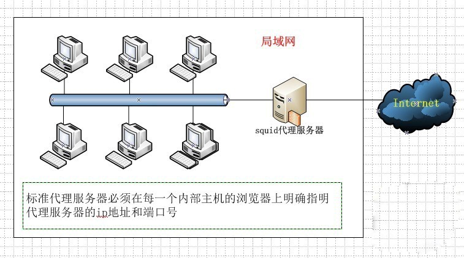
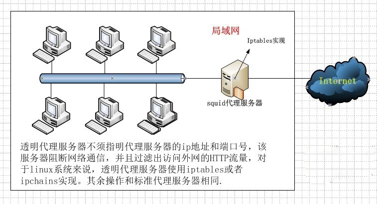
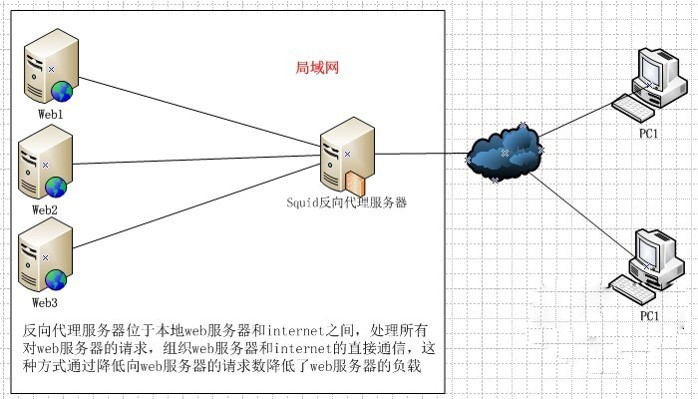

# Squid 缓存服务器

Squid 是一个 Internet 缓存代理,支持 HTTP,HTTPS,FTP等协议

Squid 有三种部署模式:

* 标准代理
  
* 透明代理
  
* 反向代理
  

|模式|特点|
|----|----|
|标准代理|需要客户端配置代理信息|
|透明代理|客户端无需配置代理信息,需要配置防火墙策略|
|反向代理|工作在服务端,对外表现为服务器|

## Squid ACL

Squid 支持 ACL,可以根据源地址,目标URL,文件类型等定义列表

Squid 的 ACL 需要先定义,再规则动作(allow/deny)

Squid 按照列表顺序进行规则匹配,当匹配到规则时,停止;**如果未匹配到规则,则是列表中最后一条的规则取反**

格式:

```conf
acl 表名 表类型 表内容              # 定义
http_access allow/deny 表名        # 动作
```

表类型有以下几种:

|类型|描述|
|----|----|
|src|源地址|
|dst|目标地址|
|port|目标端口|
|dstdomain|目标域|
|time|访问时间|
|maxconn|最大并发连接|
|url_regex|url地址,如: www.baidu.com|
|Urlpath_regex|资源路径,如:<http://www.baidu.com/1.jepg>|

## 部署

使用三台主机,处于两个网段,Squid 代理服务器作工作在网段交界
三台主机的 IP 配置如下:

|主机|LAN|WAN|
|----|---|----|
|Server|-|10.10.10.13|
|Squid|192.168.6.12|10.10.10.12|
|Client|192.168.6.11|-|

### 标准代理

1. Server 安装 apache 并配置

   ```bash
   yum -y install httpd
   echo "test page" >>/var/www/html/index.html
   service httpd start
   ```

2. Squid Proxy Server 安装及配置

   安装 squid

   ```bash
   yum -y install squid
   ```

   修改 `/etc/squid/squid.conf`

   ```conf
   http_port 3128                               # squid 端口
   visible_hostname www.test.com                # squid 主机名
   ```

   开启内核路由转发,修改 `/etc/sysctl.conf`

   ```conf
   net.ipv4.ip_forward = 1
   ```

   重载内核配置文件,开启 squid

   ```bash
   sysctl -p
   service squid start
   ```

3. Clinet 配置网关

   ```bash
   route add default gw 192.168.6.12                # 网关为 Squid 的 LAN IP
   ```

4. Client 访问 Server IP 进行测试

   如果使用浏览器需要在浏览器的设置中配置代理服务器地址

   如果使用 elinks 工具则需要配置环境变量

   ```bash
   export HTTP_PROXY=HTTP://192.168.6.12:3128           # 代理服务器的IP和端口
   ```

   如果使用 curl 工具也要配置环境变量,但与 elinks 的不同

   ```bash
   export http_proxy=HTTP://192.168.6.12:3128
   ```

### 透明代理

Squid 代理服务器工作在网关之上,会主动劫持 Client 请求

1. Server 安装 apache 并配置

   ```bash
   yum -y install httpd
   echo "test page" >>/var/www/html/index.html
   service httpd start
   ```

2. Squid Proxy Server 安装及配置

   安装 squid

   ```bash
   yum -y install squid
   ```

   修改 `/etc/squid/squid.conf`

   ```conf
   http_port 192.168.6.12:3128 transparent      # squid IP:端口和工作模式
   visible_hostname www.test.com                # squid 主机名
   reply_body_max_size 100 MB                   # 限制请求的最大文件大小
   ```

   开启内核路由转发,修改 `/etc/sysctl.conf`

   ```conf
   net.ipv4.ip_forward = 1
   ```

   配置 NAT 策略

   ```bash
   iptables -t nat -A PREROUTING -i eth0(内网) -s 192.168.6.0/24 -p tcp -dport 80 -j REDIRECT --to-ports 3128
   ```

   重载内核配置文件,开启 squid

   ```bash
   sysctl -p
   service squid start
   ```

3. Client 配置网关

   ```bash
   route add default gw 192.168.6.12                # 网关为 Squid 的 LAN IP
   ```

4. Client 访问 Server IP 进行测试

### 反向代理服务器

工作在服务侧,对外表现为正常服务器;Squid 还提供了基础的 RR 算法支持,可以进行简单的负载均衡

1. Server 安装 apache 并配置网关

   ```bash
   yum -y install httpd
   echo "test page" >>/var/www/html/index.html
   service httpd start

   route add default gw 10.10.10.12
   ```

2. Squid Proxy Server 安装及配置

   安装 squid

   ```bash
   yum -y install squid
   ```

   修改 `/etc/squid/squid.conf`

   ```conf
   http_access allow all
   http_port 10.10.10.12:80 vhost               # squid IP:端口和工作模式
   visible_hostname www.test.com                # squid 主机名
   cache_peer 10.10.10.13 parent 80 0 originserver round-robin
   # 可以使用多台Server构成负载均衡
   cache_peer 10.10.10.14 parent 80 0 originserver round-robin
   ```

   开启内核路由转发,修改 `/etc/sysctl.conf`

   ```conf
   net.ipv4.ip_forward = 1
   ```

   重载内核配置文件,开启 squid

   ```bash
   sysctl -p
   service squid start
   ```

3. Client 访问 Squid 的 IP 进行测试
