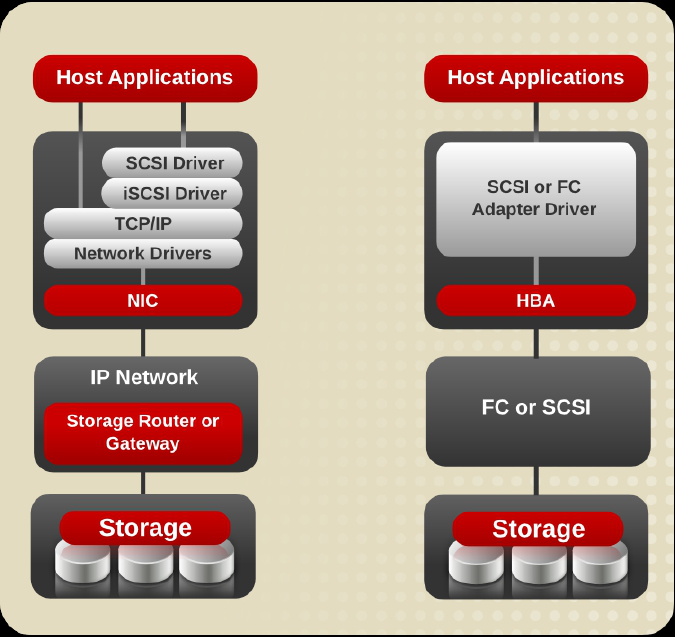
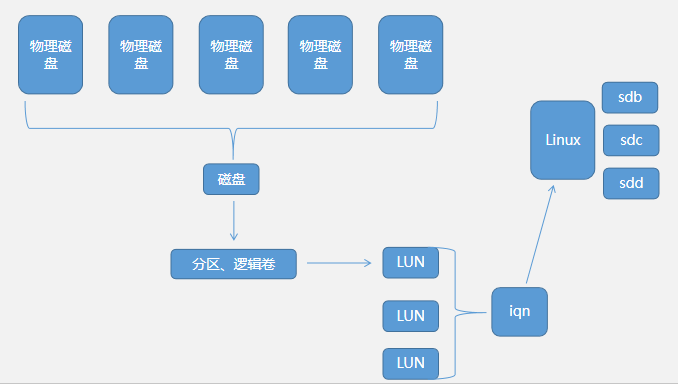

# 共享存储

## 存储结构

* DAS(Direct Attached Storage): 直接附加存储
  通过SCSI,SATA 总线直连存储设备
* NAS(Network Attached Storage): 网络附加存储
  通过网络存储读取文件
* SAN(Storage Area Network): 存储区域网络
  独立于数据网络的存储网络

|存储方式|特点|
|--------|----|
|DAS|直连,存储独占;传输速率快|
|NAS|通过网络访问文件系统,可以共享数据;速率较慢|
|SAN|通过网络挂载设备,可以共享数据;速率有较大提升|

## 存储技术

* 块存储(硬盘,光盘等)
  基础的存储技术,存储数据时分为元数据和真实数据分别存在superblock 和 datablock
* 文件存储(NFS)
  基于文件的存储方式,
* 分布式存储(对象存储)
  将数据分散在多个设备进行存储

## ISCSI

ISCSI(Internet Small Computer System Interface),与传统 SCSI 技术相比,有以下三个革命性变化

* 透过 TCP/IP 网络发送 SCSI 协议,实现远距离使用设备
* 连接服务器数量无限(SCSI-3为15)
* 在线扩容,动态部署


ISCSI 工作架构为 C/S

Client: initiator
Server: target

在 Server 端,target 通过 IQN 对外提供存储标识,IQN 由 多个LUN(逻辑单元)构成,每个 LUN 是一个存储空间(可以是分区,逻辑卷,文件等)

Client 端,通过扫描共享存储,然后登录即可使用共享的存储



## ISCSI 部署

### 非持久共享

通过命令行工具,创建 IQN 并共享;但在服务重启后,共享信息会重置

1. Server 端,创建存储池,用于提供存储空间

   ```bash
   pvcreate /dev/sdb
   vgcreate vg0 /dev/sdb
   lvcreate -L 1G -n lv0 vg0
   mkfs.ext4 /devvg0/lv0
   ```

2. Target 创建 IQN 标签

   ```bash
   yum -y install scsi-target-utils
   service tgtd start
   tgtadm -L iscsi -o new -m target -t 1 -T iqn.2021-1.com.test:one         # IQN标签: iqn.年-月.域名反写:标识
   tgtadm -L iscsi -o new -m target
   ```

3. 绑定 IQN 标签到存储设备

   ```bash
   tgtadm -L iscsi -o new -m logicalunti -t 1 -l 1 -b /dev/vg0/lv0
    -L            # 指定驱动类型
    -o            # 指定操作
    -m            # 指定对象
    -t            # target 标签
    -l            # lun 标签
    -b            # 设备
   tgtadm -L iscsi -o bind -m target -t 1 -I 192.168.6.0/24
   ```

4. Client 配置

   ```bash
   yum -y install iscsi-initiator-utils
   iscsiadm -m discovery -t st -p 192.168.6.11              # 探测共享存储
   iscsiadm -m node -T iqn.2021-1.com.hongfu:one --login    # 登录
   iscsiadm -m node -T iqn.2021-1.com.hognfu:one --logout
   ```

   查看并挂载设备,在`/etc/fstab`中添加(如果设备未格式化,需要先格式化)

   ```conf
   fdisk-l
   /dev/sdb /mnt  ext4  defaults,_netdev  0 0
   ```

### 持久化配置共享存储

通过将共享信息写入配置文件,达到持久化的目的

1. Server 端,修改`/etc/tgt/targets.conf`文件,添加 IQN 信息和 LUN 信息即可

   ```conf
   <target iqn.2021-01.com.hongfu:one>      # iqn 信息
       <backing-store /dev/vg0/lv1>         # 存储设备
           vendor_id INC.                   # 商标标识
           lun 3                            # lun 编号,可以不连续
       </backing-store>
       incominguser user01 123456     # 用户和密码
       initiator-address 192.168.6.0/24     # 共享的网段
   </target>
   ```

   启动服务,查看共享共享信息

   ```bash
   service tgtd start
   tgtadm --ld iscsi --mode target --op show
   ```

2. Client 端,修改`/etc/iscsi/initiatorname.iscsi`文件,添加 IQN

   ```iscsi
   InitiatorName=iqn.2021-01.com.hongfu:one
   ```

   修改`/etc/iscsi/iscsid.conf`,添加登录用户名和密码

   ```conf
   node.session.auth.authmethod = CHAP          # 密码验证
   node.session.auth.username = user01          # 用户名
   node.session.auth.password = 123456          # 密码
   ```

   重启 iscsid 守护进程和 iscsi 的 session

   ```bash
   service iscsid restart               # 如果有 session 存在,要先退出 session
   service iscsi restart
   ```

   查看存储设备

   ```bash
   fdisk -l
   ```
