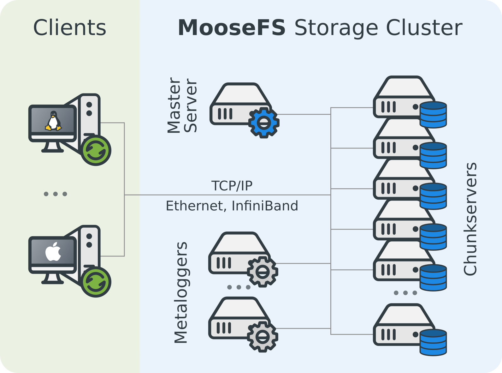

# MFS

MooseFS(Moose File System,MFS), 是一个具备冗余容错功能的分布式网络文件系统

* 高可靠性: 每一份数据可以设置多个备份,并存储在不同的主机上
* 高可扩展性: 通过增加磁盘和主机数量动态扩容整个文件系统的容量
* 高科容错性: 具有一个时间限制的全局回收站(Trash)
* 高一致性: 在文件被写入,访问时,依然可以完成对文件的一致性快照

MFS 分为两个版本: MFS(社区版) 和 MFS pro(商业版),相比社区版,商业版具有多主节点特性,并且有官方 Windows Client

MFS 目前是单主节点(可以通过keepalived实现高可用),并且对内存要求略高,处理一百万个文件chunkserver 需要约300MB内存

## MFS 集群



MFS 集群由四部分组件构成:

* 管理服务器(managing server/master)
  mfs 集群的主服务器,分发用户请求,存储整个文件系统数据文件的 metadata;并且是存在内存中的,会定期写入 `metadata.mfs.back`文件,操作实时写入`changelog.*.mfs`文件;master启动时会将 metadata.mfs 载入内存,重命名为 `metadata.mfs.back`
* 元数据备份服务器(Metadata backup servers/metaloggers)
  备份master 的 metadata 文件和其变化的日志文件,文件类型为 `changelog_ml.*.mfs`
* 数据存储服务器组(data servers/chunk servers)
  存储数据文件的实体,文件以 chunk 大小存储,chunk 最大为64MB;块的生成遵循规则:目录循环写入(00-FF 256个目录,step 为2),chunk 文件递增生成,大文件切分目录连续,chunkserver 需要留有多余空间;文件可以有多分 copy,但 goal 的大小不要超过 chunk server的数量
* 客户机服务组(client servers/client)
  挂载并使用 mfs 的客户端,是通过 fuse mechanism 实现挂载 mfs 文件系统的

### MFS 部署

从源码构建 MFS 集群使用的是同样的源代码,在安装时选择不同的角色进行安装

#### 安装 master server

```bash
tar -xf moosefs-3.0.84.-1.tar.gz
cd moosefs-3.0.84
useradd mfs -s /sbin/nologin
./configure --prefix=/usr/local/mfs --with-default-user=mfs --with-default-group=mfs
make
make install
chomd a+x /usr/local/mfs/sbin/*
ln -s /usr/local/mfs/sbin/* /usr/local/sbin/
cd /usr/local/mfs/etc/mfs
cp -a mfsmater.cfg.sample mfsmaster.cfg         # 主配置文件
cp -a mfsexports.cfg.sample mfsexports.cfg      # 共享配置文件
cp /usr/local/mfs/var/mfs/metadata.mfs.empty /usr/local/mfs/var/mfs/metadata.mfs    # meta 文件
```

master 的主要配置文件有两个: `mfsmaster.cfg`无需修改,修改`mfsexports.cfg`

```conf
192.168.6.0/24 .    re,alldirs,maproot=0
```

启动 master, 由于mate 数据存在内存中,所以千万不要使用kill 杀死进程,要使用安全的关闭方式

```bash
mfsmaster start
mfsmaster stop
```

#### 安装 metalogger server

```bash
useradd mfs -s /sbin/nologin
./configure --prefix=/usr/local/mfs --with-default-user=mfs --with-default-group=mfs
make
make install
cp mfsmetalogger.cfg.sample mfsmetalogger.cfg
chmod a+x /usr/local/mfs/sbin/*
ln -s /usr/local/mfs/sbin/* /usr/local/sbin/
```

修改配置文件`mfsmetalogger.cfg`

```conf
META_DOWNLOAD_FREQ = 2          # 备份文件下载请求频率
MASTER_HOST 192.168.6.11        # master 地址
```

启动 metalogger

```bas
mfsmetalogger.cfg
```

#### 安装 chunkserver

```bash
useradd mfs -s /sbin/nologin
./configure --prefix=/usr/local/mfs --with-default-user=mfs --with-default-group=mfs
make
make install
cd /usr/local/mfs/etc/mfs/
cp mfschunkserver.cfg.sample mfschunkserver.cfg
```

修改配置文件`mfschunkserver.cfg`

```conf
MASTER_HOST= 192.168.6.11     # master 地址
MASTER_PORT = 9420            # master 端口
HDD_CONF_FILENAME = /usr/local/mfs/etc/mfs/mfshdd.cfg   # 指明共享空间的配置文件
```

`mfshdd.cfg` 内容,写明共享空间的路径,指向的可以是磁盘,分区,文件

```conf
/mnt/shared
```

启动 chunkserver

```bash
mfschunkserver start
```

#### 安装 client

client 基于 fuse 实现

```bash
yum -y install fuse fuse-devel fuse-libs
tar -xf moosefs-3.0.84-1.tar.gz
cd moosefs-3.0.84
./configure --prefix=/usr/local/mfs --with-default-user=mfs --with-default-group=mfs --disable-mfsmaster --disable-mfschunkserver
make
make install
```

进行挂载即可使用

```bash
/usr/local/mfs/bin/mfsmount /mnt/mfsclient/ -H 192.168.6.11
  -H 指定 master server 的地址
```

mfs 常用命令

```bash
mfsmakesnaphsot           # 对文件拍摄快照(类似软连接)
mfssetgoal                # 设置备份期望值
mfsgetgoal                # 查看备份期望值
mfsfileinfo               # 查看文件详细信息
mfssettrashtime           # 设置 trash 时间
mfsgettrashtime           # 查看 trash 时间
```

## 数据找回

### 找回误删数据

```bash
makdir /back
chown mfs.mfs /back
mfsmount -m /back -H 192.168.6.11
tree .
mv 002/00000002/|test.txt /back/trash/undel/
```

### 从备份中恢复 master

在 master 因故失去 meta 文件后,可以从 metalogger 找回 metadata.mfs.back 然后使用 mfsmaster -a 命令恢复

## 附录

### master 主配置文件 mfsmaster.cfg 内容说明

```cfg
WORKING_USER = mfs                              # 用户
WORKING_GROUP = mfs                             # 用户组
SYSLOG_IDENT = mfsmaster                        # 在 syslog 中的标识,说明是 master 产生的日志
LOCK_MEMORY = 0                                 # 是否执行mlockall()避免进程溢出
NICE_LEVEL = -19                                # 进程的优先级
EXPORTS_FILENAME = /usr/local/mfs/etc/mfs/mfsexports.cfg # 共享配置文件
DATA_PATH = /usr/local/mfs/var/mfs              # 数据存放路径
BACK_LOGS = 50                                  # metadata 的改变 log 文件条目数量
REPLICATIONS_DELAY_INIT = 30                    # 延迟复制的时间
REPLICATIONS_DELAY_DISCONNECT = 3600            # chunkserver 断开的复制延迟
MATOML_LISTEN_HOST = *                          # metalogger 监听地址
MATOML_LISTEN_PORT = 9419                       # metalogger 监听端口
MATOCS_LISTEN_HOST = *                          # chunkserver 连接的 IP
MATOCS_LISTEN_PORT = 9420                       # chunkserver 连接的端口
MATOCU_LISTEN_HOST = *                          # 客户端的连接地址
MATOCU_LISTEN_PORT = 9421                       # 客户端的连接端口
CHUNKS_LOOP_TIME = 300                          # chunk 的回环频率
CHUNKS_DEL_LIMIT = 100
CHUNKS_WRITE_REP_LIMI = 1                       # 在一个循环里复制到一个 chunkserver 的最大 chunk 数目
CHUNKS_READ_REP_LIMIT = 5                       # 在一个循环里从一个 chunkserver 复制的最大 chunk 数目
REJECT_OLD_CLIENTS = 0                          # 弹出低于 1.6.0 的客户的连接(mfsexports访问控制对老版本客户无效)
```

### mfsexports.cfg 内容说明

```cfg
地址     目录    权限

# 地址可以使用多种形式
*                 # 所有
n.n.n.n           # 单个IP
n.n.n.n/b         # 网址/掩码长度
n.n.n.n/m.m.m.m   # 网址/掩码
f.f.f.f-t.t.t.t   # ip范围

# 特殊目录
/                 # MooseFS根
.                 # 表示 MFS 文件系统

# 权限
ro                # 只读
rw                # 可读写
alldirs           # 允许挂载任何指定的子目录
maproot           # 用户映射
password          # 指定客户端密码
```
