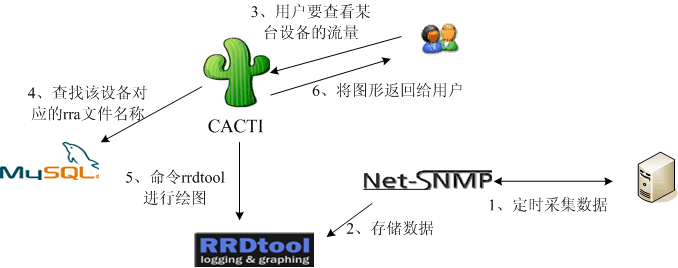
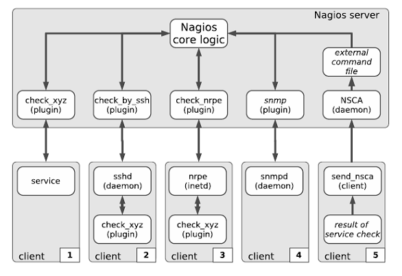
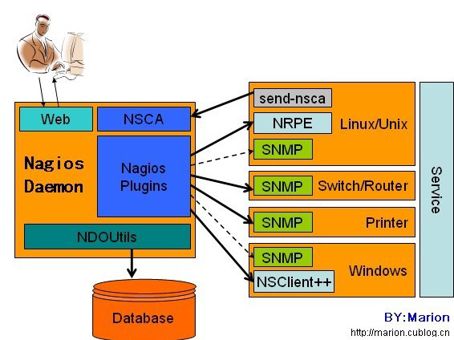

# 集群监控

对集群的各个资源指标信息进行收集分析,如:系统负载,CPU利用率,磁盘I/O,内存,网络I/O等;在出现异常情况前进行报警使管理员可以及时处理以确保集群的良好运行

常用监控工具有以下几种:

* Cacti
  通过SNMP获取数据,使用RRDtool 绘制图形,实现系统资源信息的收集和展示
* ZABBIX
  一个成熟的集群监控软件,功能全面
* Nagios
  以服务和性能监测为主
* open-falcon
  最早由小米团队开发使用,后开源,维护人数很少
* Prometheus
  适于云原生的监控方案

监控工具的数据收集手段主要分为两种:

* 主动,在发现客户端出现问题时立即发送消息
* 被动,定时发送的信息

集群监控平平台又称NMP 网络管理平台

## Cacti 监控框架

Cacti 架构如下:



Cacti 使用 SNMP 进行网络节点 agent 的数据收集,

其中,RRDtool 本身是一个强大的绘图工具,数据使用RRD数据库(存储时间序列数据)进行存储,其中每个rrd 文件的大小是固定的,RRDtool定时获取数据,如果没有获取到会使用 UNKN(unknow) 代替

### Cacti 部署

### 服务器端

安装依赖的软件和工具

```bash
yum -y install httpd mysql mysql-server mysql-devel libxml2-devel mysql-connector-odbc perl-DBD-MySQL unixODBC php php-mysql php-pdo

service httpd start
service mysqld start

yum -y install net-snmp net-snmp-utils net-snmp-libs lm_sensors
```

安装 RRDTool

```bash
tar -zxf rrdtool-4.5.tar.gz
cd rrdtool
./configure --prefix=/usr/local
make && make install
# 如果出错,按以下步骤解决
tar -zxf cgilib-0.5.tar.gz
cd cgilib-0.5
make
cp libcgi.a /usr/local/lib
cp cgi.h /usr/include

yum -y install libart_lgpl-devel
yum -y install pango-devel* cairo-devel*
```

部署 cacti,设置数据库连接

```bash
tar -zxf cacti-0.8.7g.tar.gz
mv cacti-0.8.7g/ /var/www/html/cacti
cd !$
patch -p1 -N <~/data_source_deactivate.patch
patch -p1 -N <~/graph_list_view.patch
patch -p1 -N <~/html_output.patch
patch -p1 -N <~/ldap_group_authenication.patch
patch -p1 -N <~/script_server_command_line_parse.patch
patch -p1 -N <~/ping.patch
patch -p1 -N <~/poller_interval.patch
```

添加检测数据的用户账户,更改权限,保证读写数据正常

```bash
usradd runct
chown -R root.root ./
chown -R runct.runct rra/ log/
```

授权数据库用户,导入初始化数据

```bash
mysql -u root -p
mysql> create database cactidb default character set utf-8;
mysql> grant all on cactidb.* to 'cactiuser'@'localhost' identified 'pwd@123';
mysql> quit
mysql -u cactiuser -p cactidb <cacti.sql
```

修改 cacti配置文件 `/var/www/html/cacti/include/config.php`

```php
mysql       # 数据库类型
cactidb     # 表名
localhost   # 数据库地址
cactiuser   # 数据库用户名
pwd@123     # 数据库密码
3306        # 端口
```

调整 httpd 配置 `/etc/httpd/conf/httpd.conf`

```conf
Listen 80
DocumentRoot "/var/www/html/cacti"
<Directory "/var/www/html/cacti">
    Options None
    AllowOverride None
    Order allow,deny
    Allow from all
</Directory>
DirectoryIndex index.php index.html
AddDefaultCharset utf-8
```

重启 httpd, 使用浏览器访问网址 <http://192.168.6.11/install>,进行 cacti 安装,默认登陆用户和密码都为: admin

### 客户端配置

安装基础软件包

```bash
yum -y install net-snmp net-snmp-utils lm_sensors
```

修改 snmpd 配置 `/etc/snmp/snmpd.conf`

```conf
服务器地址 默认为default 共同体名称 默认为public      # 41行
开放所有的SNMP查询权限 all 默认为SystemView           # 62行
支持各种查询与访问,取消注释                           # 85行
```

### 部署完成的测试

在服务端主动收集数据

```bash
php /var/www/html/cacti/poller.php
crontab -e                                                  # 添加至自动任务
> */5 * * * * /usr/bin/php /var/www/htm./cacti/poller.php   # 每五分钟执行一次
service crond start
```

cacti 可以通过安装插件,来丰富功能

```bas
tar -xf cacti-plugin-0.8.7.g-PA-v2.8.tar.gz
mysql -u cactiuser -p cactidb <cacti-plugin-arch/pa.sql
cd /var/www/html/cacti
patch -p1 -N <~/cacti-plugin/cacti-plugin-arch/cacti-plugin-0.8.7g-PA-v2.8.diff
cd /var/www/html/cacti/plugins
tar -xf ~/monitor-0.8.2.tar.gz
```

## Nagios

Nagios 是一个偏重于主机,服务实时状态展示的监控软件;而 Cacti 侧重于全时段资源信息的收集展示.并且Nagios 监控手段相比 Cacti 更丰富



Nagio 与 Cacti 相似的是,自身也并不具有监控功能,而是由众多插件完成监控,回馈给 Nagios

在实际使用中对于不同的操作系统使用不同的监控手段



### Nagio 部署

#### Nagio 服务端安装

服务端需要 Nagio 的主要框架,和插件管理器nagios-plugins

首先安装所需依赖

```bash
yum -y install httpd gcc glibc glibc-common gd gd-devel php php-mysql openssl openssl-devel
```

创建运行身份

```bash
groupadd nagcmd
useradd -m nagios
usermod -a -G nagcmd nagios
usermod -a -G nagcmd apache
```

编译安装 nagios

```bash
tar -zxf nagios-3.1.2.tar.gz
cd nagios-3.1.2
./configure --with-command-group=nagcmd --enable-event-broker
make all
make install
make install-init
make install-confi
make install-webconf
```

编译安装 nagios-plugins

```bash
tar -zxf nagios-plugins-1.4.15.tar.gz
cd nagios-plugins-1.4.15
./configure --with-nagio-user=nagios --with-nagios-group=nagios --with-mysql --enable-perl-modules
make
make install
```

在 nagios 安装时,在 `/etc/httpd/conf.d/nagios.conf` 文件,其中规定了访问的用户权限

```bash
htpasswd -c /usr/local/nagios/etc/htpasswd.users nagiosadmin    # 生成认证文件
```

到此,nagios 的核心框架就部署完成了,但要能够监控客户端则需要针对不同的客户端安装不同的监控工具了

对于Linux 使用 nrpe 插件,收集客户端信息

```bash
cd nagios-nrpe-3.1.2
./configure --enable-ssl --with-ssl-lib=/usr/lib64/
make all
make install-plugin
```

在命令定义配置文件中添加外部构件 nrpe 的定义,修改`/usr/local/nagios/etc/objects/commands.cfg`

```conf
define command{
    command_name check_nrpe
    command_line $USER1$/check_nrpe -H $HOSTADDRESS$ -c $ARG1$
}
```

编写监控客户端的配置文件,主要添加监控何种资源,创建`/usr/local/nagios/etc/objects/mylinux.cfg`

```cfg
define host{
    use                     linux-server
    host_name               mylinux
    alias                   centos2
    address                 192.168.6.12
}
define service{
    use                     generic-service
    host_name               mylinux
    service_description     check-load
    check_command           check_nrpe!check_load
}
define service{
    use                     generic-service
    host_name               mylinux
    service_description     check-users
    check_command           check_nrpe!check_users
}
define service{
    use                     generic-service
    host_name               mylinux
    service_description     otal_procs
    check_command           check_nrpe!check_total_procs
}
```

启动 nagios

```bash
/usr/local/nagios/bin/nagios -v /usr/local/nagios/etc/nagions.cfg       # 检查配置文件是否有错误
service nagios start
```

然后就可以通过浏览器进行查看了

#### Nagios 客户端配置

对于Linux 的监控使用 nrpe, 首先需要安装 nagios-plugins

创建用户

```bash
useradd nagios
```

安装 nagios-plugins

```bash
tar -zxf nagios-plugins-1.4.15.tar.gz
cd nagios-plugins-1.4.15
./configure --with-nagios-user=nagios --with-nagios-group=nagios
make all
make install
```

安装 nrpe

```bash
tar -zxf nrpe-3.1.2.tar.gz
cd nrpe-3.1.2
./configure --enable-ssl --with-ssl-lib=/usr/lib64/
make all
make install-plugin
make install-daemon
make install-daemon-config
```

配置 nrpe 信息,修改 `/usr/local/nagios/etc/nrpe.cfg`

```cfg
allowed_hosts=192.168.6.11,127.0.0.1
```

启动 nrpe

```bash
/usr/local/nagios/bin/nrpe -c /usr/local/nagios/etc/nrpe.cfg -d     # 在后台启动daemon
```

现在,服务端就可以收集到客户端的信息了
