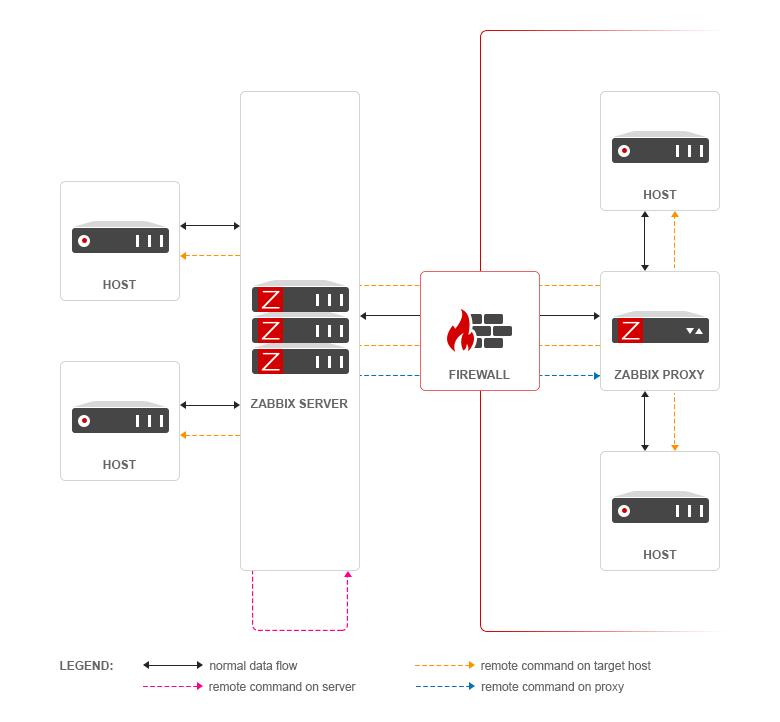

# Zabbix

Zabbix 是一个企业级的分布式开源监控方案,功能非常全面,支持多种数据收集方式,灵活的报警配置,大量的模板,实时的图表绘制

Zabbix支持主动轮询和被动捕获;Zabbix所有的报告、统计信息和配置参数都可以通过基于Web的前端页面进行访问

Zabbix是设计在非root用户下,当使用root运行,会自动使用zabbix用户

Zabbix 有几个主要的软件组件构成:

* Zabbix Server, 统计信息和数据统计的核心组件
* 数据库存储, 存储收集的信息
* WEB 界面, 提供了一个可视化界面,通常和Zabbix Server运行在同一主机之上
* Proxy 代理服务器(可选),需要使用独立的数据库;替Server 收集信息,用于分担Server 压力
* Agent 监控代理, 部署在受监控的主机之上,能主动监控本地资源并将收集的数据传输至Server



Agent 有两种工作模式: 被动(PASSIVE)和主动(ACTIVE)

* 被动,由Server 主动询问,然后agent 返回数据
* 主动,agent 先从Server 获取监控项,然后周期性发送新的值给Server

Zabbix 内部数据流:

1. 监控项(Item),对资源进行监控,将资源数值化
2. 触发器(Trigger),当监控资源的值到达阈值时,Trigger 被触发
3. 动作(Action), Trigger被触发后进行动作

例如: 对主机的CPU负载进行监控,当CPU 的负载高于80%,触发Trigger,Action 进行报警--给管理员发警告邮件

## Zabbix 部署

### Server 端部署

安装 apache,php,mariadb 和mariadb-server,并启动服务

```bash
yum -y install httpd php php-mysql mairadb mariadb-server
systemctl start mariadb
systemctl start httpd
```

mariadb 在安装后不会自动初始化,需要手动初始化,按照提示选择即可

```bash
mysql_secure_installation
```

Zabbix 在额外的库中,需要添加库地址,然后安装

```bash
rpm -ivh http://repo.zabbix.com/zabbix/3.4/rhel/7/x86_64/zabbix-release-3.4-1.el7.noarch.rpm
rpm --import /etc/pki/rpm-gpg/RPM-GPG-KEY-ZABBIX
yum -y install zabbix-server-mysql zabbix-web-mysql
```

导入 zabbix 的数据库

```bash
zcat /usr/share/doc/zabbix-server-mysql-3.4.0/create.sql.gz |mysql -uroot -p zabbix
```

修改 `/etc/zabbix/zabbix_server.conf` 中的数据库配置

```conf
DBHost=localhost
DBName=zabbix
DBUser=zabbix
DBPassword=zabbix
```

启动 zabbix server 进程

```bash
systemctl start zabbix-server
```

修改 zabbix 前端的 php 配置 `/etc/httpd/conf.d/zabbix.conf`

```php
php_value max_execution_time 300
php_value memory_limit 128M
php_value post_max_size 16M
php_value upload_max_filesize 2M
php_value max_input_time 300
php_value always_populate_raw_post_data -1
# php_value date.timezone Europe/Riga              # 取消注释并修改改为所在时区
```

修改后重启 apache

```bash
systemctl restart httpd
```

然后可以通过浏览器进行访问, <http://192.168.17.104/zabbix>;默认的用户名/密码为: Admin/zabbix

### Agent 端部署

添加 Zabbix 库地址,然后安装 zabbix-agnet

```bash
rpm -ivh http://repo.zabbix.com/zabbix/3.4/rhel/7/x86_64/zabbix-release-3.4-1.el7.noarch.rpm
yum -y install zabbix-agent
```

修改配置文件`/etc/zabbix/zabbix_agentd.conf

```conf
LogFile=/tmp/zabbix_agentd.log
Server=192.168.17.104                   # server 端地址
ServerActive=192.168.17.104             # server 端地址
Hostname=192.168.17.103                 # 本地hostname
```

启动 zabbix-agent

```bash
systemctl start zabbix-agent
```

### 在web 界面添加监控主机

在配置 Agent并开启服务后,即可在Server 的web界面配置主机

配置-主机-创建主机-主机,模板

添加主机,并添加模板,模板中定义了许多的监控项

### 添加自动发现规则

在 web 界面添加自动发现规则,并自动添加主机和监控项

配置-自动发现-创建发现规则

然后添加发现主机后的动作

配置-动作-事件源(自动发现),创建动作-动作,操作

选择触发条件,并添加操作

### zabbix 监控 mysql 数据库

创建用户, 赋予能被zabbix 监控的权力

```bash
mysql -uroot -p
mysql> GRANT ALL ON *.* TO 'zabbix'@'localhost' IDENTIFIED BY 'zabbix';
mysql> FLUSH PRIVILEGES;
```

配置用户连接信息,在`/var/lib/zabbix/` 目录下创建`.my.cnf`文件,目录信息写在了`/etc/zabbix/zabbix_agentd.d/userparameter_mysql.conf` 文件中

```conf
[client]
user=zabbix
password=zabbix
```

在 web 界面中的主机中添加模板 Template App MySQL

### Zabbix 监控 Nginx 性能

安装时,开启Nginx 自带的状态统计模块

```bash
./configure --prefix=/usr/local/nginx --user=nginx --group=gninx --with-http_stub_status_module
make
make install
```

在nginx 的配置文件`/usr/local/conf/nginx.conf`中添加

```conf
location /ngx_status {
    stub_status on;
}
```

编写客户端脚本,放在`/etc/zabbix/zabbix_agentd.d/`目录下`check_nginx.sh`

```bash
#!/bin/bash

HOST="192.168.17.103"
PORT="80"

# 检测 nginx 进程是否存在
function ping {
    /sbin/pidof nginx | wc -l 
}

# 检测 nginx 性能
function active {
    /usr/bin/curl "http://$HOST:$PORT/ngx_status/" 2>/dev/null| grep 'Active' | awk '{print $NF}'
}

function reading {
    /usr/bin/curl "http://$HOST:$PORT/ngx_status/" 2>/dev/null| grep 'Reading' | awk '{print $2}'
}

function writing {
    /usr/bin/curl "http://$HOST:$PORT/ngx_status/" 2>/dev/null| grep 'Writing' | awk '{print $4}'
}

function waiting {
    /usr/bin/curl "http://$HOST:$PORT/ngx_status/" 2>/dev/null| grep 'Waiting' | awk '{print $6}'
}

function accepts {
    /usr/bin/curl "http://$HOST:$PORT/ngx_status/" 2>/dev/null| awk NR==3 | awk '{print $1}'
}

function handled {
    /usr/bin/curl "http://$HOST:$PORT/ngx_status/" 2>/dev/null| awk NR==3 | awk '{print $2}'
}

function requests {
    /usr/bin/curl "http://$HOST:$PORT/ngx_status/" 2>/dev/null| awk NR==3 | awk '{print $3}'
}

# 执行function
$1
```

在 agent 配置文件`/etc/zabbix/zabbix_agentd.conf`中添加自定义脚本规则

```conf
UserParameter=nginx.status[*]./etc/zabbix/zabbix_agentd.d/check_nginx.sh $1
```

重启 zabbix-agent

```bash
systemctl restart zabbix-agent
```

在 server 测试,安装 zabbix-get 工具

```bash
yum -y install zabbix-get
zabbix_get -x 192.168.17.103 -k 'nginx.status[accepts]'
zabbix_get -x 192.168.17.103 -k 'nginx.status[ping]'
```

在 server 端 web 界面里,添加监控 nginx 的模板

### zabbix 调用钉钉接口,发消息

建立钉钉群组,添加钉钉机器人,详情步骤参考[官方操作手册](https://ding-doc.dingtalk.com/doc#/serverapi2/qf2nxq)

配置警告脚本路径,在`/etc/zabbix/zabbix_server.conf`中添加

```conf
AlertScriptsPath=/usr/lib/zabbix/alertscripts
```

在`/usr/lib/zabbix/alertscripts/`目录下创建脚本`dingding.sh`,将其中的地址换为自己机器人的

```bash
#!/bin/bash
to=$1
subject=$2
text=$3
curl 'https://oapi.dingtalk.com/robot/send?access_token=758cefbfde6108910a29fad7e35edd9ff76255df5ac16871ad7cf03b2262a7fc' \
    -H 'Content-Type: application/json' \
    -d '
    {"msgtype": "text",
        "text": {
            "content": "'"$text"'"
        },
        "at":{
            "atMobiles": [ 
                "'"$1"'" 
        ],
        "isAtAll": false
        }
    }'
```

修改文件归属和权限

```bash
chown zabbix.zabbix dingding.sh
chmod +x dingding.sh
```

在web 界面中创建报警媒介

管理-报警媒介类型-创建媒体类型

添加三个脚本参数,{ALERT.SENDTO},{ALERT.SUBJECT},{ALERT.MESSAGE};对应:收件人地址,主题,详细内容

创建动作

配置-动作-事件源(触发器),创建动作

在操作中添加默认接收人,默认信息和操作细节中选择发送到的用户群组和发送到用户

```txt
# 标题改为：
故障{TRIGGER.STATUS},服务器:{HOSTNAME1}发生: {TRIGGER.NAME}故障!

# 信息改为：
告警主机:{HOSTNAME1}
告警时间:{EVENT.DATE} {EVENT.TIME}
告警等级:{TRIGGER.SEVERITY}
告警信息: {TRIGGER.NAME}
告警项目:{TRIGGER.KEY1}
问题详情:{ITEM.NAME}:{ITEM.VALUE}
当前状态:{TRIGGER.STATUS}:{ITEM.VALUE1}
事件 ID:{EVENT.ID}
```

在恢复操作中添加默认接收人,默认信息和操作细节中选择发送到用户群组和发送到用户

```txt
# 标题改为
恢复{TRIGGER.STATUS}, 服务器:{HOSTNAME1}: {TRIGGER.NAME}已恢复!

# 信息改为
告警主机:{HOSTNAME1}
告警时间:{EVENT.DATE} {EVENT.TIME}
告警等级:{TRIGGER.SEVERITY}
告警信息: {TRIGGER.NAME}
告警项目:{TRIGGER.KEY1}
问题详情:{ITEM.NAME}:{ITEM.VALUE}
当前状态:{TRIGGER.STATUS}:{ITEM.VALUE1}
事件 ID:{EVENT.ID}
```

配置用户权限

管理-用户-admin-报警媒介-添加

填写收件人

## 总结

**问题**: 中文字体缺失;zabbix 的web页面在管理员资料页面可以修改为中文,但图标中的中文字体缺失,显示为方框

**原因**: 由于zabbix 的中文字体并不全,导致图表上的字体缺失,需要手动添加字体

**解决方法1**:

1. 自己下载一个字体库,如:`msyh.ttf`
2. 放入`/usr/share/zabbix/fonts`
3. 然后修改`/usr/share/zabbix/include/defines.inc.php`文件中的

   ```conf
   define('ZBX_GRAPH_FONT_NAME', 'graphfont')
   # 将 graph font 修改为自己下载字体的名字
   ```

**解决方法2**:

1. 查看zabbix 原来的字体是一个软连接
2. 删掉旧的软连接,创建新的连接到自己的字体

   ```bash
   ln -sf /usr/share/zabbix/fonts/msyh.ttf /usr/share/zabbix/fonts/graphfont.ttf
   ```
